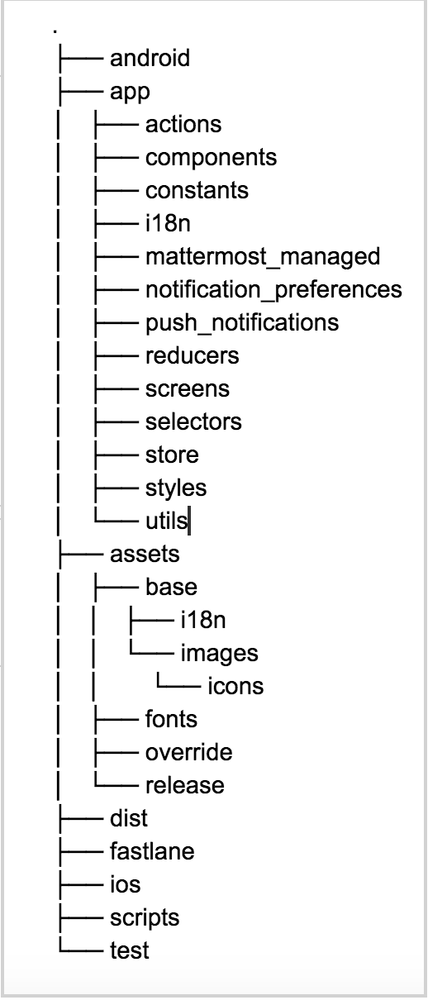

..  _mobile-developer-setup:

Mobile Developer Machine Setup
==================================

The following instructions apply to the mobile apps for iOS and Android built in React Native. Download the iOS version `here <http://about.mattermost.com/mattermost-ios-app/>`_ and the Android version `here <http://about.mattermost.com/mattermost-android-app/>`_. Source code can be found at: https://github.com/mattermost/mattermost-mobile

.. contents:: Contents:
  :backlinks: top
  :local:

If you run into any issues getting your environment set up, check the Troubleshooting section at the bottom for common solutions.

Development Environment Setup
---------------------------------

A macOS computer is required to build the Mattermost iOS mobile app.

Software Requirements
---------------------------------

iOS and Android
~~~~~~~~~~~~~~~~~~~

Install the following prerequisite software to develop and build the iOS or Android apps. For macOS, we recommend using `Homebrew <https://brew.sh/>`_ as a package manager.

1. Using Homebrew, install `NodeJS <https://nodejs.org/en/>`_.
 - Open a terminal and run ``brew install node``
 - Use `NVM <https://github.com/creationix/nvm>`_
 - Download and install the package from the `NodeJS website <https://nodejs.org/en/>`_

2. Using Homebrew, install `Watchman <https://facebook.github.io/watchman/>`_.
 - Open a terminal and run ``brew install watchman``

3. Assuming that you already have NodeJS installed, you can now use **npm** to install `React Native CLI Tools <http://facebook.github.io/react-native/docs/understanding-cli.html>`_ globally
 - ``npm -g install react-native-cli``

4. Using Homebrew, install yarn (used as our package manager for the mobile apps)
 - Open a terminal and run ``brew install yarn``
 - Use `NPM <https://github.com/npm/npm>`_
 - Open a terminal and run ``npm -g install yarn``

5. We use GitHub to host the source code so we recommend that you install `Git <https://git-scm.com/>`_ to get the source code. Optionally, you can also contribute your changes back with `pull requests <https://help.github.com/articles/creating-a-pull-request/>`_.
 - If you do not have git installed you can do so with Homebrew by running ``brew install git`` on your terminal

iOS
~~~~~~~~~~~~~~~~~~~

1. Install `Xcode 9 <https://idmsa.apple.com/IDMSWebAuth/login?appIdKey=891bd3417a7776362562d2197f89480a8547b108fd934911bcbea0110d07f757&path=%2Fdownload%2F&rv=1>`_ to build and run the app on iOS.
2. Install `Cocoapods <https://cocoapods.org/>`_. You'll need it to install the project’s iOS dependencies.

Android
~~~~~~~~~~~~~~~~~~~

1. Download and install `Android Studio or the Android SDK command line tools <https://developer.android.com/studio/index.html#downloads>`_.
2. Make sure you have the following ENV VARS configured:
 - ``ANDROID_HOME`` to where Android SDK is located (likely ``/Users/<username>/Library/Android/sdk``)
 - Make sure your ``PATH`` includes ``ANDROID_HOME/tools`` and ``ANDROID_HOME/platform-tools``
  
  - On Mac, this usually requires adding the following lines to your ~/.bash_profile file:
  
    - ``export ANDROID_HOME=/Users/<username>/Library/Android/sdk``
    - ``export PATH=$ANDROID_HOME/platform-tools:$PATH``
    - ``export PATH=$ANDROID_HOME/tools:$PATH``
    
   Then reload your bash configuration: 

   ``source ~/.bash_profile``
3. In the SDK Manager using Android Studio or the Android SDK command line tool, ensure the following are installed (you may have to click "Show Package Details" to expand packages)
 - SDK Tools
  - Android SDK Build-Tools (multiple versions)
   - 23.0.3
   - 25.0.3
   - 26.0.1
  - Android Emulator
  - Android SDK Platform-Tools
  - Android SDK Tools
  - Google Play services
  - Intel x86 Emulator Accelerator (HAXM installer)
  - Android Support Repository
  - Google Repository
 - SDK Platforms
  - Android API 23 (Marshmallow)
   - Google APIs
   - Android SDK Platform
   - Google APIs Intel x86 Atom_64 System Image
  - Any other API version that you want to test

Test Environment Setup
--------------------------

Mac OS X
~~~~~~~~~~~~

1. Install `XCode 8.3 <https://developer.apple.com/download/>`_.

2. Install `Homebrew <http://brew.sh/>`_.

3. Using Homebrew, install `Node.js <https://nodejs.org>`_ and npm.

  ``brew install node``

4. Using Homebrew, install `Watchman <https://github.com/facebook/watchman>`_.

  ``brew install watchman``

5. Using npm, install the React Native CLI tools globally.

  ``npm install -g react-native-cli``

6. Using Homebrew or npm install `Yarn <https://yarnpkg.com>`_.

   ``brew install yarn`` or ``npm install -g yarn``

7. Fork `mattermost-mobile <https://github.com/mattermost/mattermost-mobile>`_ on GitHub.

8. Clone your fork locally.

  ``cd`` into the folder that you want to store the local copy of your code

  ``git clone https://github.com/<username>/mattermost-mobile.git``

  ``cd mattermost-mobile``

9. Download any other dependencies. The ``make pre-run`` command does this automatically using npm. 

  ``make pre-run``

10. (Optional): Install Mattermost locally so that you can run unit tests and connect to the server while doing development.

  a. Follow the steps in the `Developer Machine Setup <developer-setup.html>`_ to install Mattermost.

  b. Edit your Mattermost instance's configuration file to allow sign-up without an invite.

    In ``config/config.json``, set ``"EnableOpenServer"`` to ``true``

  c. Start/restart your server.

    ``make restart-server``

Android (Device)
~~~~~~~~~~~~~~~~~~~

1. Install the Android SDK (can be skipped if you already have Android Studio installed).

  a. Go to `the Android developer downloads page <https://developer.android.com/studio/index.html#downloads>`_, scroll down to the Get Just the Command Line Tools, and download the zip file suitable for your operating system.

  b. Unzip the SDK to somewhere on your hard drive. For example, ``/Users/<username>/Library/Android/sdk`` on Mac OS X.

2. Configure the following environment variables:

  - Set ``ANDROID_HOME`` to where Android SDK is located (likely ``/Users/<username>/Library/Android/sdk``)

  - Add ``ANDROID_HOME/tools`` and ``ANDROID_HOME/platform-tools`` to the ``PATH``.

3. Run ``android`` to open the Android SDK Manager and install the following packages:

  - Tools > Android SDK Tools 25.2.5 or higher

  - Tools > Android SDK Platform-tools 25.0.3

  - Tools > Android SDK Build-tools 25.0.2

  - Tools > Android SDK Build-tools 25.0.1

  - Android 6.0 > SDK Platform 23

  - Android 6.0 > Google APIs 23

  - Android 5.1.1 > SDK Platform 22

  - Android 5.1.1 > Google APIs 22

  - Extras > Android Support Repository and/or Androud Support Library
  
  - Extras > Google Play Services
  
  - Extras > Google Repository

4. Connect your Android device to your computer.

5. Enable USB Debugging on your device.

6. Ensure that your device is listed in the output of ``adb devices``.

7. Start the React Native packager to deploy the APK to your device.

  ``make run-android``

8. The installed APK may not be opened automatically. You may need to manually open the Mattermost app on your device.

Start Developing and Building
------------------------------------

In order to develop and build the Mattermost mobile apps you'll need to get a copy of the source code. Forking the ``mattermost-mobile`` repository will also make it easy to contribute your work back to the project in the future.

1. Fork the `mattermost-mobile <https://github.com/mattermost/mattermost-mobile>`_ repository on GitHub.
2. Clone your fork locally:
 - Open a terminal 
 - Change to a directory you want to hold your local copy 
 - Run ``git clone https://github.com/<username>/mattermost-mobile.git`` if you want to use HTTPS, or ``git clone git@github.com:<username>/mattermost-mobile.git`` if you want to use SSH

.. important::
  ``<username>`` refers to the username or organization in GitHub that forked the repository.

3. Change the directory to ``mattermost-mobile``.

  ``cd mattermost-mobile``

4. Run ``make pre-run`` in order to install all the dependencies.

.. important::
  It is important that you run everything with the make commands and avoid using npm or yarn to install dependencies. If you use npm or yarn, you may skip steps and the app won't build correctly.
 
Make Commands Explained
------------------------------------

We've included several make commands to control the development flow and to ensure that everything works as expected. Always use these make commands unless they cannot accomplish what you're trying to do.

Every make command has to be run from a terminal in the project's root directory.

Commands to Prepare the App
~~~~~~~~~~~~~~~~~~~~~~~~~~~~~~~~~~~~~~~~~~~~~~~~

These make commands are used to install dependencies, to configure necessary steps before running or building the app, and to clean everything.

 - **make pre-run**: Downloads any project dependencies needed and sets up the app assets. This is the equivalent of running  ``.yarninstall``, ``.podinstall`` and ``dist/assets`` make commands.
 - **make .yarninstall**: Downloads JavaScript and react native dependencies. Once this command finishes executing it will create a ``.yarninstall`` empty file in the project's root directory to indicate that this command already ran. If yarn updates your local dependencies in the ``node_modules`` directory, it will automatically run ``make post-install`` for you.
 - **make .podinstall**: Downloads cocoapods dependencies needed to build the iOS app. Once this command finishes executing it will create a ``.podinstall`` empty file in the project's root directory to indicate that this command already ran.
 - **make post-install**: Normally this command runs automatically if yarn detects that the project updated some or all of its JavaScript dependencies. Once yarn finishes executing, this command automatically sets up a few post installation steps to ensure that everything runs correctly.
 - **make clean**: Removes all downloaded dependencies, clears the cache of those dependencies and deletes any builds that were created. It will not reset the repo, so your current changes will still be there.
 - **make dist/assets**: Builds the assets to be used including images, localization files and overriding of asset files (see Override Assets & White Labeling for details).
 
Commands to Run the App
~~~~~~~~~~~~~~~~~~~~~~~~

These make commands are used to run the app on a device or emulator for Android, and on a simulator for iOS. (see `Running the App on a Device <http://facebook.github.io/react-native/docs/running-on-device.html>`_ for details).

 - **make start-packager**: Runs the react-native packager used to bundle the JavaScript code. This command will execute *pre-run* to ensure the app is prepared.
 - **make start**: Alias of ``make start-packager``.
 - **make stop-packager**: Stops the react-native packager if it is running.
 - **make stop**: Alias of ``make stop-packager``.
 - **make run-ios**: Compiles and runs the app for iOS on an iPhone 6 simulator by default. You can set the environment variable SIMULATOR to the name of the device you want to use. This command will execute ``make start`` to ensure the packager is running.
 - **make run**: Alias of ``make run-ios``.
 - **make run-android**: Compiles and runs the app for Android on a running emulator or a device connected through USB. This command will execute ``make start`` to ensure the packager is running (see `Create and Manage Virtual Devices to configure and run the Android emulator <https://developer.android.com/studio/run/managing-avds.html>`_).

Commands to Test the App
~~~~~~~~~~~~~~~~~~~~~~~~

These make commands are used to ensure that code follows linter rules and that tests pass succesfully.

 - **make check-style**: Runs the ESLint JavaScript linter.
 - **make test**: Runs the tests.
 
Commands to Build the App
~~~~~~~~~~~~~~~~~~~~~~~~~~~~~~~~~~~~~~

The set of commands for building the app are used in conjunction with `Fastlane <https://fastlane.tools/>`_. For most of them, you will need to modify ``Fastfile``, since the commands are coupled with Mattermost's build and deployment process.

You will always be able to build an unsigned version of the app as it does not need provisioning profiles or certificates as long as you set up Fastlane in your environment.

 - **make build-ios**: Builds the iOS app and generates the ``.ipa`` file to be distributed. This make command expects an argument as the target which can be ``dev``, ``beta`` or ``release``. Depending on the target, a Fastlane script runs and each lane has the appropriate certificates and steps according to the Mattermost release process.
 - **make build-android**: Builds the Android app and generates the ``.apk`` file to be distributed. This make command expects an argument as the target which can be ``dev``, ``alpha`` or ``release``. Depending on the target, a Fastlane script runs and each lane has the appropriate certificates and steps according to the Mattermost release process.
 - **make unsigned-ios**: Builds the iOS app and generates an unsigned ``Mattermost-unsigned.ipa`` file in the project's root directory.
 - **make unsigned-android**: Builds the Android app and generates an unsigned ``Mattermost-unsigned.apk`` file in the project's root directory.

If you plan to use the **make build-*** commands, be sure to `modify Fastlane <https://docs.fastlane.tools/>`_ to suit your needs or the commands will fail.

Adding New Dependencies to the Project
-------------------------------------------

If you need to add a new dependency to the project, it is important to add them in the right way. Instructions for adding different types of dependencies are described below.

JavaScript Only
~~~~~~~~~~~~~~~~~~~~~~~~

If you need to add a new JavaScript dependency that is not related to React Native, **use yarn, not npm**. Be sure to save the exact version number to avoid conflicts in the future. 

	e.g. ``yarn add -E <package-name>``
  
React Native
~~~~~~~~~~~~~~~~~~~~~~~~

As with `JavaScript only <JavaScript Only>`_, **use yarn** to add your dependency and include an exact version. Then link the library in react native by running ``react-native link <package-name>`` in a terminal.

Be aware that we are using React Native Navigation. For Android, you might need to complete the linking process manually as the ``react-native link`` command won't do it for you.

To do this, after running the ``react-native link`` command, head to ``<project-root>/android/app/src/main/java/com/mattermost/rnbeta/MainApplication.java`` and initialize the react native library that you just added in the ``createAdditionalReactPackages`` method.

Android
~~~~~~~~~~~~

Usually the react native libraries that you add to the project will take care of adding new dependancies to the project. 

If you come across a case where it is needed, we recommend you first review your work to confirm the need. The Android documentation should then be followed to add the libraries.

iOS
~~~~~~~~~~~~

Sometimes you may need to add iOS specific dependencies that react native cannot normally link. These will be in the form of Cocoapods.

To add them, edit the ``Podfile`` located in the ``ios`` directory, then from that directory run ``pod install`` to update the ``Podfile.lock`` file.

Project Directory Structure
------------------------------------

Troubleshooting
------------------

Errors When Running 'make run-android'
~~~~~~~~~~~~~~~~~~~~~~~~~~~~~~~~~~~~~~

Error message
  .. code-block:: none

    React-native-vector-icons: cannot find dependencies

Solution
  Make sure the **Extras > Android Support Repository** package is installed with the Android SDK.

Error message
  .. code-block:: none

    Execution failed for task ':app:packageAllDebugClassesForMultiDex'.
    > java.util.zip.ZipException: duplicate entry: android/support/v7/appcompat/R$anim.class

Solution
  Clean the Android part of the mattermost-mobile project. Issue the following commands:

  1. ``cd android``
  2. ``./gradlew clean``

Error message
  .. code-block:: none

    Execution failed for task ':app:installDebug'.
    > com.android.builder.testing.api.DeviceException: com.android.ddmlib.InstallException: Failed to finalize session : INSTALL_FAILED_UPDATE_INCOMPATIBLE: Package com.mattermost.react.native signatures do not match the previously installed version; ignoring!

Solution
  The development version of the Mattermost app cannot be installed alongside a release version. Open ``android/app/build.gradle`` and change the applicationId from ``"com.mattermost.react.native"`` to a unique string for your app.
