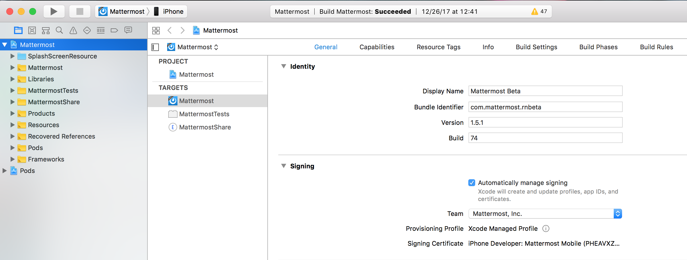
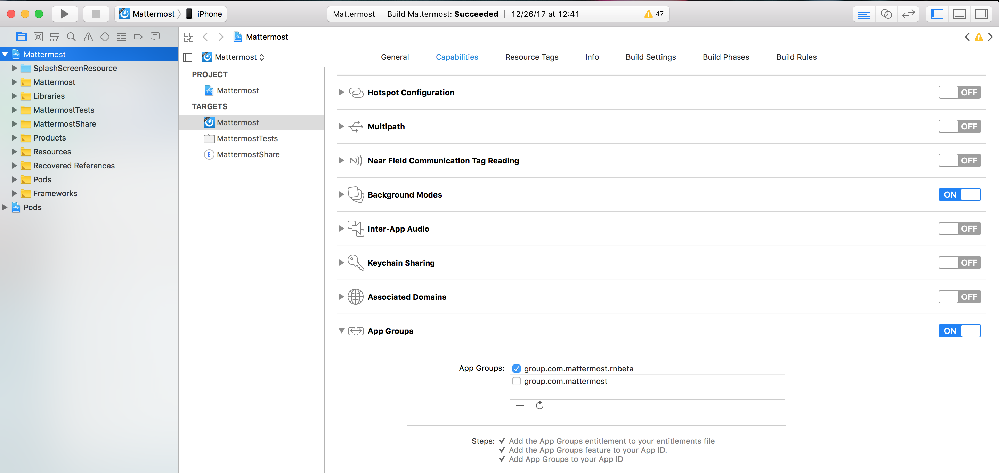
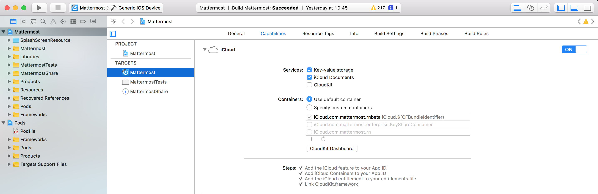
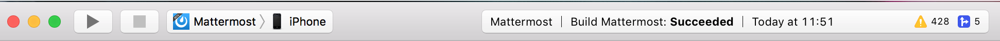
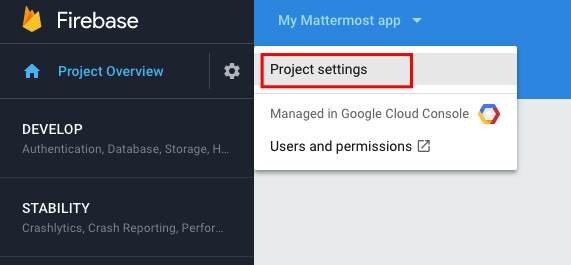
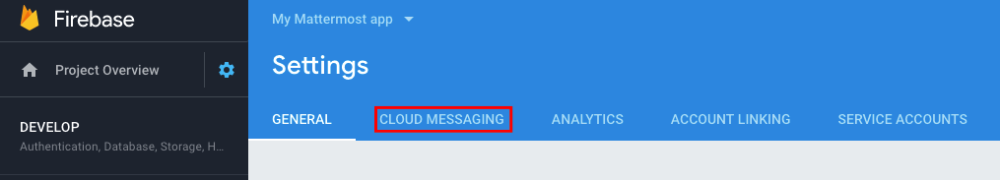
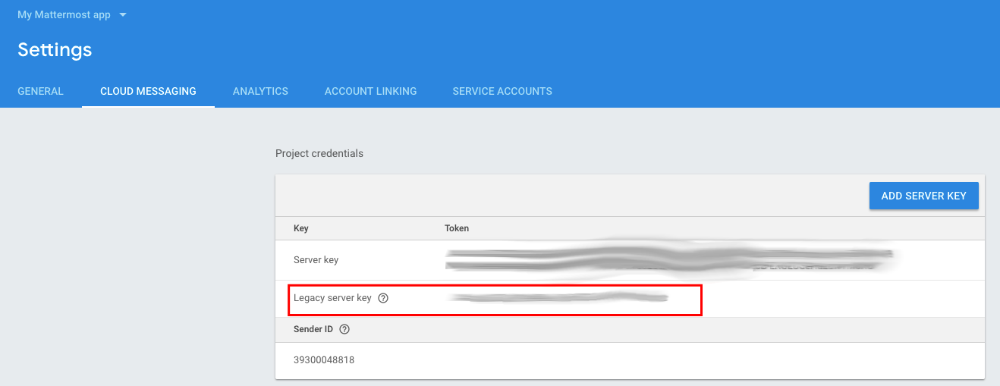
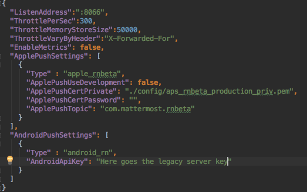

..  _mobile-developer-setup:

Mobile Developer Machine Setup
==================================

The following instructions apply to the mobile apps for iOS and Android built in React Native. Download the iOS version `here <http://about.mattermost.com/mattermost-ios-app/>`_ and the Android version `here <http://about.mattermost.com/mattermost-android-app/>`_. Source code can be found at: https://github.com/mattermost/mattermost-mobile

.. contents:: Contents:
  :backlinks: top
  :local:

If you run into any issues getting your environment set up, check the Troubleshooting section at the bottom for common solutions.

Development Environment Setup
---------------------------------

A macOS computer is required to build the Mattermost iOS mobile app.

Software Requirements
---------------------------------

iOS and Android
~~~~~~~~~~~~~~~~~~~

Install the following prerequisite software to develop and build the iOS or Android apps. For macOS, we recommend using `Homebrew <https://brew.sh/>`_ as a package manager.

1. Install `NodeJS <https://nodejs.org/en/>`_. This includes NPM which is also needed. (minimum required version is 9.3.0)
 - To install using Homebrew open a terminal and execute
 .. code-block:: bash

    $ brew install node

 - Install using NVM by following the instructions  `here <https://github.com/creationix/nvm#install-script>`_
 - Download and install the package from the `NodeJS website <https://nodejs.org/en/>`_

2. Install `Watchman <https://facebook.github.io/watchman/>`_. (minimum required version is 4.9.0)
 - To install using Homebrew open a terminal and execute
 .. code-block:: bash

    $ brew install watchman

3. Assuming that you already have NodeJS installed, you can now use **npm** to install `React Native CLI Tools <http://facebook.github.io/react-native/docs/understanding-cli.html>`_ globally (minimum required version is 2.0.1)
 .. code-block:: bash

    $ npm -g install react-native-cli

4. We use GitHub to host the source code so we recommend that you install `Git <https://git-scm.com/>`_ to get the source code. Optionally, you can also contribute by submitting `pull requests <https://help.github.com/articles/creating-a-pull-request/>`_.
   If you do not have git installed you can do so with Homebrew by opening a terminal and executing:

 .. code-block:: bash

    $ brew install git

iOS
~~~~~~~~~~~~~~~~~~~

1. Install `Xcode <https://itunes.apple.com/us/app/xcode/id497799835?ls=1&mt=12>`_ to build and run the app on iOS. (minimum required version is 9.0)
2. Install `Cocoapods <https://cocoapods.org/>`_ using the ``gem`` method. You'll need it to install the project’s iOS dependencies. (required version is 1.3.1)

Android
~~~~~~~~~~~~~~~~~~~

1. Download and install `Android Studio or the Android SDK command line tools <https://developer.android.com/studio/index.html#downloads>`_.
2. Make sure you have the following ENV VARS configured:
 - ``ANDROID_HOME`` to where Android SDK is located (likely ``/Users/<username>/Library/Android/sdk``)
 - Make sure your ``PATH`` includes ``ANDROID_HOME/tools`` and ``ANDROID_HOME/platform-tools``
  
  - On Mac, this usually requires adding the following lines to your ~/.bash_profile file:
  
    - ``export ANDROID_HOME=/Users/<username>/Library/Android/sdk``
    - ``export PATH=$ANDROID_HOME/platform-tools:$PATH``
    - ``export PATH=$ANDROID_HOME/tools:$PATH``
    
   Then reload your bash configuration: 

   ``source ~/.bash_profile``
3. In the SDK Manager using Android Studio or the `Android SDK command line tool <https://developer.android.com/studio/command-line/sdkmanager.html>`_, ensure the following are installed
 - SDK Tools (you may have to click "Show Package Details" to expand packages)
  - .. image:: ../../source/images/mobile_SDK_Tools.png
  - Android SDK Build-Tools (multiple versions)
   - 23.0.3
   - 25.0.3
   - 26.0.1
  - Android Emulator
  - Android SDK Platform-Tools
  - Android SDK Tools
  - Google Play services
  - Intel x86 Emulator Accelerator (HAXM installer)
  - Support Repository
   - Android Support Repository
   - Google Repository
 - SDK Platforms (you may have to click "Show Package Details" to expand packages)
  - .. image:: ../../source/images/mobile_SDK_Platforms.png
  - Android 6 (Marshmallow)
   - Google APIs
   - Android SDK Platform 23
   - Intel x86 Atom_64 System Image
  - Any other API version that you want to test

Start Developing and Building
------------------------------------

In order to develop and build the Mattermost mobile apps you'll need to get a copy of the source code. Forking the ``mattermost-mobile`` repository will also make it easy to contribute your work back to the project in the future.

1. Fork the `mattermost-mobile <https://github.com/mattermost/mattermost-mobile>`_ repository on GitHub.
2. Clone your fork locally:
 - Open a terminal 
 - Change to a directory you want to hold your local copy 
 - Run ``git clone https://github.com/<username>/mattermost-mobile.git`` if you want to use HTTPS, or ``git clone git@github.com:<username>/mattermost-mobile.git`` if you want to use SSH

.. important::
  ``<username>`` refers to the username or organization in GitHub that forked the repository.

3. Change the directory to ``mattermost-mobile``.

  ``cd mattermost-mobile``

4. Run ``make pre-run`` in order to install all the dependencies.

.. important::
  It is important that you run everything with the make commands and avoid using npm or yarn to install dependencies. If you use npm or yarn, you may skip steps and the app won't build correctly.
 
Adding New Dependencies to the Project
-------------------------------------------

If you need to add a new dependency to the project, it is important to add them in the right way. Instructions for adding different types of dependencies are described below.

JavaScript Only
~~~~~~~~~~~~~~~~~~~~~~~~

If you need to add a new JavaScript dependency that is not related to React Native, **use npm, not yarn**. Be sure to save the exact version number to avoid conflicts in the future. 

	e.g. ``npm add -E <package-name>``
  
React Native
~~~~~~~~~~~~~~~~~~~~~~~~

As with `JavaScript only <https://docs.mattermost.com/developer/mobile-developer-setup.html#javascript-only>`_, **use npm** to add your dependency and include an exact version. Then link the library in React Native by running ``react-native link <package-name>`` in a terminal.

Be aware that we are using React Native Navigation. For Android, you might need to complete the linking process manually as the ``react-native link`` command won't do it for you.

To do this, after running the ``react-native link`` command, head to ``<project-root>/android/app/src/main/java/com/mattermost/rnbeta/MainApplication.java`` and initialize the react native library that you just added in the ``createAdditionalReactPackages`` method.

Android
~~~~~~~~~~~~

Usually the React Native libraries that you add to the project will take care of adding new dependencies to the project. 

If you come across a case where adding new dependencies manually is needed, we recommend you first review your work to confirm the need. The Android documentation should then be followed to add the libraries.

iOS
~~~~~~~~~~~~

Sometimes you may need to add iOS specific dependencies that React Native cannot normally link. These will be in the form of Cocoapods.

To add them, edit the ``Podfile`` located in the ``ios`` directory, then from that directory run ``pod install`` to update the ``Podfile.lock`` file.

Project Directory Structure
------------------------------------

  .. code-block:: bash

    .
    ├── android
    ├── app
    │   ├── actions
    │   ├── components
    │   ├── constants
    │   ├── i18n
    │   ├── mattermost_managed
    │   ├── notification_preferences
    │   ├── push_notifications
    │   ├── reducers
    │   ├── screens
    │   ├── selectors
    │   ├── store
    │   ├── styles
    │   └── utils
    ├── assets
    │   ├── base
    │   │   ├── i18n
    │   │   ├── images
    │   │   └── release
    │   └── fonts
    ├── coverage
    ├── dist
    │   └── assets
    │       ├── i18n
    │       ├── images
    │       └── release
    ├── docs
    ├── fastlane
    ├── ios
    ├── scripts
    └── test

Make Commands Explained
------------------------------------

We've included a bunch of make commands in order to control the development flow and to ensure that everything works as expected. Always try and use these make commands unless they can't accomplish what you need to do.

Every make command has to be run from a terminal in the project's root directory. Try running **make help** to get a short description in your terminal about every make command available.

Commands to Prepare the App
~~~~~~~~~~~~~~~~~~~~~~~~~~~~~~~~~~~~~~~~~~~~~~~~

These make commands are used to install dependencies, to configure necessary steps before running or building the app, and to clean everything.

 - **make pre-run**: Downloads and installs any project dependencies and sets up the app assets required to build and run the app. Run this command when setting up your environment or after a **make clean**.
 - **make clean**: Removes all downloaded dependencies, clears the cache of those dependencies and deletes any builds that were created. It will not reset the repo, so your current changes will still be there.

Commands to Run the App
~~~~~~~~~~~~~~~~~~~~~~~~

These make commands are used to run the app on a device or emulator in the case of Android, and on a simulator in the case of iOS. (see `Running the App on a Device`_ for details)

 - **make start**: Runs the React Native packager server used to bundle the javascript code and leaves it running in your terminal. Use this if you have a compiled app already running in dev mode on a device, emulator or simulator and you have only made changes to your JavaScript code, so re-compiling the app isn't necessary.
 - **make stop**: Stops the React Native packager server if it is running. This command is optional if you need to terminate the packager server from another terminal.
 - **make run**: Alias of ``run-ios``.
 - **make run-ios**: Compiles and runs the app for iOS on an iPhone 6 simulator by default. You can set the environment variable SIMULATOR to the name of the device you want to use.
 - **make run-android**: make run-android: Compiles and runs the app for Android on a running emulator or a device connected through USB. (see `Create and Manage Virtual Devices <https://developer.android.com/studio/run/managing-avds.html>`_ to configure and run the Android emulator).

Commands to Test the App
~~~~~~~~~~~~~~~~~~~~~~~~

These make commands are used to ensure that the code follows the linter rules and that the tests work correctly.

 - **make check-style**: Runs the ESLint JavaScript linter.
 - **make test**: Runs the tests.

Commands to Build the App
~~~~~~~~~~~~~~~~~~~~~~~~~~~~~~~~~~~~~~

The set of commands for building the app are used in conjunction with `Fastlane <https://fastlane.tools/>`_ and a set of environment variables that can be found under the project's fastlane directory.

 - **make build-ios**: Builds the iOS app and generates the Mattermost.ipa file in the project's root directory to be distributed.
 - **make build-android**: Builds the Android app and generates the Mattermost.apk file in the project's root directory to be distributed.
 - **make unsigned-ios**: Builds the iOS app and generates an unsigned Mattermost-unsigned.ipa file in the project's root directory.
 - **make unsigned-android**: Builds the Android app and generates an unsigned Mattermost-unsigned.apk file in the project's root directory.

If you plan to use the make build-* commands be sure to set your environment variables for use in conjunction with Fastlane to suit your needs. For more information please refer to the `Build Your Own App from Source`_ section.

Running the App on a Device
------------------------------

If you want to test the app or if you want to make a contribution it is always a good idea to run the app on an actual device. This will let you ensure that the app is working correctly and in a performant way before making a pull request.

Running the App on Android Devices
~~~~~~~~~~~~~~~~~~~~~~~~~~~~~~~~~~~

Enable Debugging over USB
++++++++++++++++++++++++++++

Most Android devices can only install and run apps downloaded from Google Play. By default, in order to be able to install our app in the device during development you will need to enable USB Debugging on your device in the "Developer options" menu by going to **Settings -> About phone** and then tap the Build number row at the bottom seven times, then go back to **Settings -> Developer options** and enable "USB debugging".

Plug in Your Device via USB
++++++++++++++++++++++++++++
Plug in your Android device in any available USB port in your development machine (try to avoid hubs and plug it directly into your computer) and check that your device is properly connecting to ADB (Android Debug Bridge) by running **adb devices**.

  .. code-block:: bash

    $ adb devices
    List of devices attached
    42006fb3e4fb25b8    device

If you see **device** in the right column that means that the device is connected. You must have **only one device connected** at a time.

Run the App
+++++++++++++

With your device connected to the USB port execute the following in your command prompt to install and launch the app on the device:

  .. code-block:: bash

    $ make run-android

If you get a "bridge configuration isn't available" error. See `Using adb reverse <http://facebook.github.io/react-native/docs/running-on-device.html#method-1-using-adb-reverse-recommended>`_.

You can also run a **Release** build of the app in your device by setting the *VARIANT* environment variable to "release" like:

  .. code-block:: bash

    $ VARIANT=release make run-android

.. important::
  If you already have a Debug app install in your phone, you need to uninstall it first because the Debug and Release variants aren't compatible. If it is installed, you will get an error saying ``INSTALL_FAILED_UPDATE_INCOMPATIBLE``.

Also remember running the app in Release mode will be more performant than in debug mode but you cannot test new changes without recompiling the app.

Running the App on iOS Devices
~~~~~~~~~~~~~~~~~~~~~~~~~~~~~~~~~~~

Plug in Your Device via USB
++++++++++++++++++++++++++++

Plug in your iOS device in any available USB port in your development machine (try to avoid hubs and plug it directly into your computer). Navigate to the ios folder in your ``mattermost-mobile`` project, then open the file **Mattermost.xcworkspace** in XCode.

If this is your first time running an app on your iOS device, you may need to register your device for development. To do so,
open the **Product** menu in XCode menu bar, then go to **Destination** and look for your device to select from the list.

Configure Code signing
+++++++++++++++++++++++

Register for an `Apple developer account <https://developer.apple.com/>`_ if you don't have one yet.

Select the **Mattermost** project in the Xcode Project Navigator, then select the **Mattermost** target.
Look for the "General" tab. Go to the "Signing" section and make sure your Apple developer account or team is selected under the Team dropdown. Then make sure to change the *Bundle Identifier* in the "Identity" section that will be used for your own custom build. XCode will then register your provisioning profiles in your account for the Bundle Identifier you've entered.

Repeat the steps for the **MattermostTests** target in the project and the **MattermostShare** target.

.. important::
  The **MattermostShare** target must use different *Bundle Identifier* than the other two targets.

Configure App Groups
+++++++++++++++++++++

Select the **Mattermost** project in the Xcode Project Navigator, then select the **Mattermost** target. Look for the "Capabilities" tab.
Expand the **App Groups** capability and then enter the name for your app group, remember that it has to include the "group." prefix.

Repeat the process for the **MattermostShare** target and use the same app group defined in the **Mattermost** target.
App Groups are used to share data between the main app and the app extension.

Finally, you'll need to set the same app group in your config.json under the assets folder. Refer to `Overriding Assets & White Labeling`_ section for further instructions.

Configure iCloud container identifier
++++++++++++++++++++++++++++++++++++++

Select the **Mattermost** project in the Xcode Project Navigator, then select the **Mattermost** target. Look for the "Capabilities" tab.
Expand the **iCloud** capability, select the option to *Specify custom containers* and then add and enable your own.

Build and Run the App
++++++++++++++++++++++

If everything is set up correctly, your device will be listed as the build target in the Xcode toolbar, and it will also appear in the Devices Pane (⇧⌘2). You can press the **Build and run** button (⌘R) or select the **Run** from the Product menu to run the app.

If you run into any issues, please take a look at Apple's `Launching Your App on a Device <https://developer.apple.com/library/content/documentation/IDEs/Conceptual/AppDistributionGuide/LaunchingYourApponDevices/LaunchingYourApponDevices.html#//apple_ref/doc/uid/TP40012582-CH27-SW4>`_ documentation.

If the app fails to build, you can try either of the following options before trying to build the app again:
- Go to the **Product** menu and select **Clean**
- Go to the **Product** menu, hold down the Option key, and select **Clean Build Folder…**

Build Your Own App from Source
------------------------------

Now you can build the app from source and distribute it within your team or company either using the App Stores, Enterprise App Stores or EMM providers, or any other way.

We recommend using the **make build-*** commands in conjunction with `Fastlane <https://docs.fastlane.tools/#choose-your-installation-method>`_. With Fastlane, you can also configure the app using environment variables. 

Build Preparations
~~~~~~~~~~~~~~~~~~

First of all, ensure that the following remains exactly the same as in the original `mattermost-mobile <https://github.com/mattermost/mattermost-mobile>`_ repo:
 - The package ID for the Android app and the Bundle Identifier for the iOS app remain the same as the one in the original mattermost-mobile repo, com.mattermost.rnbeta.
 - Android-specific source files remain under *android/app/src/main/java/com/mattermost/rnbeta*
 - Your `environment variables <https://github.com/mattermost/mattermost-mobile/blob/master/fastlane/env_vars_example>`_ are set according to your needs

Build the Android App
~~~~~~~~~~~~~~~~~~~~~~

Android requires that all apps be digitally signed with a certificate before they can be installed, so to distribute your Android application via the Google Play Store, you'll need to generate a signed release APK.

Generating a Signing Key
+++++++++++++++++++++++++

To generate the signed key, we'll be using **keytool** which comes with the JDK required to develop for Android.

  .. code-block:: bash

    $ keytool -genkey -v -keystore my-release-key.keystore -alias my-key-alias -keyalg RSA -keysize 2048 -validity 10000

The above command prompts you for passwords for the keystore and key (make sure you use the same password for both), and asks you to provide the Distinguished Name fields for your key. It then generates the keystore as a file called my-release-key.keystore.

The keystore contains a single key, valid for 10000 days. The alias is a name that you will use later when signing your app, so remember to take a note of the alias.

.. note::
  Remember to keep your keystore file private and never commit it to version control.

Setting up Gradle Variables
++++++++++++++++++++++++++++

 - Place the *my-release-key.keystore* file under a directory that you can access. It can be in your home directory or even under *android/app* in the project folder so long as it is not checked in.
 - Edit the file ~/.gradle/gradle.properties, or create it if one does not exist, and add the following:

   .. code-block:: bash

     MATTERMOST_RELEASE_STORE_FILE=/full/path/to/directory/containing/my-release-key.keystore
     MATTERMOST_RELEASE_KEY_ALIAS=my-key-alias
     MATTERMOST_RELEASE_PASSWORD=*****

.. important::
  Replace **/full/path/to/directory/containing/my-release-key.keystore** with the full path to the actual keystore file and ********* with the actual keystore password.

.. warning::
  Once you publish the app on the Play Store, you will need to republish your app under a different package id (losing all downloads and ratings) if you change the signing key at any point, so backup your keystore and don't forget the password.

Setting up Environment Variables
++++++++++++++++++++++++++++++++
In order to use the **make build-android** command, you'll need to set a few environment variables. In this guide, we will explain some of them. You can refer to the `env_vars_example <https://github.com/mattermost/mattermost-mobile/blob/master/fastlane/env_vars_example>`_
file under the fastlane directory to see all of them.
In order to make fastlane work with these environment variables you have two options:

1. Copy the file with your variables to ``../mattermost-mobile/fastlane/.env`` where ``.env`` is the file name.

or

2. Create an .sh file with your variables (for example ``my_env.sh``), and execute ``source my_env.sh`` in the terminal session where you will later execute ``make build-android`` 

+-----------------------------------------------+-------------------------------------------------------------------------------------------------------+-------------------------+
| Variable                                      | Description                                                                                           | Default value           |
+===============================================+=======================================================================================================+=========================+
| SUBMIT_ANDROID_TO_GOOGLE_PLAY                 | Should the app be submitted to the Play Store once it finishes to build, use along with               | false                   |
|                                               | **SUPPLY_TRACK**.                                                                                     |                         |
|                                               | Valid values are: true, false                                                                         |                         |
+-----------------------------------------------+-------------------------------------------------------------------------------------------------------+-------------------------+
| ANDROID_BUILD_FOR_RELEASE                     | Defines if the Android app should be built in release mode.                                           | false                   |
|                                               | Valid values are: true, false                                                                         |                         |
|                                               |                                                                                                       |                         |
|                                               | **Make sure you set this value to true if you plan to submit this app to the Play Store or distribute |                         |
|                                               | it in any other way**.                                                                                |                         |
+-----------------------------------------------+-------------------------------------------------------------------------------------------------------+-------------------------+
| ANDROID_PACKAGE_ID                            | The package ID for the android app.                                                                   | com.mattermost.rnbeta   |
+-----------------------------------------------+-------------------------------------------------------------------------------------------------------+-------------------------+
| ANDROID_APP_NAME                              | The name of the app as it is going to be shown in the Android home screen.                            | Mattermost Beta         |
+-----------------------------------------------+-------------------------------------------------------------------------------------------------------+-------------------------+
| ANDROID_REPLACE_ASSETS                        | Replaces app icons with the ones found under the folder *dist/assets/release/icons/android* and       | false                   |
|                                               | the splash screen with the ones found under the folder */dist/assets/release/splash_screen/android*.  |                         |
|                                               | Valid values are: true, false                                                                         |                         |
+-----------------------------------------------+-------------------------------------------------------------------------------------------------------+-------------------------+
| ANDROID_INCREMENT_BUILD_NUMBER                | Increases the Android app build number, required when a new build is going to be publish to the       | false                   |
|                                               | Google Play Store.                                                                                    |                         |
|                                               | Valid values are: true, false                                                                         |                         |
+-----------------------------------------------+-------------------------------------------------------------------------------------------------------+-------------------------+
| ANDROID_COMMIT_INCREMENT_BUILD_NUMBER_MESSAGE | The message that will be used for committing to git the increment of the build number, the actual     | Version Bump to         |
|                                               | number will be appended to the end of this message.                                                   |                         |
+-----------------------------------------------+-------------------------------------------------------------------------------------------------------+-------------------------+
| SUPPLY_TRACK                                  | The track of the application to use when submitting                                                   | production              |
|                                               | the app to Google Play Store.                                                                         |                         |
|                                               | Valid values are: alpha, beta, production                                                             |                         |
|                                               |                                                                                                       |                         |
|                                               | **We strongly recommend not submitting the app to to production, instead try any of the other tracks  |                         |
|                                               | and then promote your app using the Google Play console**.                                            |                         |
+-----------------------------------------------+-------------------------------------------------------------------------------------------------------+-------------------------+
| SUPPLY_PACKAGE_NAME                           | The package Id of your application, make sure it matches **ANDROID_PACKAGE_ID**.                      | com.mattermost.rnbeta   |
+-----------------------------------------------+-------------------------------------------------------------------------------------------------------+-------------------------+
| SUPPLY_JSON_KEY                               | The path to the service account json file used to authenticate with Google.                           |                         |
|                                               |                                                                                                       |                         |
|                                               | See the `Supply documentation <https://docs.fastlane.tools/actions/supply/#setup>`_ to learn more.    |                         |
+-----------------------------------------------+-------------------------------------------------------------------------------------------------------+-------------------------+

Building the App
++++++++++++++++

Once all the previous steps are done, execute the following command from within the project's directory:

  .. code-block:: bash

    $ make build-android

This will start the build process following the environment variables you've set. Once it finishes, it will
create a *Mattermost.apk* file in the project's root directory. If you have not set Fastlane to submit the app
to the Play Store, you can use this file to manually publish and distribute the app.

Build the iOS App
~~~~~~~~~~~~~~~~~~~~~~

Apple requires that all apps be digitally signed with a certificate before they can be installed, so to distribute
your iOS application via Apple App Store, you'll need to generate a signed release IPA. The process is the same as
any other native iOS app, but in our case we've created a set of scripts in conjunction with Fastlane to
make this process easier than the standard manual process.

We make use of `Match <https://docs.fastlane.tools/actions/match/>`_ to sync your provisioning profiles (the profiles will be created for you if needed), then use `Gym <https://docs.fastlane.tools/actions/gym/>`_ to build and sign the app, and then optionally use `Pilot <https://docs.fastlane.tools/actions/pilot/>`_ to submit the app to TestFlight in order for you to promote the app to the App Store.

Setting up environment variables
++++++++++++++++++++++++++++++++

In order to use the **make build-ios** command, you'll need to set a few environment variables. In this guide, we will explain some of them. You can refer to the `env_vars_example <https://github.com/mattermost/mattermost-mobile/blob/master/fastlane/env_vars_example>`_ file under the fastlane directory to see all of them. In order to make fastlane work with these environment variables you have two options:

1. Copy the file with your variables to ``../mattermost-mobile/fastlane/.env`` where ``.env`` is the file name.

or

2. Create an .sh file with your variables (for example ``my_env.sh``), and execute ``source my_env.sh`` in the terminal session where you will later execute ``make build-ios`` 

.. note::
  You must use your own provisioning profiles and certificates as well as your own Bundle Identifiers. If you use the default values, you will be unable to build and sign the app.

+-----------------------------------------------+-------------------------------------------------------------------------------------------------------+----------------------------------------+
| Variable                                      | Description                                                                                           | Default value                          |
+===============================================+=======================================================================================================+========================================+
| SYNC_IOS_PROVISIONING_PROFILES                | Should we run **match** to sync the provisioning profiles.                                            | false                                  |
|                                               | Valid values are: true, false                                                                         |                                        |
+-----------------------------------------------+-------------------------------------------------------------------------------------------------------+----------------------------------------+
| SUBMIT_IOS_TO_TESTFLIGHT                      | Submit the app to TestFlight once the build finishes.                                                 | false                                  |
|                                               | Valid values are: true, false                                                                         |                                        |
+-----------------------------------------------+-------------------------------------------------------------------------------------------------------+----------------------------------------+
| IOS_BUILD_FOR_RELEASE                         | Defines if the iOS app should be built in release mode.                                               | false                                  |
|                                               | Valid values are: true, false                                                                         |                                        |
|                                               |                                                                                                       |                                        |
|                                               | **Make sure you set this value to true if you plan to submit this app to TestFlight or distribute     |                                        |
|                                               | it in any other way**.                                                                                |                                        |
+-----------------------------------------------+-------------------------------------------------------------------------------------------------------+----------------------------------------+
| IOS_REPLACE_ASSETS                            | Replaces the icons of the app with the ones found under the folder *dist/assets/release/icons/ios*    | false                                  |
|                                               | and the splash screen with the one found under the folder *dist/assets/release/splash_screen/ios*.    |                                        |
|                                               | Valid values are: true, false                                                                         |                                        |
+-----------------------------------------------+-------------------------------------------------------------------------------------------------------+----------------------------------------+
| IOS_INCREMENT_BUILD_NUMBER                    | Increases the iOS app build number, required when a new build is going to be publish to TestFlight    | false                                  |
|                                               | and the Apple App Store.                                                                              |                                        |
|                                               | Valid values are: true, false                                                                         |                                        |
+-----------------------------------------------+-------------------------------------------------------------------------------------------------------+----------------------------------------+
| IOS_COMMIT_INCREMENT_BUILD_NUMBER_MESSAGE     | The message that will be used for committing to git the increment of the build number, the actual     | Version Bump to                        |
|                                               | number will be appended to the end of this message.                                                   |                                        |
+-----------------------------------------------+-------------------------------------------------------------------------------------------------------+----------------------------------------+
| IOS_APP_NAME                                  | The name of the app as it is going to be shown in the iOS home screen.                                | Mattermost Beta                        |
+-----------------------------------------------+-------------------------------------------------------------------------------------------------------+----------------------------------------+
| IOS_MAIN_APP_IDENTIFIER                       | The Bundle Identifier for the app.                                                                    | com.mattermost.rnbeta                  |
+-----------------------------------------------+-------------------------------------------------------------------------------------------------------+----------------------------------------+
| IOS_EXTENSION_APP_IDENTIFIER                  | The Bundle Identifier for the share extension app.                                                    | com.mattermost.rnbeta.MattermostShare  |
+-----------------------------------------------+-------------------------------------------------------------------------------------------------------+----------------------------------------+
| IOS_APP_GROUP                                 | The iOS App Group identifier used to share data between the app and the share extension.              |                                        |
+-----------------------------------------------+-------------------------------------------------------------------------------------------------------+----------------------------------------+
| IOS_ICLOUD_CONTAINER                          | The iOS iCloud container identifier used to support iCloud storage.                                   | iCloud.com.mattermost.rnbeta           |
+-----------------------------------------------+-------------------------------------------------------------------------------------------------------+----------------------------------------+
| IOS_BUILD_EXPORT_METHOD                       | Method used to export the archive.                                                                    | adhoc                                  |
|                                               | Valid values are: app-store, ad-hoc, enterprise, development                                          |                                        |
+-----------------------------------------------+-------------------------------------------------------------------------------------------------------+----------------------------------------+
| MATCH_USERNAME                                | Your Apple ID Username.                                                                               |                                        |
+-----------------------------------------------+-------------------------------------------------------------------------------------------------------+----------------------------------------+
| MATCH_PASSWORD                                | Your Apple ID Password.                                                                               |                                        |
+-----------------------------------------------+-------------------------------------------------------------------------------------------------------+----------------------------------------+
| MATCH_GIT_URL                                 | URL to the git repo containing all the certificates.                                                  |                                        |
|                                               |                                                                                                       |                                        |
|                                               | **Make sure this git repo is set to private. Remember this repo will be used to sync the provisioning |                                        |
|                                               | profiles and other certificates**.                                                                    |                                        |
+-----------------------------------------------+-------------------------------------------------------------------------------------------------------+----------------------------------------+
| MATCH_APP_IDENTIFIER                          | The Bundle Identifiers for the app (comma-separated).                                                 | com.mattermost.rnbeta.MattermostShare, |
|                                               | In our case refers to the identifiers of the app and the share extension                              | com.mattermost.rnbeta                  |
+-----------------------------------------------+-------------------------------------------------------------------------------------------------------+----------------------------------------+
| MATCH_TYPE                                    | Define the provisioning profile type to sync.                                                         | adhoc                                  |
|                                               | Valid values are: appstore, adhoc, development, enterprise                                            |                                        |
|                                               |                                                                                                       |                                        |
|                                               | **Make sure you set this value to the same type as the IOS_BUILD_EXPORT_METHOD as you want to have    |                                        |
|                                               | the same provisioning profiles installed the machine so they are found when signing the app**.        |                                        |
+-----------------------------------------------+-------------------------------------------------------------------------------------------------------+----------------------------------------+
| FASTLANE_TEAM_ID                              | The ID of your Apple Developer Portal Team.                                                           |                                        |
+-----------------------------------------------+-------------------------------------------------------------------------------------------------------+----------------------------------------+
| PILOT_USERNAME                                | Your Apple ID Username.                                                                               |                                        |
+-----------------------------------------------+-------------------------------------------------------------------------------------------------------+----------------------------------------+

Building the App
++++++++++++++++

Once all the previous steps are done, you can run the following command from within the project's directory

  .. code-block:: bash

    $ make build-ios

This will start the build process following the environment variables you've set. Once it finishes, it will create a *Mattermost.ipa* file in the project's root directory. If you have not set Fastlane to submit the app to TestFlight, you can use this file to manually publish and distribute the app.

Push Notifications with Your Own Build
---------------------------------------

When building a custom version of the Mattermost mobile app, you will also need to host your own `Mattermost Push Proxy Server <https://github.com/mattermost/mattermost-push-proxy>`_ and make a few modifications to your Mattermost mobile app to be able to get push notifications.

Set Up Android to Receive Push Notifications
~~~~~~~~~~~~~~~~~~~~~~~~~~~~~~~~~~~~~~~~~~~~

Push notifications on Android are managed and dispatched using `Google's GCM service <https://developers.google.com/cloud-messaging/gcm>`_ (now integrated into Firebase).

 - Create a Firebase project within the `Firebase Console <https://console.firebase.google.com>`_.
 - Click **Add Project**
 .. image:: ../../source/images/mobile/firebase_console.png

 - Enter the project name, project ID and Country
 - Click **CREATE PROJECT**
 .. image:: ../../source/images/mobile/firebase_project.png

Once the project is created you'll be redirected to the Firebase project dashboard

 .. image:: ../../source/images/mobile/firebase_dashboard.png

 - Click **Add Firebase to your Android App**
 - Enter the package ID of your custom Mattermost app as the **Android package name**. See `Build Your Own App from Source`_ for more information on the package ID.
 - Enter an **App nickname** so you can identify it with ease
 - Click **REGISTER APP**
 - Once the app has been registered, download the **google-services.json** file which will be used later
 - Click **CONTINUE** and then **FINISH**
 .. image:: ../../source/images/mobile/firebase_register_app.png
 .. image:: ../../source/images/mobile/firebase_google_services.png
 .. image:: ../../source/images/mobile/firebase_sdk.png

Now that you have created the Firebase project and the app and downloaded the *google-services.json* file, you need to make some changes in the project.

 - Replace ``android/app/google-services.json`` with the one you downloaded earlier
 - Open ``android/app/google-services.json``, find the project_number and copy the value
 - Open ``android/app/src/main/AndroidManifest.xml`` file, look for the line ``<meta-data android:name="com.wix.reactnativenotifications.gcmSenderId" android:value="184930218130\0"/>`` and replace the value with the one that you copied in the previous step

.. important::
  Leave the trailing \\0 intact

At this point, you can build the Mattermost app for Android.

Set Up Mattermost Push Proxy Server to Send Android Push Notifications
~~~~~~~~~~~~~~~~~~~~~~~~~~~~~~~~~~~~~~~~~~~~~~~~~~~~~~~~~~~~~~~~~~~~~~~

Now that the app can receive push notifications, we need to make sure that the Push Proxy server is able to send the notification to the device. If you haven't installed the Mattermost Push Proxy Server, you should now do so by following the documentation in the `Mattermost Push Proxy Server repository <https://github.com/mattermost/mattermost-push-proxy/blob/master/README.md>`_ and the documentation about `Hosted Push Notification Service <https://docs.mattermost.com/mobile/mobile-hpns.html>`_. This guide will focus on the changes needed to configure the push proxy.

- Go to the `Firebase Console <https://console.firebase.google.com>`_ and select the project you've created. Once in the
  dashboard, go to the project settings and select **CLOUD MESSAGING**.

- Look for the value of the **Legacy Server Key** and copy it.

- Open the **mattermost-push-proxy.json** file in the ``mattermost-push-proxy/config`` directory and paste the value for the "AndroidApiKey" setting

- Finally restart your Mattermost Push Proxy server and your app should start receiving push notifications.

Set Up iOS to Receive Push Notifications
~~~~~~~~~~~~~~~~~~~~~~~~~~~~~~~~~~~~~~~~~

Push notifications on iOS are managed and dispatched using `Apple's Push Notification Service <https://developer.apple.com/library/content/documentation/NetworkingInternet/Conceptual/RemoteNotificationsPG/APNSOverview.html>`_.
You must have a **Paid Apple Developer account** to create certificates needed to send notifications using this service.

 - Generate a Certificate from Keychain Access
    * Launch the **Keychain Access application** in your Mac and select **KeyChain Access -> Certificate Assistant -> Request a Certificate From a Certificate Authority...**
    .. image:: ../../source/images/mobile/ios_keychain_request_certificate.png

    * Enter your email address in **User Email Address** and check the **"Save to disk"** option, then click **Continue**
    .. image:: ../../source/images/mobile/ios_keychain_create_cert_request.png

    * Save the certificate request
    .. image:: ../../source/images/mobile/ios_keychain_save_cert_request.png

 - Log in to `Apple developer account <https://developer.apple.com/account>`_ and click **Certificates, Identifiers and Profiles**
 .. image:: ../../source/images/mobile/ios_account.png

 - Select iOS from the dropdown
 .. image:: ../../source/images/mobile/ios_type.png

 - Select App IDs from the side menu and look for the Bundle Identifier you are using for the Mattermost app
 .. image:: ../../source/images/mobile/ios_appid.png

 - Select the App ID and click **Edit**
 .. image:: ../../source/images/mobile/ios_edit_appid.png

 - Scroll down to the **Push Notification** Section and click Create a **Production SSL Certificate**
 .. image:: ../../source/images/mobile/ios_create_push_certificate.png

 - In the **About Creating a Certificate Signing Request (CSR)** screen click Continue
 .. image:: ../../source/images/mobile/ios_csr.png

 - Choose the certificate request file created using the Keychain access in the previous section and click **Continue**
 .. image:: ../../source/images/mobile/ios_upload_csr.png

 - Download the Certificate and click **Done** to finish the process

Set up Mattermost Push Proxy Server to Send iOS Push Notifications
~~~~~~~~~~~~~~~~~~~~~~~~~~~~~~~~~~~~~~~~~~~~~~~~~~~~~~~~~~~~~~~~~~~~~~~

Now that the app is capable of receiving push notifications we need to make sure that the Push Proxy server is able to send
the notification to the device. If you haven't installed the Mattermost Push Proxy Server at this point you can
do so by following the documentation on the `Mattermost Push Proxy Server repo <https://github.com/mattermost/mattermost-push-proxy/blob/master/README.md>`_ and the documentation about `Hosted Push Notification Service <https://docs.mattermost.com/mobile/mobile-hpns.html>`_. This guide will only focus on the changes needed in the **mattermost-push-proxy.json** file which is the configuration file for the push proxy.

 - Double click the **Distribution Certificate** generated in the previous step to add it to your Keychain Access. Go to **Keychain Access**,
   select the **login** keychain and **My Certificates** from the side menu.
 .. image:: ../../source/images/mobile/ios_keychain_select.png

 - Find the certificate you imported and then right click to **export** it as a **.p12** file
 .. image:: ../../source/images/mobile/ios_keychain_export.png

 - Enter a name for the filename and click **Save**
 .. image:: ../../source/images/mobile/ios_keychain_export_save.png

 - Leave the **password** blank and then click **OK**
 .. image:: ../../source/images/mobile/ios_keychain_export_password.png

 - Convert the downloaded certificate to **.pem**
 .. code-block:: bash

   $ openssl x509 -in aps.cer -inform DER -out aps_production.pem

 - Extract the private key from the certificate you exported
 .. code-block:: bash

   $ openssl pkcs12 -in Certificates.p12 -out aps_production_priv.pem -nodes -clcerts -passin pass:

 - Verify the certificate works with apple
 .. code-block:: bash

   $ openssl s_client -connect gateway.push.apple.com:2195 -cert aps_production.pem -key aps_production_priv.pem

 - Copy the private key file ``aps_production_priv.pem`` into your ``mattermost-push-proxy/config`` directory

 - Open the **mattermost-push-proxy.json** file under the ``mattermost-push-proxy/config`` directory and add the path to the private key file
   as the value for **"ApplePushCertPrivate"** and the value for **"ApplePushTopic"** with your *Bundle Identifier*
 .. image:: ../../source/images/mobile/proxy-config.png

- Finally, restart your Mattermost Push Proxy server, and your app should start receiving push notifications.

Overriding Assets & White Labeling
-----------------------------------

We've made it easy to white label the mobile app and to replace override the assets used, however, you have to `Build Your Own App from Source`_.

If you look at the `Project Directory Structure`_, you'll see that there is an assets folder containing a base folder with assets provided by Mattermost.
These include localization files, images and a release folder that optionally contains the icons and the splash screen of the app when building in release mode.

To replace these with your own assets, create a sub-directory called ``override`` in the ``assets`` folder. Using the same
directory structure and file names as in the ``base`` directory, you can add assets to the override folder to be used instead.

Localization Strings
~~~~~~~~~~~~~~~~~~~~~~~~~~~~~~

To replace some or all of the strings in the app in any supported language, create a new json file for each locale you wish to support in ``assets/override/i18n``.
Any strings that you provide will be used instead of the ones located in ``assets/base/i18n``, but any that you don't provide will fall back to the base ones.

Images
~~~~~~

To replace an image, copy the image to ``assets/override/images/`` with the same location and file name as in the ``base`` folder.

.. note::
 Make sure the images have the same height, width and DPI as the images that you are overriding.

App Splash Screen and Launch Icons
~~~~~~~~~~~~~~~~~~~~~~~~~~~~~~~~~~~~

In the ``assets`` directory you will find a folder named ``assets/base/release`` which contains an ``icons`` folder and a ``splash_screen`` folder
under each platform directory.

Copy the full ``release`` directory under ``assets/override/release`` and then replace each image with the same name. Make sure you replace all the
icon images for the platform you are building for the app - the same applies to the splash screen.

.. important::
The Splash Screen's background color is white by default and the image is centered. If you need to change the color or the layout to improve the experience of your new splash screen
make sure that you also override the file ``launch_screen.xml`` for Android and ``LaunchScreen.xib`` for iOS. `` Both can found under ``assets/base/release/splash_screen/<platform>``.

.. note::
 Make sure the images have the same height, width and DPI as the images that you are overriding.

Configuration
~~~~~~~~~~~~~

The config.json file handles custom configuration for the app for settings that cannot be controlled by the Mattermost server. Like with localization strings, create a ``config.json`` file under ``assets/override`` and just include the keys and values that you wish to change.

For example, if you want the app to automatically provide a server URL and skip the screen to input it, you would add the following to ``assets/override/config.json``:

.. code-block:: json

  {
    "DefaultServerUrl": "http://192.168.0.13:8065",
    "AutoSelectServerUrl": true
  }

The above key/value pairs are taken from the original ``config.json`` file and since we don't need to change anything else, we only included these two settings.

Troubleshooting
------------------

Errors When Running 'make run-android'
~~~~~~~~~~~~~~~~~~~~~~~~~~~~~~~~~~~~~~

Error message
  .. code-block:: none

    React-native-vector-icons: cannot find dependencies

Solution
  Make sure the **Extras > Android Support Repository** package is installed with the Android SDK.

Error message
  .. code-block:: none

    Execution failed for task ':app:packageAllDebugClassesForMultiDex'.
    > java.util.zip.ZipException: duplicate entry: android/support/v7/appcompat/R$anim.class

Solution
  Clean the Android part of the mattermost-mobile project. Issue the following commands:

  1. ``cd android``
  2. ``./gradlew clean``

Error message
  .. code-block:: none

    Execution failed for task ':app:installDebug'.
    > com.android.builder.testing.api.DeviceException: com.android.ddmlib.InstallException: Failed to finalize session : INSTALL_FAILED_UPDATE_INCOMPATIBLE: Package com.mattermost.react.native signatures do not match the previously installed version; ignoring!

Solution
  The development version of the Mattermost app cannot be installed alongside a release version. Open ``android/app/build.gradle`` and change the applicationId from ``"com.mattermost.react.native"`` to a unique string for your app.

Errors When Running 'make run-ios'
~~~~~~~~~~~~~~~~~~~~~~~~~~~~~~~~~~~~~~

Error message
  .. code-block:: bash

    xcrun: error: unable to find utility "instruments", not a developer tool or in PATH

Solution
  - Launch XCode and agree to the terms first.
  - Go to **Preferences -> Locations** and you'll see an option to select a version of the Command Line Tools. Click the select box and choose any version to use.

  .. image:: ../../source/images/mobile/xcode_preferences.png

  After this go back to the command line and run ``make run-ios`` again.
