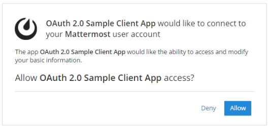
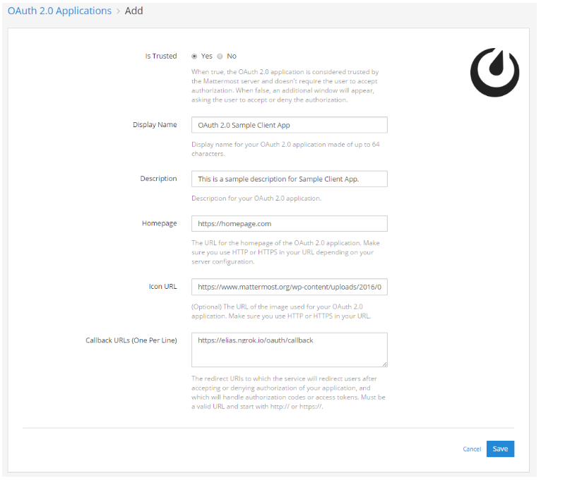
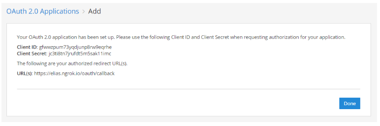
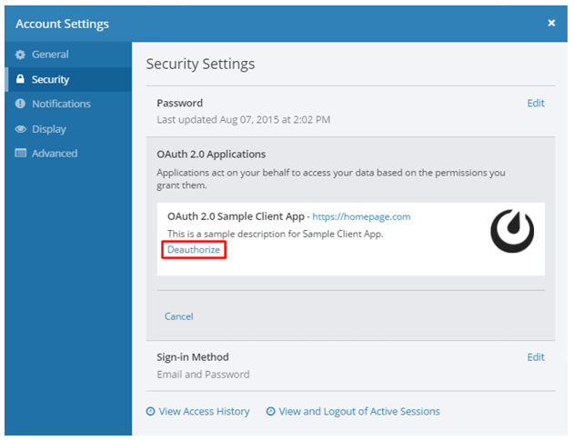

OAuth 2.0 Applications
======================

OAuth 2.0 is a protocol that allows Mattermost to authorize API requests from external applications. The authorization allows 

 - users with an account on a Mattermost server to sign in to third-party applications. You can find a `sample OAuth2 Client Application for Mattermost here <https://github.com/enahum/mattermost-oauth2-client-sample>`_ to test the functionality.

 - a Mattermost server to authenticate requests to a third-party API. One popular application is Zapier integration which allows you to integrate more than 700 applications with Mattermost through OAuth 2.0. See our `Zapier documentation <https://docs.mattermost.com/integrations/zapier.html>`_ to learn more.

This documentation includes the following details:

 - `Register your application in Mattermost <https://docs.mattermost.com/developer/oauth-2-0-applications.html#id1>`_
 - `Granting permissions to your application <https://docs.mattermost.com/developer/oauth-2-0-applications.html#id3>`_

Register your application in Mattermost
---------------------------------------------------------

You must register your application in Mattermost to generate OAuth 2.0 credentials (client ID and secret), which your application can use to authenticate API calls to Mattermost, and which Mattermost uses to authorize API requests from the application.

If you would like to set up a Zapier integration with OAuth 2.0, see our `Zapier documentation <https://docs.mattermost.com/integrations/zapier.html>`_ to learn more.

Enable OAuth 2.0 Applications
~~~~~~~~~~~~~~~~~~~~~~~~~~~~~

OAuth 2.0 applications are off by default and can be enabled by the System Administrator as follows:

1 - Login to your Mattermost server as the System Administrator.

2 - Go to **Main Menu > System Console > Integrations > Custom Integrations**.

3 - Set `Enable OAuth 2.0 Service Provider <https://docs.mattermost.com/administration/config-settings.html#enable-oauth-2-0-service-provider>`_ to **True**.

4 - (Optional) If you would like to allow external applications to post with customizable usernames and profile pictures, then set `Enable integrations to override usernames <https://docs.mattermost.com/administration/config-settings.html#enable-webhooks-and-slash-commands-to-override-usernames>`_ and `Enable integrations to override profile picture icons <https://docs.mattermost.com/administration/config-settings.html#enable-webhooks-and-slash-commands-to-override-profile-picture-iconss>`_ to **True**.

5 - (Optional) If you would like to allow users on your system who are not System Admins to create OAuth 2.0 applications, then set `Restrict managing integrations to Admins <https://docs.mattermost.com/administration/config-settings.html#restrict-managing-integrations-to-admins>`_ to **False**.

Register an OAuth 2.0 Application
~~~~~~~~~~~~~~~~~~~~~~~~~~~~~~~~~
1 - Go to **Main Menu** > **Integrations**

2 - Click **OAuth 2.0 Applications**, then click **Add OAuth 2.0 Application**

3 - Set **Is Trusted**: When set to **Yes**, your application is considered trusted by Mattermost. This means Mattermost doesn't require users to accept authorization when signing to third-party applications. When set to **No**, users will be provided with the following page to accept or deny authorization when authenticating for the first time.

4 - Specify the **Display Name**: Enter a name for your application made of up to 64 characters. This is the name users will see when granting access to the application, when viewing a list of authorized applications in **Account Settings > Security > OAuth 2.0 Applications** and when viewing a list of OAuth 2.0 applications in **Main Menu** > **Integrations**.

5 - Add **Description**: This is a short description of your application that users will see when viewing a list of authorized applications in **Account Settings > Security > OAuth 2.0 Applications**.

6 - Specify the **Homepage**: This is the homepage of the OAuth 2.0 application and lets users visit the app page to learn more what it does. The URL must be a valid URL and start with ``http://`` or ``https://`` depending on your server configuration.

7 - (Optional) Add **Icon URL**: The image users will see when viewing a list of authorized applications in **Account Settings > Security > OAuth 2.0 Applications** and when viewing a list of OAuth 2.0 applications in **Main Menu** > **Integrations**. Must be a valid URL and start with ``http://`` or ``https://``.

8 - Add **Callback URLs**: These are the URL(s) to which Mattermost will redirect users after accepting or denying authorization of your application, and which will be the only URL(s) that handle authorization codes or access tokens. If more than one URL is specified, users will be redirected to the URL used for the initial authorization of the app. Each URL must be on a separate line and start with ``http://`` or ``https://``.

9 - Click **Save** to create the application. 

10 - You will be provided with a **Client ID**, **Client Secret** and the authorized redirect URLs. Save these values and use them in your application to connect it to Mattermost.

Note: **Client Secret** can be regenerated by the application creator or System Administrator. Tokens created with the old secret will remain valid and authorization of existing users will continue to work; however, new authorizations and requests for new tokens will fail until the client secret has been updated in your app configuration.

.. image:: ../images/oauth2_regenerate_secret.PNG

Granting permissions to your application 
---------------------------------------------------------

Once you have created an OAuth 2.0 application, all users on the Mattermost server are automatically given access to it. Deleting the application will revoke access from all users, and only the user who created the application or a System Administrator can delete the app.

If the application was set up as a trusted OAuth 2.0 app on the Mattermost server, authorization from users is not required. Otherwise, the following page will be provided to accept or deny authorization when authenticating the app for the first time.

Users can view a list of authorized apps from **Account Settings > Security > OAuth 2.0 Applications**, and revoke authorization from this setting.

