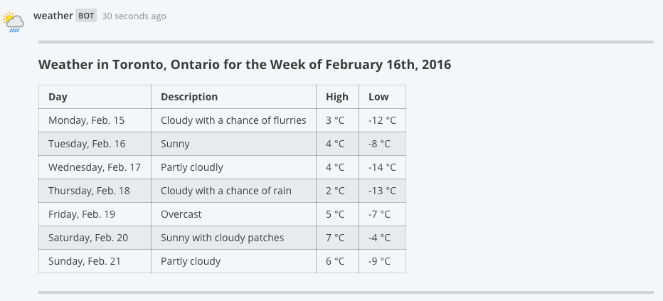
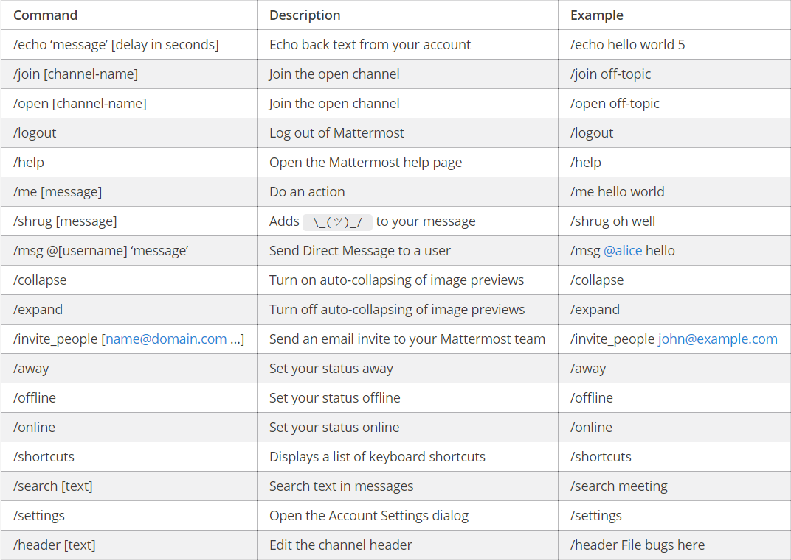

# Slash Commands

Slash commands, like outgoing webhooks, allow users to interact with external applications right from within Mattermost. The user will enter a `/` followed by a command, and optionally some arguments, then an HTTP request will be sent to an external application. What occurs next is decided by how the application responds to the HTTP request.

A couple key points:

- **Mattermost slash commands are Slack-compatible.** If you've used Slack's slash commands to interact with external applications, you can reuse those same applications with Mattermost. Mattermost will automatically translate Slack's proprietary JSON payload format into markdown to render in Mattermost messages
- **Custom commands support auto-complete.** When you a create a custom command for your teammates, you have the option to fill in information about how auto-complete should work with that command. This gives your teammates quick and easy access to use your custom slash command

_Example:_

Suppose you had an external application that had the ability to check the weather for certain cities. By creating a custom slash command, and setting up the application to handle the HTTP POST or GET from the command, you could allow your users to check the weather in their city using your command. For example, a user might be able to type:

`/weather toronto week`

Your external weather application would receive an HTTP request letting it know the user is interested in Toronto and would like to know the weather for the week. The application could simply respond to the HTTP request with the following JSON payload:

```
{"response_type": "in_channel", "text": "
---
#### Weather in Toronto, Ontario for the Week of February 16th, 2016

| Day                 | Description                      | High   | Low    |
|:--------------------|:---------------------------------|:-------|:-------|
| Monday, Feb. 15     | Cloudy with a chance of flurries | 3 °C   | -12 °C |
| Tuesday, Feb. 16    | Sunny                            | 4 °C   | -8 °C  |
| Wednesday, Feb. 17  | Partly cloudly                   | 4 °C   | -14 °C |
| Thursday, Feb. 18   | Cloudy with a chance of rain     | 2 °C   | -13 °C |
| Friday, Feb. 19     | Overcast                         | 5 °C   | -7 °C  |
| Saturday, Feb. 20   | Sunny with cloudy patches        | 7 °C   | -4 °C  |
| Sunday, Feb. 21     | Partly cloudy                    | 6 °C   | -9 °C  |
---
"}
```
Which would render in a Mattermost message as follows:


### Built-in Commands
Each Mattermost installation comes with some built-in slash commands that are ready to use. These commands are listed below:



### Enabling Custom Commands
Custom slash commands are off by default, and can be enabled by the system administrator. If you are the system administrator you can enable them by doing the following:

1. Login to your Mattermost team account that has the system administrator role.
2. Enable slash commands from **System Console** > **Integrations** > **Webhooks and Commands**.
3. (Optional) Configure the **Enable Overriding Usernames from Webhooks and Slash Commands** option to allow custom slash commands to post under any name. If not enabled, the username of the user who activated the command will be used
4. (Optional) Configure the **Enable Overriding Icon from Webhooks and Slash Commands** option to allow custom slash commands to post using any icon. If not enabled, the icon of the user who activated the command will be used
5. (Optional) Configure the **Enable Integrations for Admin Only** option to allow only system and team admins to create slash commands

### Set Up a Custom Command
Once slash commands are enabled, you will be able to set some up through the Mattermost UI. You can do so by following these steps:

1. Login to your Mattermost team site and go to **Main Menu** > **Integrations** > **Slash Commands**
2. Click **Add a new command**, and select your options
   1. Fill in **Command Trigger Word**, this will be the word that is your command (Note: The trigger word must be unique, and cannot contain any spaces)
   2. Enter a **Request URL** that will be the endpoint Mattermost hits to reach your external application
   3. Select an HTTP **Request Method** from the dropdown
   4. (Optional) Type in a **Response Username** that will be used with any messages your command responds with
   5. (Optional) Enter the URL to a **Reponse Icon** that will be used with any messages your command responds with
   6. (Optional) Check the **Show this command in the autocomplete list.** to let users autocomplete your command
   7. (Optional) Fill in an **Autocomplete Hint** to let users know about possible arguments to your command
   8. (Optional) Add an **Autocomplete Description** to help users understand your command
   9. (Optional) Type in a **Descriptive Label** to provide a bit more information about your command
4. Click **Add** to add your command to the system
5. Your new slash command will be displayed with a **Token** that your external application should use to verify the request came from Mattermost

### Creating Integrations with Commands
If you'd like to build your own integration that uses slash commands, you can follow these general guidelines:

1. In the programming language of your choice, write your integration to perform what you had in mind
    1. Your integration should have a function for receiving HTTP POSTs or GETs from Mattermost that look like this example:
        ```
        Content-Length: 244
        User-Agent: Go 1.1 package http
        Host: localhost:5000
        Accept: application/json
        Content-Type: application/x-www-form-urlencoded

        channel_id=cniah6qa73bjjjan6mzn11f4ie&
        channel_name=town-square&
        command=/somecommand&
        response_url=not+supported+yet&
        team_domain=someteam&
        team_id=rdc9bgriktyx9p4kowh3dmgqyc&
        text=hello+world&
        token=xr3j5x3p4pfk7kk6ck7b4e6ghh&
        user_id=c3a4cqe3dfy6dgopqt8ai3hydh&
        user_name=somename
        ```
    2. Your integration must have a configurable **MATTERMOST_TOKEN** variable that is the Token given to you when you set up the custom command in Mattermost as decribed in the previous section _Set Up a Custom Command_. This configurable **MATTERMOST_TOKEN** must match the token in the request body so your application can be sure the request came from Mattermost
    3. If you want your integration to post a message back to the same channel, it can respond to the HTTP POST request from Mattermost with a JSON response body similar to this example:
        ```
        {
          "response_type": "in_channel",
          "text": "This is some response text."
        }
        ```
        - Change `response_type` to "ephemeral" to have the message appear temporarily and only display to the user who activated the command
        - Use the field `goto_location` with a URL as the value to redirect the user of the command to a webpage
2. Set up your integration running on Heroku, an AWS server or a server of your own to start using your application from within Mattermost

Additional Notes:

1. As mentioned previously, [markdown](http://docs.mattermost.com/help/messaging/formatting-text.html) can be used to create richly formatted responses, for example: ```{"text": "# A Header\nThe _text_ below **the** header."}``` creates a messages with a header, a carriage return, italicized text for "text" and bold text for "the"

2. Including `@username` will trigger a mention notification for the person with the specified username, and channels can be mentioned by including `@channel` or `<!channel>`. For example:  ```{"text": "<!channel> this is a notification""}``` would create a message that mentions `@channel` 

3. Just like regular posts, the text in a response will be limited to 4000 characters at maximum

### Slack Compatibility

As mentioned above, Mattermost makes it easy to take integrations written for Slack's proprietary JSON payload format and repurpose them to become Mattermost integrations. The following automatic translations are supported:

1. The HTTP POST and GET request body is formatted the same as Slack's, which means your Slack integration's receiving function should not need to change at all to be compatible with Mattermost
2. JSON responses designed for Slack using `<>` to note the need to hyperlink a URL, such as ```{"text": "<http://www.mattermost.com/>"}```, are translated to the equivalent markdown in Mattermost and rendered the same as you would see in Slack
3. Similiarly, responses designed for Slack using `|` within a `<>` to define linked text, such as ```{"text": "Click <http://www.mattermost.com/|here> for a link."}```, are also translated to the equivalent markdown in Mattermost and rendered the same as you would see in Slack

#### Known Slack Compatibility Issues

1. Using icon_emoji to override the username is not supported  
2. Referencing  channels using <#CHANNEL_ID> does not link to the channel  
3. `<!here>`, `<!everyone>`, and `<!group>` are not supported  
4. Parameters "mrkdwn", "parse", and "link_names" are not supported (Mattermost always converts markdown and automatically links @mentions)  
5. Bold formatting as `*bold*` is not supported (must be done as `**bold**`)  
6. Slack assumes default values for some fields if they are not specified by the integration, while Mattermost does not 

#### Troubleshooting

##### `Command with a trigger of 'trigger_word' returned an empty response` 

If you are using a slash command that previously worked in Slack, try specifying the "response_type" for the slash command. Slack assumes the "response_type" is "ephemeral" while Mattermost does not, so the "response_type" must be specified before the command will work.
