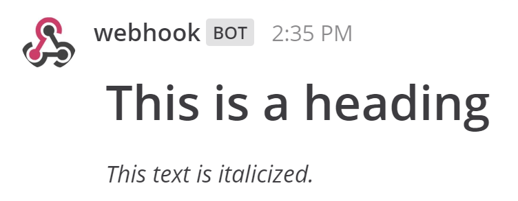
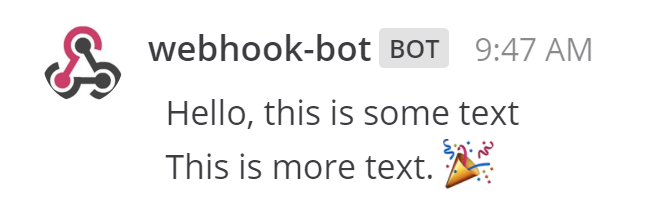

.. _slash-commands:

Slash Commands
==============

Mattermost supports slash commands to easily integrate external applications into the platform. They function similarly to :doc:`outgoing webhooks <../developer/webhooks-outgoing/>`, except they can be used in any channel, including private channels and direct messages.

Messages that begin with ``/`` are interpreted as slash commands. The commands will send an HTTP POST request to a web service, and process a response back to Mattermost. Mattermost supports both `built-in <https://docs.mattermost.com/developer/slash-commands.html#built-in-commands>`_ and `custom slash commands <https://docs.mattermost.com/developer/slash-commands.html#custom-slash-command>`_.

.. toctree::
   :maxdepth: 2

Built-in Commands
------------------------

Each Mattermost installation comes with some built-in slash commands that are ready to use. These commands are available in the `latest Mattermost release <https://about.mattermost.com/download/>`_:

.. csv-table::
    :header: "Command", "Description", "Example"

    "/away", "Set your status away", "/away"
    "/offline", "Set your status offline", "/offline"
    "/online", "Set your status online", "/online"
    "/code *{text}*", "Display text as a code block", "/code File bugs"
    "/collapse", "Turn on auto-collapsing of image previews", "/collapse"
    "/expand", "Turn off auto-collapsing of image previews", "/expand"
    "/echo *{message}* *{delay in seconds}*", "Echo back text from your account", "/echo Hello World 5"
    "/header *{text}*", "Edit the channel header", "/header File bugs here"
    "/purpose *{text}*", "Edit the channel purpose", "/purpose A channel to discuss bugs"
    "/rename *{text}*", "Rename the channel", "/rename Developers"
    "/help", "Open the Mattermost help page", "/help"
    "/invite_people *{name@domain.com ...}*", "Send an email invite to your Mattermost team","/invite_people john@example.com"
    "/join *{channel-name}*", "Join the open channel", "/join off-topic"
    "/open *{channel-name}*", "Join the open channel", "/open off-topic"
    "/leave", "Leave the current channel", "/leave"
    "/logout", "Log out of Mattermost", "/logout"
    "/me *{message}*", "Do an action", "/me Hello World"
    "/msg *{@username}* *{message}*", "Send a Direct Message to a user", "/msg @alice hello"
    "/search *{text}*", "Search text in messages", "/search meeting"
    "/settings", "Open the Account Settings dialog", "/settings"
    "/shortcuts", "Display a list of keyboard shortcuts", "/shortcuts"
    "/shrug *{message}*", "Add ``¯\_(ツ)_/¯`` to your message", "/shrug oh well"

Custom Slash Command
------------------------------

Suppose you want to write an external application that is able to check the weather for certain cities. By creating a custom slash command, and setting up the application to handle the HTTP POST or GET from the command, you can let your users check the weather in their city using your command, say ``/weather toronto week``.

You can follow these general guidelines to set up a custom Mattermost slash command for your application.

1 - First, go to **Main Menu > Integrations > Slash Commands**. If you don't have the **Integrations** option in your Main Menu, slash commands may not be enabled on your Mattermost server or may be disabled for non-admins. Enable them from **System Console > Integrations > Custom Integrations** or ask your System Administrator to do so.

2 - Click **Add Slash Command** and add name and description for the command.

3 - Set the **Command Trigger Word**. The trigger word must be unique and cannot begin with a slash or contain any spaces. It also cannot be one of the `built-in commands <https://docs.mattermost.com/help/messaging/executing-commands.html#built-in-commands>`_.

4 - Set the **Request URL** and **Request Method**. The request URL is the endpoint that Mattermost hits to reach your application, and the request method is either POST or GET and specifies the type of request sent to the request URL.

5 - (Optional) Set the response username and icon the command will post messages as in Mattermost. If not set, the command will use your username and profile picture.

  .. note::
    `Enable integrations to override usernames <https://docs.mattermost.com/administration/config-settings.html#enable-integrations-to-override-usernames>`_ must be set to `true` in `config.json` to override usernames, and `similarly for profile picture icons <https://docs.mattermost.com/administration/config-settings.html#enable-integrations-to-override-profile-picture-icons>`_. Enable them from **System Console > Integrations > Custom Integrations** or ask your System Administrator.

6 - (Optional) Include the slash command in the command autocomplete list, displayed when typing ``/`` in an empty input box. Use it to make your command easier to discover by your teammates. You can also provide a hint listing the arguments of your command and a short description displayed in the autocomplete list.

7 - Hit **Save**. On the next page, copy the **Token** value. This will be used in a later step.

.. image:: ../images/slash_commands_token.png
  :width: 500 px

8 - Next, write your external application. Include a function which receives HTTP POST or HTTP GET requests from Mattermost. The request will look something like this:

.. code-block:: text

   Content-Length: 244
   User-Agent: Go 1.1 package http
   Host: localhost:5000
   Accept: application/json
   Content-Type: application/x-www-form-urlencoded

   channel_id=cniah6qa73bjjjan6mzn11f4ie&
   channel_name=town-square&
   command=/somecommand&
   response_url=not+supported+yet&
   team_domain=someteam&
   team_id=rdc9bgriktyx9p4kowh3dmgqyc&
   text=hello+world&
   token=xr3j5x3p4pfk7kk6ck7b4e6ghh&
   user_id=c3a4cqe3dfy6dgopqt8ai3hydh&
   user_name=somename

9 - Add a configurable *MATTERMOST_TOKEN* variable to your application and set it to the **Token** value from step 7. This value will be used by your application to confirm the HTTP POST or GET request came from Mattermost.

10 - To have your application post a message back to ``town-square``, it can respond to the HTTP POST request with a JSON response payload such as:

.. code-block:: text

   {"response_type": "in_channel", "text": "
   ---
   #### Weather in Toronto, Ontario for the Week of February 16th, 2016

   | Day                 | Description                      | High   | Low    |
   |:--------------------|:---------------------------------|:-------|:-------|
   | Monday, Feb. 15     | Cloudy with a chance of flurries | 3 °C   | -12 °C |
   | Tuesday, Feb. 16    | Sunny                            | 4 °C   | -8 °C  |
   | Wednesday, Feb. 17  | Partly cloudly                   | 4 °C   | -14 °C |
   | Thursday, Feb. 18   | Cloudy with a chance of rain     | 2 °C   | -13 °C |
   | Friday, Feb. 19     | Overcast                         | 5 °C   | -7 °C  |
   | Saturday, Feb. 20   | Sunny with cloudy patches        | 7 °C   | -4 °C  |
   | Sunday, Feb. 21     | Partly cloudy                    | 6 °C   | -9 °C  |
   ---
   "}

Which would render in Mattermost as

.. image:: ../images/weatherBot.PNG
  :alt: Shows what the JSON payload renders as in Mattermost

11 - You're all set! See below for message formatting options for the JSON payload, as well as tips and best practices for setting up your slash command.

Parameters and Formatting
--------------------------

Below we give a brief description of additional parameters that help you customize the post in Mattermost made by your slash command.

Message type
~~~~~~~~~~~~~~~~~~~~

You can use the ``response_type`` parameter to set whether the command posts a regular message or an ephemeral message. Ephemeral messages are only displayed temporarily to the user who activated the command.

For example, to send an ephemeral message, use the following payload.

.. code-block:: text

  payload={"response_type": "ephemeral", "text": "Hello, this is some text\nThis is more text. :tada:"}

To send the response as a regular message, use the following payload.

.. code-block:: text

  payload={"response_type": "in_channel", "text": "Hello, this is some text\nThis is more text. :tada:"}

Redirect to an external webpage
~~~~~~~~~~~~~~~~~~~~~~~~~~~~~~~~

You can use the ``goto_location`` parameter to redirect the user of your command to an external webpage.

If the parameter is present, the user is redirected to the specified URL in a new browser tab. For instance, to redirect the user to `https://about.mattermost.com <https://about.mattermost.com>`_, use the following payload.

.. code-block:: text

  payload={"response_type": "ephemeral", "goto_location": "https://about.mattermost.com", "text": "Hello, this is some text\nThis is more text. :tada:"}

The parameter supports any custom protocol including ``http://``, ``https://``, ``ftp://``, ``ssh://`` and ``mailto://``.

Delayed and multiple responses
~~~~~~~~~~~~~~~~~~~~~~~~~~~~~~~~

You can use the ``response_url`` parameter to supply multiple responses or a delayed response to a slash command. Response URLs can be used to send five additional messages within a 30-minute time period from the original command invocation. 

Delayed responses are useful when the action takes more than three seconds to perform. For instance:
- Retrieval of data from external third-party services, where the response time may take longer than three seconds.
- Report generation, batch processing or other long-running processes that take longer than three seconds to respond.

Any requests that are made to the response URL should either be a plain text or JSON-encoded body. The JSON-encoded message supports both Markdown formatting and message attachments.

Markdown formatting
~~~~~~~~~~~~~~~~~~~~

A rich range of formatting unavailable in Slack is made possible through :doc:`Markdown support <../help/messaging/formatting-text>` in Mattermost, including headings, formatted fonts, tables, inline images and other options supported by Mattermost Markdown. All of these options are also supported by slash commands.

For example, to create a message with a heading and an italicized text on the next line, use the following payload. 

.. code-block:: text

  payload={"text": "# This is a heading\n_This text is italicized._"}

  
Messages with advanced formatting can be created by including an :doc:`attachment array <message-attachments>` in the JSON payload.

Mention notifications
~~~~~~~~~~~~~~~~~~~~~~

You can trigger mention notifications with your message. To trigger a mention, include *@username* in the `text` parameter of the JSON payload.

Channels can be mentioned by including *@channel* or *<!channel>*. For example:

.. code-block:: text

  payload={"text": "<!channel> this is a notification."}

Override the username
~~~~~~~~~~~~~~~~~~~~~

In addition to specifying the response username when setting up your slash command, you can also override it by specifying a ``username`` parameter in your JSON payload.

For example, to send the message as a ``webhook-bot``, use the following payload.

.. code-block:: text

  payload={"username": "webhook-bot", "text": "Hello, this is some text\nThis is more text. :tada:"}
  

To prevent malicious users from trying to perform `phishing attacks <https://en.wikipedia.org/wiki/Phishing>`_, a *BOT* indicator appears next to posts coming from webhooks regardless of what username is specified.

.. note::
  `Enable integrations to override usernames <https://docs.mattermost.com/administration/config-settings.html#enable-integrations-to-override-usernames>`_ must be set to `true` in `config.json` to override usernames. Enable them from **System Console > Integrations > Custom Integrations** or ask your System Administrator. If not enabled, the username is set to `webhook`.

Override the profile picture
~~~~~~~~~~~~~~~~~~~~~~~~~~~~~

Similary to the username, you can also override the profile picture by specifying an ``icon_url`` parameter in your JSON payload.

For example, you can use the following payload to override the profile picture to use the image located at http://example.com/somecoolimage.jpg.

.. code-block:: text

  payload={"icon_url": "http://example.com/somecoolimage.jpg", "text": "Hello, this is some text\nThis is more text. :tada:"}

.. note::
  `Enable integrations to override profile picture icons <https://docs.mattermost.com/administration/config-settings.html#enable-integrations-to-override-profile-picture-icons>`_ must be set to `true` in `config.json` to override usernames. Enable them from **System Console > Integrations > Custom Integrations** or ask your System Administrator. If not enabled, the icon of the creator of the webhook URL is used to post messages.

Tips and Best Practices
------------------------

1. Slash commands are designed to easily allow you to post messages. For other actions such as channel creation, you must also use the `Mattermost APIs <../developer/api.html>`_.

2. If the text in the JSON payload is longer than 4000 characters, the message is split into multiple consecutive posts, each within the 4000 character limit.

3. You can restrict who can create slash commands in `System Console > Integrations > Custom Integrations <https://docs.mattermost.com/administration/config-settings.html#restrict-managing-integrations-to-admins>`_.

4. Mattermost outgoing webhooks are Slack-compatible. You can copy-and-paste code used for a Slack outgoing webhook to create Mattermost integrations. Mattermost `automatically translates Slack's proprietary JSON payload format <../developer/slash-commands#translate-slacks-proprietary-data-format-to-mattermost>`_.

5. The external application may be written in any programming language. It needs to provide a URL which receives the request sent by your Mattermost server and responds with in the required JSON format.

Share Your Integration
-----------------------

If you've built an integration for Mattermost, please consider `sharing your work <https://www.mattermost.org/share-your-mattermost-projects/>`_ in our `app directory <https://about.mattermost.com/default-app-directory/>`_.

The `app directory <https://about.mattermost.com/default-app-directory/>`_ lists open source integrations developed by the Mattermost community and are available for download, customization and deployment to your private cloud or on-prem infrastructure.

Slack Compatibility
-------------------

Mattermost makes it easy to migrate integrations written for Slack to Mattermost. 

Translate Slack's proprietary data format to Mattermost
~~~~~~~~~~~~~~~~~~~~~~~~~~~~~~~~~~~~~~~~~~~~~~~~~~~~~~~~

Mattermost automatically translates the data coming from Slack:

1. JSON payloads written for Slack, that contain the following, are translated to Mattermost Markdown and rendered equivalently to Slack:
   
   - *<>* to denote a URL link, such as ``payload={"text": "<http://www.mattermost.com/>"}``
   - *|* within a *<>* to define linked text, such as ``payload={"text": "Click <http://www.mattermost.com/|here> for a link."}``

2. Both the HTTP POST and GET request bodies sent to a web service are formatted the same as Slack's. This means your Slack integration's receiving function does not need change to be compatible with Mattermost.
  
Known Slack compatibility issues
~~~~~~~~~~~~~~~~~~~~~~~~~~~~~~~~

1. Using ``icon_emoji`` to override the username is not supported.
2. Referencing  channels using ``<#CHANNEL_ID>`` does not link to the channel.
3. ``<!here>``, ``<!everyone>``, and ``<!group>`` are not supported.
4. Parameters "mrkdwn", "parse", and "link_names" are not supported (Mattermost always converts markdown and automatically links @mentions).
5. Bold formatting supplied as ``*bold*`` is not supported (must be done as ``**bold**``).
6. Slack assumes default values for some fields if they are not specified by the integration, while Mattermost does not.

Troubleshooting
---------------

To debug slash commands in **System Console > Logs**, set **System Console > Logging > Enable Webhook Debugging** to ``true`` and set **System Console > Logging > Console Log Level** to ``DEBUG``.

Command with a trigger of 'trigger_word' returned an empty response
~~~~~~~~~~~~~~~~~~~~~~~~~~~~~~~~~~~~~~~~~~~~~~~~~~~~~~~~~~~~~~~~~~~~

If you are using a slash command that previously worked in Slack, try specifying the ``response_type`` for the slash command. 

Slack assumes the ``response_type`` is ``ephemeral`` while Mattermost does not, so the `response_type must be specified <https://docs.mattermost.com/developer/slash-commands.html#message-type>`_ before the command works.
