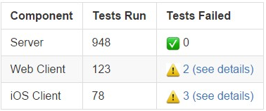

.. _outgoing-webhooks:

Outgoing Webhooks
=================

In addition to :doc:`Incoming Webhooks <../developer/webhooks-incoming/>` Mattermost also supports outgoing webhooks. This allows Mattermost to send a request to a web service and process the response. The outgoing webhook is triggered whenever a user posts to a certain channel, with a trigger word at the beginning of a message, or a combination of both. If the application responds appropriately to the HTTP request, a response message can be posted in the channel where the original post occurred.

A couple of key points:

- **The outgoing webhook is similar to the incoming webhook.** As described in the chapter :doc:`Incoming Webhooks <../developer/webhooks-incoming/>` the application may be written in the programming language of your choice. It needs to provide a URL which reacts to the request send by your Mattermost instance, and may be able to send a HTTP POST in the required JSON format as a response.
- **Mattermost outgoing webhooks are Slack-compatible.** If you've used Slack's outgoing webhooks before, than you can copy and paste that code to create Mattermost integrations. Mattermost automatically translates Slack's proprietary JSON payload format.
- **Outgoing webhooks are supported in public channels only.** If you need a trigger that works in a private channel, consider using a :doc:`Slash Command <slash-commands>` instead.

**Example:**

Suppose you have an external application that should be triggered whenever a message in Mattermost starts with *#build*. If a user posted the message *#build Let's see the status*, then the external application would receive an HTTP POST with data about that message. The application could then calculate all necessary data, such as a statistic of executed software tests. The application then builds the required JSON payload format and sends it as response to Mattermost. Mattermost reads the response and posts a new message.

An example response of such an application might be:

.. code-block:: text

  {"text": "
  | Component  | Tests Run   | Tests Failed                                   |
  |:-----------|:------------|:-----------------------------------------------|
  | Server     | 948         | :white_check_mark: 0                           |
  | Web Client | 123         | :warning: [2 (see details)](http://linktologs) |
  | iOS Client | 78          | :warning: [3 (see details)](http://linktologs) |
  "}

Which would render in a Mattermost message as follows:

Enabling Outgoing Webhooks
--------------------------

Outgoing webhooks are off by default. They need to be enabled by the system administrator. If you are the system administrator you can enable them by doing the following:

1. Login to your Mattermost team account that has the system administrator role.
2. Enable outgoing webhooks from **System Console > Integrations > Custom Integrations**.
3. (Optional) Configure the **Enable integrations to override usernames** option to allow external applications to post messages under any name. If not enabled, the username is set to "webhook".
4. (Optional) Configure the **Enable integrations to override profile picture icons** option to allow external applications to change the icon of the account posting messages. If not enabled, the icon of the creator of the webhook URL is used to post messages.
5. (Optional) Configure the **Restrict managing integrations to Admins** option to allow only system and team admins to create outgoing webhooks.

Set Up an Outgoing Webhook
--------------------------

Once outgoing webhooks are enabled in general, you will be able to set individual webhooks through the Mattermost UI. You will need to know the following:

1. The channel you want to listen to post events from (you can leave the channel field blank if you would like to set up the webhook for all channels).
2. The trigger words (if any) that will trigger a post event if they are the **first word** of the post.
3. The URL you want Mattermost to report the events to.

Once you have this information, you can follow these steps to set up your new webhook:

1. Login to your Mattermost team site and go to **Main Menu > Integrations > Outgoing Webhooks**.
2. Click **Add outgoing webhook**, and select your options.
 1. Select a channel from the **Channel** dropdown to only report events from a certain channel (optional if Trigger Words selected).
 2. Enter comma separated words into **Trigger Words** to only report events from posts that start with one of those words (optional if **Channel** selected).
 3. Enter new line separated URLs that the post events will be sent to.
 4. Choose when to trigger the outgoing webhook; if the first word of a message matches a Trigger Word exactly, or if the first word of a message starts with a Trigger Word.
3. Click **Add** to add your webhook to the system.
4. Your new outgoing webhook will be displayed with a **Token** that any external application that wants to listen to the webhook should ask for in its instructions.

Creating Integrations using Outgoing Webhooks
---------------------------------------------

If you'd like to build your own application that uses outgoing webhooks, you can follow these general guidelines:

1. In the programming language of your choice, write your application to perform what you had in mind.
  1. Your integration should have a function for receiving HTTP POSTs from Mattermost that look like this example:

    .. code-block:: text

      Content-Length: 244
      User-Agent: Go 1.1 package http
      Host: localhost:5000
      Accept: application/json
      Content-Type: application/x-www-form-urlencoded

      channel_id=hawos4dqtby53pd64o4a4cmeoo&
      channel_name=town-square&
      team_domain=someteam&
      team_id=kwoknj9nwpypzgzy78wkw516qe&
      post_id=axdygg1957njfe5pu38saikdho&
      text=some+text+here&
      timestamp=1445532266&
      token=zmigewsanbbsdf59xnmduzypjc&
      trigger_word=some&
      user_id=rnina9994bde8mua79zqcg5hmo&
      user_name=somename

  2. Your integration must have a configurable **MATTERMOST_TOKEN** variable that is the Token given to you when you set up the outgoing webhook in Mattermost as described in the previous section. This configurable **MATTERMOST_TOKEN** must match the token in the request body so your application can be sure the request came from Mattermost
  3. If you want your integration to post a message back to the same channel, it can respond to the HTTP POST request from Mattermost with a JSON response body similar to this example:

  .. code-block:: javascript

    {
      "text": "This is some response text."
    }

2. Set up your integration running on Heroku, an AWS server, or a server of your own to start getting real time post events from Mattermost channels

Additional Notes:

1. With **Enable integrations to override usernames** turned on,  you can also override the username the message posts as by providing a *username* parameter in your JSON payload. For example, you might want your message looking like it came from a robot so you can use the JSON response ``{"username": "robot", "text": "Hello, this is some text."}`` to change the username of the post to robot. Note, to combat any malicious users from trying to use this to perform `phishing attacks <https://en.wikipedia.org/wiki/Phishing>`_ a *BOT* indicator appears next to posts coming from webhooks.

2. With **Enable integrations to override profile picture icons** turned on, you can similarly change the icon the message posts with by providing a link to an image in the *icon_url* parameter of your JSON response. For example, ``{"icon_url": "http://example.com/somecoolimage.jpg", "text": "Hello, this is some text."}`` will post using whatever image is located at *http://example.com/somecoolimage.jpg* as the icon for the post.

3. Also, as mentioned previously, markdown can be used to create richly formatted payloads, for example: ``payload={"text": "# A Header\nThe _text_ below **the** header."}`` creates a message with a header, a carriage return, italicized text for "text" and bold text for "the".

4. Including *@username* in the JSON payload will trigger a mention notification for the person with the specified username. Channels can be mentioned by including *@channel* or *<!channel>*. For example:  ``payload={"text": "<!channel> this is a notification""}`` would create a message that mentions *@channel*.

5. Just like regular posts, the text will be limited to 4000 characters at maximum.

Slack Compatibility
-------------------

As mentioned above, Mattermost makes it easy to take integrations written for Slack's proprietary JSON payload format and repurpose them to become Mattermost integrations. The following automatic translations are supported:

1. The HTTP POST request body is formatted the same as Slack's, which means your Slack integration's receiving function should not need to change at all to be compatible with Mattermost.
2.  JSON responses designed for Slack using *<>* to note the need to hyperlink a URL, such as ``{"text": "<http://www.mattermost.com/>"}``, are translated to the equivalent markdown in Mattermost and rendered the same as you would see in Slack.
3. Similarly, responses designed for Slack using *|* within a *<>* to define linked text, such as ``{"text": "Click <http://www.mattermost.com/|here> for a link."}``, are also translated to the equivalent markdown in Mattermost and rendered the same as you would see in Slack.

To see samples and community contributions, please visit http://mattermost.org/webhooks.

Known Slack Compatibility Issues
~~~~~~~~~~~~~~~~~~~~~~~~~~~~~~~~

1. Using icon_emoji to override the username is not supported.
2. Referencing  channels using <#CHANNEL_ID> does not link to the channel.
3. ``<!here>``, ``<!everyone>``, and ``<!group>`` are not supported.
4. Parameters "mrkdwn", "parse", and "link_names" are not supported (Mattermost always converts markdown and automatically links @mentions).
5. Bold formatting as ``*bold*`` is not supported (must be done as ``**bold**``).
6. Advanced formatting using :doc:`attachments <message-attachments>` is not yet supported.
7. Webhook responses cannot be sent to the direct message channel of the user who created the webhook.
