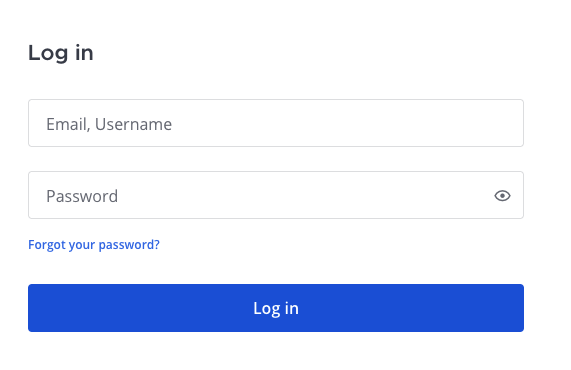

Access your workspace
=====================

.. include:: ../../_static/badges/all-commercial.rst
  :start-after: :nosearch:

Access your Mattermost instance with your credentials using a web browser, the desktop app, or the mobile app for iOS or Android. Depending on how Mattermost is configured, you'll log in using your email address, username, or single sign-on (SSO) username, and your password. See the :doc:`Client availability </end-user-guide/access/client-availability>` documentation to learn which features are available on different Mattermost clients.

.. tip::

  Can't find your Mattermost link? Ask your company's IT department or your Mattermost system admin for your organization's **Mattermost Site URL**. It'll look something like ``https://example.com/company/mattermost``, ``mattermost.yourcompanydomain.com``, or ``chat.yourcompanydomain.com``. These URLs could also end in ``.net``.

.. toctree::
  :maxdepth: 1
  :hidden:
  :titlesonly:

  Install the desktop app </end-user-guide/access/install-desktop-app>
  Install the iOS mobile app </end-user-guide/access/install-ios-app>
  Install the Android mobile app </end-user-guide/access/install-android-app>
  Client availability </end-user-guide/access/client-availability>
  Log out of Mattermost </end-user-guide/access/log-out>

.. tab:: Web/Desktop
  :parse-titles:

  Web browser
  -----------

  1. Open a supported :ref:`web browser <deployment-guide/software-hardware-requirements:pc web>`.
  2. Copy and paste the Mattermost server link into the browser's address field.
  3. Enter your user credentials to log into Mattermost.
  4. Bookmark the Mattermost URL in your web browser of choice so logging into Mattermost is easy in the future.

  Desktop app
  -----------

  1. Download and install the Mattermost desktop app from the App Store (macOS), Microsoft Store (Windows), or by :doc:`using a package manager (Linux) </deployment-guide/desktop/linux-desktop-install>`.
  2. When prompted, enter the Mattermost server link and a display name for the Mattermost instance. The display name is helpful in cases where you connect to multiple Mattermost instances. See the :doc:`server connections </end-user-guide/preferences/connect-multiple-workspaces>` documentation for details.
  3. Enter your user credentials to log into Mattermost.
  4. If the server requires an authentication secret, you'll be prompted to enter it when you connect. Enter the secret provided by your system admin and select **OK**. See the `troubleshooting <#troubleshooting-authentication-secrets>`__ section below for help if you're having issues.
  5. The team that displays first in the team sidebar opens. If you're not a member of a team yet, you're prompted to select a team to join.

  .. note::

    When you log into Mattermost using external user credentials, such as Google or Entra ID, you'll temporarily leave the desktop app during login while authenticating your credentials. Once you're successfully logged in to Mattermost, you'll be returned to the desktop app. See the `Single Sign-On (SSO) <#single-sign-on-sso>`__ section below for details on the external providers that Mattermosts supports.

.. tab:: Mobile
  :parse-titles:

  1. Download and install the Mattermost mobile app from the `Apple App Store (iOS) <https://www.apple.com/app-store/>`__ or `Google Play Store (Android) <https://play.google.com/store/games?hl=en>`__.
  2. When prompted, enter the Mattermost server link and a display name for the Mattermost instance. Server URLs must begin with either ``http://`` or ``https://``. The display name is helpful in cases where you connect to multiple Mattermost instances. See the :doc:`server connections </end-user-guide/preferences/connect-multiple-workspaces>` documentation for details.
  3. Enter your user credentials to log into Mattermost.
  4. Optionally toggle the **Advanced Options** section to enter an **Authentication secret**. This is an additional security measure that some organizations use. Your system admin can provide you with the secret if required. See the `troubleshooting <#troubleshooting-authentication-secrets>`__ section below for help if you're having issues.
  5. The team that displays first in the team sidebar opens. If you're not a member of a team yet, you're prompted to select a team to join.

.. tab:: Mobile via Microsoft Intune
  :parse-titles:

  When your organization uses Microsoft Intune App Protection to secure Mattermost on iOS mobile devices, you must enroll to access Mattermost on mobile. Enrollment adds extra protection to work data while keeping your personal device and apps private.

  What to Expect
  ---------------

  Each time you sign in, Mattermost checks the Intune App Protection Policy applied to your account and automatically enroll your account before you can access your workspace. After enrollment, your Mattermost experience generally stays the same, but some restrictions may be enforced.

  Intune protections apply **per Mattermost workspace** (the Mattermost server you sign in to). If you have access to multiple Mattermost workspaces, each workspace may have different protections and requirements in place. This guide explains what to expect when the workspace you are connecting to is protected by Intune.

  .. note::

    * Intune protections are based on your **user account**, not your Mattermost role or permissions.
    * Intune policies are controlled by your organization, not by Mattermost.
    * Intune enrollment applies only when you sign in using your organization’s **Microsoft/Entra ID** sign-in method (for example, **Sign in with Microsoft**). If you sign in using a different method (such as email/password or another SSO provider), Intune App Protection may not be applied for that workspace.
    * If you’re unsure which sign-in option to use, contact your IT support team.

  Sign In to Enroll
  -----------------

  To sign in and enroll your iOS device:

  1. Open the Mattermost mobile app on your iOS device.
  2. Sign in with Microsoft (your organization’s sign-in option).
  3. Enter your credentials.
  4. When enrollment completes, you are notified.
  5. If your organization’s Intune App Protection Policy requires it, you’ll be prompted to set a PIN to protect your work data. Once the PIN is confirmed, the Mattermost Mobile App unlocks access to your workspace.

  Enrollment happens automatically during sign-in. If you cancel the sign-in flow before it completes, return to the sign-in flow and finish signing in to continue using Mattermost on that device.

  Mid-Session Enrollment
  ----------------------

  If enrollment is triggered while you're already signed in, you may be prompted to confirm your Microsoft sign-in again. This is expected and typically takes only a few seconds.

  If you tap **Cancel**, you won’t be able to continue using Mattermost on that device until enrollment succeeds. You can retry immediately, or `log out <#what-happens-when-i-log-out-manually>`__ and retry later.

  What Changes After Enrollment?
  ------------------------------

  Your organization’s Intune App Protection Policy may restrict how you copy, capture, save, and share data from Mattermost. The exact behavior depends on the specific policy settings your organization has configured.

  Screenshot and Screen Recording Restrictions
  ~~~~~~~~~~~~~~~~~~~~~~~~~~~~~~~~~~~~~~~~~~~~~

  Depending on your organization’s policy, you may not be able to take screenshots or record your screen while using Mattermost. If screenshot or screen recording is blocked, your device may still show the screenshot or recording UI, but the content may not be captured.

  File Save Restrictions
  ~~~~~~~~~~~~~~~~~~~~~~

  Depending on policy, you may not be able to save files from Mattermost to personal or unmanaged locations. Files may be limited to locations approved by your organization.

  Browser and Sharing Restrictions
  ~~~~~~~~~~~~~~~~~~~~~~~~~~~~~~~~~

  Depending on policy, links may open only in an approved browser and sharing may be restricted to managed apps. If you try to open a link in an unapproved browser or share content to an unmanaged app, the action may be blocked.

  Frequently Asked Questions
  --------------------------

  What Happens If I Leave the Organization or Lose My Device?
  ~~~~~~~~~~~~~~~~~~~~~~~~~~~~~~~~~~~~~~~~~~~~~~~~~~~~~~~~~~~

  If you leave the organization, or your device is lost or compromised, your IT support team can wipe Mattermost work data from your iOS device. This is called a **selective wipe**.

  A selective wipe means that:

  * Only Mattermost work data is removed from your device.
  * Personal apps, photos, and files are untouched.
  * You are logged out of the affected Mattermost workspace.
  * Other Mattermost workspaces on your device remain unaffected.

  Why Can’t I Access Mattermost After Enrollment?
  ~~~~~~~~~~~~~~~~~~~~~~~~~~~~~~~~~~~~~~~~~~~~~~~~

  Mattermost may restrict access after enrollment if Intune detects a risk, such as:

  * Your device operating system is out of date
  * The device is too old to meet security requirements
  * A jailbroken device is detected
  * Malware is detected
  * Re-authentication is required

  If this occurs, Intune blocks access and displays an error message in the Mattermost mobile app explaining what action is required. Contact your IT support team for help.

  What Happens When I Log Out Manually?
  ~~~~~~~~~~~~~~~~~~~~~~~~~~~~~~~~~~~~~~

  When you log out of Mattermost:

  * All workspace data is securely removed from the device.
  * Intune protection for that workspace is removed.

  You can sign back in with Microsoft if you need access again.

Reset your password
--------------------

If you've forgotten your password, you can reset it on the login screen by selecting **Forgot your password?**, or by contacting your system admin for assistance.

Magic link login for guests  
----------------------------

.. include:: ../../_static/badges/entry-ent.rst
  :start-after: :nosearch:

From Mattermost v11.3, guests can log in to Mattermost without a password using a secure link sent to their email address when :ref:`enabled by the system admin <administration-guide/onboard/guest-accounts:configure magic links for guests>`. The magic link login provides a streamlined passwordless authentication option for guest users.

If you've been invited as a guest to a Mattermost workspace, enter your email address on the login screen. You'll receive an email with a link to log in without a password. The link expires in 48 hours for security purposes. To log in again at a later time, enter your email address on login to receive a new login link by email that expires in 5 minutes.

.. important::
  
  - Magic link security depends on your email account security.
  - Never share your magic link with anyone else, as doing so would give that person full access to your account.

Email address or username
--------------------------

When :ref:`account creation with email <administration-guide/configure/authentication-configuration-settings:enable account creation with email>` is enabled by your system admin, you can log in with the username or email address used to create a Mattermost account.

Single Sign-On (SSO)
--------------------

When enabled by your system admin, you may log in using your GitLab, Google, Entra ID, AD/LDAP, or SAML credentials.

.. tab:: GitLab

  When enabled by your system admin, you can log in with your GitLab account using a one-click login option.

  .. image:: ../../images/login-gitlab.png
    :alt: Log in to Mattermost using your GitLab credentials.

.. tab:: Google

  When enabled by your system admin, you can log in with your Google account using a one-click login option.

  .. image:: ../../images/login-google.png
    :alt: Log in to Mattermost using your Google Apps credentials.

.. tab:: Entra ID

  When enabled by your system admin, you can log in with your Entra ID account using a one-click login option.

  .. image:: ../../images/sign-in-entraid.png
    :scale: 40
    :alt: Log in to Mattermost with your Entra ID credentials.

.. tab:: AD/LDAP

  When enabled by your system admin, you can log in with your AD/LDAP credentials. This lets you use the same username and password for Mattermost that you use for various other company services.

  .. image:: ../../images/login-ad.png
    :alt: Log in to Mattermost with your AD/LDAP credentials.

.. tab:: SAML

  When enabled by your system admin, you can log in with your SAML credentials. This lets you use the same username and password for Mattermost that you use for various other company services. 
  
  Mattermost officially supports :doc:`Okta </administration-guide/onboard/sso-saml-okta>`, :doc:`OneLogin </administration-guide/onboard/sso-saml-onelogin>`, and Microsoft ADFS as an identity provider (IDP) for SAML, but you may use other SAML IDPs as well. See our :doc:`SAML Single Sign-On documentation </administration-guide/onboard/sso-saml>` to learn more about configuring SAML for Mattermost.

  .. image:: ../../images/login-onelogin.png
    :alt: Log in to Mattermost with SAML credentials, such as OneLogin.

Multi-factor authentication
---------------------------

If your system admin :ref:`enables multi-factor authentication <administration-guide/onboard/multi-factor-authentication:enabling mfa>` for your Mattermost instance, you can :doc:`optionally set up multi-factor authentication </end-user-guide/preferences/manage-your-security-preferences>` for your Mattermost user account by selecting your profile picture located in the top-right corner of Mattermost, and going to **Security > Multi-Factor Authentication**.

If your system admin :ref:`enforces multi-factor authentication <administration-guide/onboard/multi-factor-authentication:enforcing mfa>`, you are required to :doc:`set up multi-factor authentication </end-user-guide/preferences/manage-your-security-preferences>` for your Mattermost account. When you attempt to log in to Mattermost, you're directed to the multi-factor authentication setup page. You won't be able to access Mattermost until multi-factor setup is complete. If you encounter issues setting up multi-factor authentication, contact your Mattermost system admin for assistance.

Troubleshooting authentication secrets
---------------------------------------

If you're having trouble connecting to a Mattermost server that requires an authentication secret, consider the following troubleshooting tips:

- **Authentication secrets are case-sensitive**: Ensure you're entering the secret exactly as provided, including any uppercase letters, numbers, or special characters.
- **Spaces matter**: Don't add extra spaces before or after the secret.
- **Copy/paste issues**: If copying the secret from a document, ensure you're not accidentally copying extra characters. It may be safer to type it manually.
- **Contact your administrator**: If you continue experiencing issues, contact your IT department or Mattermost system administrator. They can verify the secret is configured correctly on the server side.

.. tab:: Desktop

  If you're having trouble connecting to a server with an authentication secret:

  .. list-table::
   :header-rows: 1
   :widths: 40 60

   * - Issue
     - What To Do
   * - Error: **Server authentication required**
     - Your server requires an authentication secret. Enter the secret provided by your system administrator in the modal that appears.
   * - Error: **The provided authentication secret is incorrect**
     - The secret you entered doesn't match the server's configuration. Verify with your system admin that you have the correct secret (secrets are case-sensitive).
   * - **Connection works but then stops**
     - Your organization may have rotated the authentication secret. Try connecting again. The app will automatically prompt you to enter the new secret.
   * - **Modal doesn't appear**
     - If you're not seeing the authentication prompt, try removing the server and adding it again. This will reset all stored credentials.

.. tab:: Mobile

  If you're having trouble connecting to a server with an authentication secret:

  .. list-table::
    :header-rows: 1
    :widths: 40 60

    * - Issue
      - What To Do
    * - Error: **"Authentication secret is invalid"**
      - Tap on the server entry, tap **Edit**, expand **Advanced Options**, verify the secret is entered correctly, and tap **Save** to retry.
    * - **Forgot to enter secret during setup**
      - Tap on the server entry, tap **Edit**, expand **Advanced Options**, enter the secret in the **Authentication secret** field, and tap **Save**.
    * - **Need to update secret after rotation**
      - Swipe left on the server, tap **Edit**, expand **Advanced Options**, update the **Authentication secret** field with the new value, and tap **Save**.
    * - **Error persists with correct secret**
      - Try removing the server completely and adding it again with the authentication secret entered during initial setup.