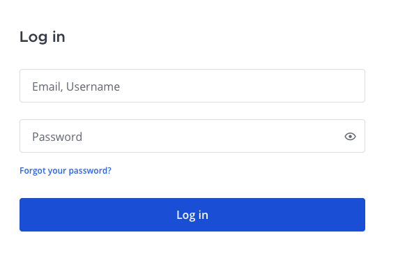

Access your workspace
=====================

.. include:: ../../_static/badges/all-commercial.rst
  :start-after: :nosearch:

Access your Mattermost instance with your credentials using a web browser, the desktop app, or the mobile app for iOS or Android. Depending on how Mattermost is configured, you'll log in using your email address, username, or single sign-on (SSO) username, and your password. See the :doc:`Client availability </end-user-guide/collaborate/client-availability>` documentation to learn which features are available on different Mattermost clients.

.. tip::

  Can't find your Mattermost link? Ask your company's IT department or your Mattermost system admin for your organization's **Mattermost Site URL**. It'll look something like ``https://example.com/company/mattermost``, ``mattermost.yourcompanydomain.com``, or ``chat.yourcompanydomain.com``. These URLs could also end in ``.net``.

.. toctree::
  :maxdepth: 1
  :hidden:
  :titlesonly:

  Install the desktop app </end-user-guide/collaborate/install-desktop-app>
  Install the iOS mobile app </end-user-guide/collaborate/install-ios-app>
  Install the Android mobile app </end-user-guide/collaborate/install-android-app>
  Client availability </end-user-guide/collaborate/client-availability>
  Log out of Mattermost </end-user-guide/collaborate/log-out>

.. tab:: Web/Desktop
  :parse-titles:

  Web browser
  -----------

  1. Open a supported :ref:`web browser <deployment-guide/software-hardware-requirements:pc web>`.
  2. Copy and paste the Mattermost server link into the browser's address field.
  3. Enter your user credentials to log into Mattermost.
  4. Bookmark the Mattermost URL in your web browser of choice so logging into Mattermost is easy in the future.

  Desktop app
  -----------

  1. Download and install the Mattermost desktop app from the App Store (macOS), Microsoft Store (Windows), or by :doc:`using a package manager (Linux) </deployment-guide/desktop/linux-desktop-install>`.
  2. When prompted, enter the Mattermost server link and a display name for the Mattermost instance. The display name is helpful in cases where you connect to multiple Mattermost instances. See the :doc:`server connections </end-user-guide/preferences/connect-multiple-workspaces>` documentation for details.
  3. Enter your user credentials to log into Mattermost.
  4. The team that displays first in the team sidebar opens. If you're not a member of a team yet, you're prompted to select a team to join.

  .. note::

    When you log into Mattermost using external user credentials, such as Google or Entra ID, you'll temporarily leave the desktop app during login while authenticating your credentials. Once you're successfully logged in to Mattermost, you'll be returned to the desktop app. See the `Single Sign-On (SSO) <#single-sign-on-sso>`__ section below for details on the external providers that Mattermosts supports.

.. tab:: Mobile
  :parse-titles:

  1. Download and install the Mattermost mobile app from the `Apple App Store (iOS) <https://www.apple.com/app-store/>`__ or `Google Play Store (Android) <https://play.google.com/store/games?hl=en>`__.
  2. When prompted, enter the Mattermost server link and a display name for the Mattermost instance. Server URLs must begin with either ``http://`` or ``https://``. The display name is helpful in cases where you connect to multiple Mattermost instances. See the :doc:`server connections </end-user-guide/preferences/connect-multiple-workspaces>` documentation for details.
  3. Enter your user credentials to log into Mattermost. 
  4. The team that displays first in the team sidebar opens. If you're not a member of a team yet, you're prompted to select a team to join.

Reset your password
--------------------

If you've forgotten your password, you can reset it on the login screen by selecting **Forgot your password?**, or by contacting your system admin for assistance.

Email address or username
--------------------------

When :ref:`account creation with email <administration-guide/configure/authentication-configuration-settings:enable account creation with email>` is enabled by your system admin, you can log in with the username or email address used to create a Mattermost account.

Single Sign-On (SSO)
--------------------

When enabled by your system admin, you may log in using your GitLab, Google, Entra ID, AD/LDAP, or SAML credentials.

.. tab:: GitLab

  When enabled by your system admin, you can log in with your GitLab account using a one-click login option.

  .. image:: ../../images/login-gitlab.png
    :alt: Log in to Mattermost using your GitLab credentials.

.. tab:: Google

  When enabled by your system admin, you can log in with your Google account using a one-click login option.

  .. image:: ../../images/login-google.png
    :alt: Log in to Mattermost using your Google Apps credentials.

.. tab:: Entra ID

  When enabled by your system admin, you can log in with your Entra ID account using a one-click login option.

  .. image:: ../../images/sign-in-entraid.png
    :scale: 40
    :alt: Log in to Mattermost with your Entra ID credentials.

.. tab:: AD/LDAP

  When enabled by your system admin, you can log in with your AD/LDAP credentials. This lets you use the same username and password for Mattermost that you use for various other company services.

  .. image:: ../../images/login-ad.png
    :alt: Log in to Mattermost with your AD/LDAP credentials.

.. tab:: SAML

  When enabled by your system admin, you can log in with your SAML credentials. This lets you use the same username and password for Mattermost that you use for various other company services. 
  
  Mattermost officially supports :doc:`Okta </administration-guide/onboard/sso-saml-okta>`, :doc:`OneLogin </administration-guide/onboard/sso-saml-onelogin>`, and Microsoft ADFS as an identity provider (IDP) for SAML, but you may use other SAML IDPs as well. See our :doc:`SAML Single Sign-On documentation </administration-guide/onboard/sso-saml>` to learn more about configuring SAML for Mattermost.

  .. image:: ../../images/login-onelogin.png
    :alt: Log in to Mattermost with SAML credentials, such as OneLogin.

Multi-factor authentication
---------------------------

If your system admin :ref:`enables multi-factor authentication <administration-guide/onboard/multi-factor-authentication:enabling mfa>` for your Mattermost instance, you can :doc:`optionally set up multi-factor authentication </end-user-guide/preferences/manage-your-security-preferences>` for your Mattermost user account by selecting your profile picture located in the top-right corner of Mattermost, and going to **Security > Multi-Factor Authentication**.

If your system admin :ref:`enforces multi-factor authentication <administration-guide/onboard/multi-factor-authentication:enforcing mfa>`, you are required to :doc:`set up multi-factor authentication </end-user-guide/preferences/manage-your-security-preferences>` for your Mattermost account. When you attempt to log in to Mattermost, you're directed to the multi-factor authentication setup page. You won't be able to access Mattermost until multi-factor setup is complete. If you encounter issues setting up multi-factor authentication, contact your Mattermost system admin for assistance.
