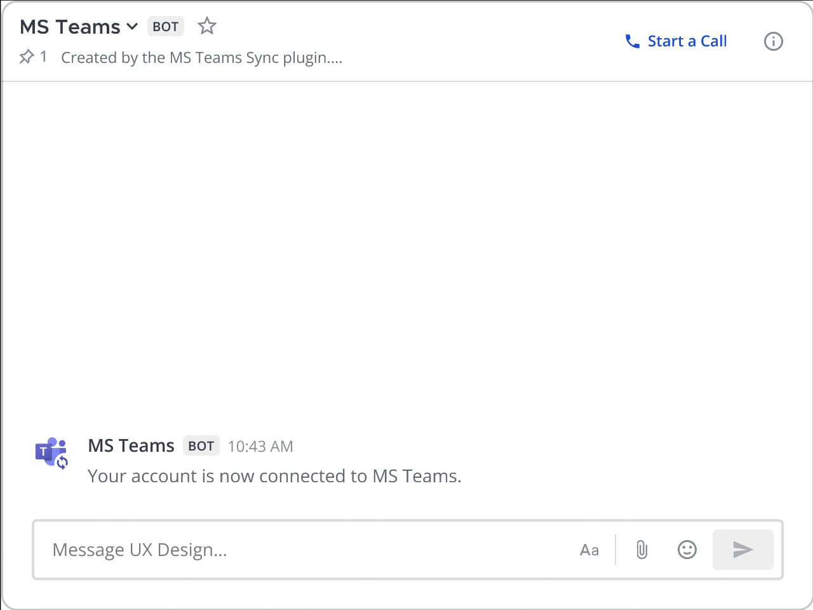
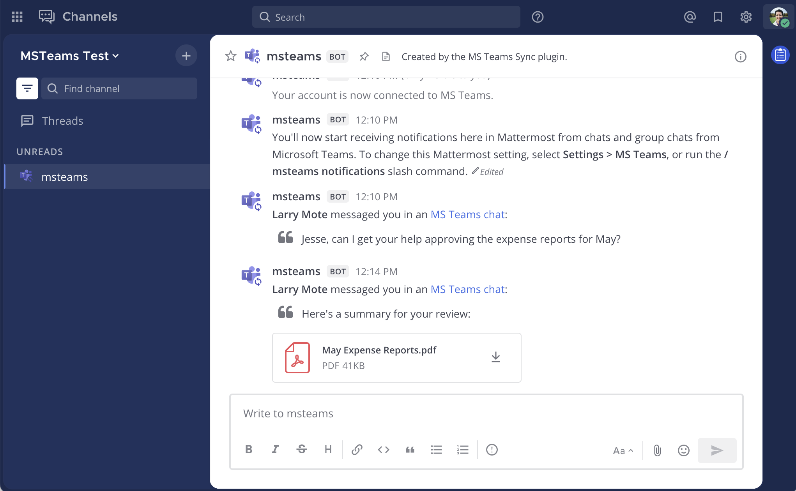
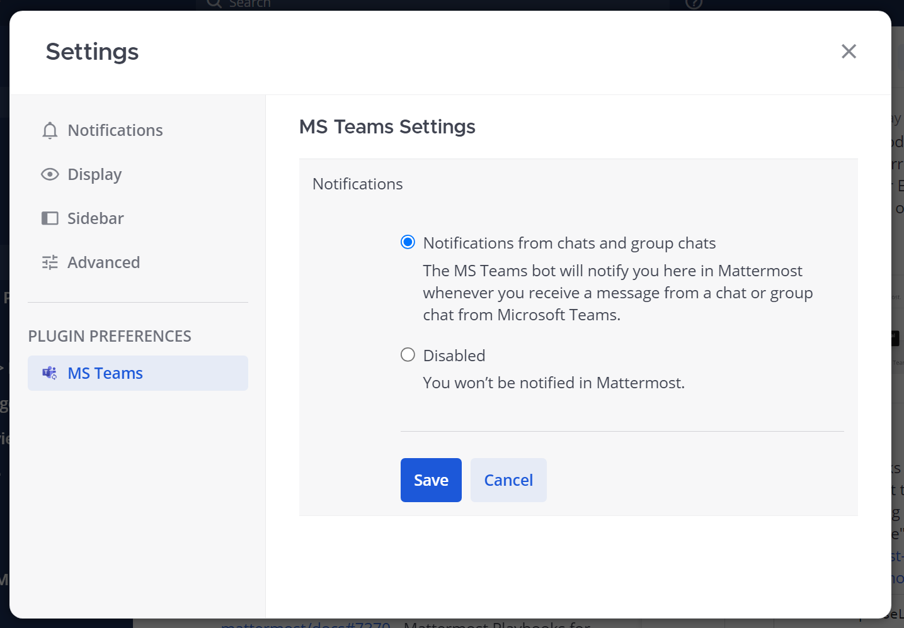

Collaborate within Microsoft Teams
===================================

.. include:: ../../_static/badges/entry-ent.rst
  :start-after: :nosearch:

The Mattermost for Microsoft Teams integration enables you to break through siloes in a mixed Mattermost and Teams environment by forwarding real-time chat notifications from Teams to Mattermost.

.. include:: ../../_static/badges/academy-msteams.rst
  :start-after: :nosearch:

Connect your Mattermost account to your Microsoft Teams account
---------------------------------------------------------------

.. note::
  Your System Administrator must install and enable the :doc:`Mattermost for Microsoft Teams integration </integrations-guide/microsoft-teams-sync>` and ensure :ref:`support for notifications is enabled <administration-guide/configure/plugins-configuration-settings:sync notifications>` in order for you to connect your account and recieve chat notifications. 

Once the integration is installed and configured by a System Administrator, you can connect your Mattermost user account to your Microsoft Teams account. You only need to complete this step once.

1. Log into Mattermost using your credentials. 
2. In any channel, run the ``/msteams connect`` slash command, and select the resulting link.
3. Authenticate with Microsoft Teams using the email address matching your account in Mattermost.

Mattermost will confirm when your account is connected.

Once you've connected your Mattermost account to your Microsoft Teams account, when you're offline or away from Microsoft Teams, any messages you receive in a chat or group chat in Microsoft Teams will display in Mattermost as a notification and include a link to open the chat in Microsoft Teams to continue the conversation. These notifications won't appear if you've been recently active in Teams.

Manage notification settings
~~~~~~~~~~~~~~~~~~~~~~~~~~~~~~~

Manage your Mattermost notification settings for the Microsoft Teams integration at any time in **Settings** > **Plugin Preferences**

.. tip::

  You can run the following :ref:`slash commands <integrations-guide/run-slash-commands:run slash commands>` to manage your integration settings by typing the commands into the Mattermost message text box, and selecting **Send**:

  - ``/msteams connect``: Connect your Mattermost account to Microsoft Teams account.
  - ``/msteams disconnect``: Disconnect your Mattermost account from Microsoft Teams account.
  - ``/msteams status``: Show your current connection status.
  - ``/msteams notifications on|off``: Change your current notifications settings.

Frequently asked questions
---------------------------

How does the integration determine when to send chat notifications?
~~~~~~~~~~~~~~~~~~~~~~~~~~~~~~~~~~~~~~~~~~~~~~~~~~~~~~~~~~~~~~~~~~~ 

Chat notifications are sent in real-time whenever you're not active in Microsoft Teams and receive a chat or group chat. Mattermost uses your online status in Teams to determine if a chat notification should be delivered. Mattermost delivers notifications if you appear **Away** or **Offline** in Microsoft Teams, so the default behavior for when notifications will be delivered depends on the client you typically use to access Microsoft Teams:

- Web browser: Mattermost delivers notifications when you've not had activity in your Microsoft Teams browser tab for 5 minutes or more, when the browser tab is closed, or when you mark yourself as **Offline** in Microsoft Teams.
- Desktop app: Mattermost delivers notifications when you've not had activity at your computer for 5 minutes or more, when the Microsoft Teams desktop app is closed, or when you mark yourself as **Offline** in Microsoft Teams.

In order to avoid double notifications, Mattermost won't deliver chat notifications when your availability is set to **Available**, **Busy**, **Do not disturb**, or **Be right back** in Microsoft Teams.

