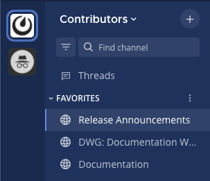
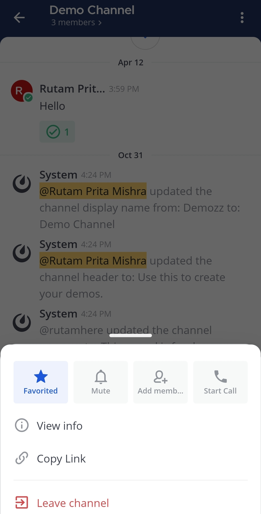
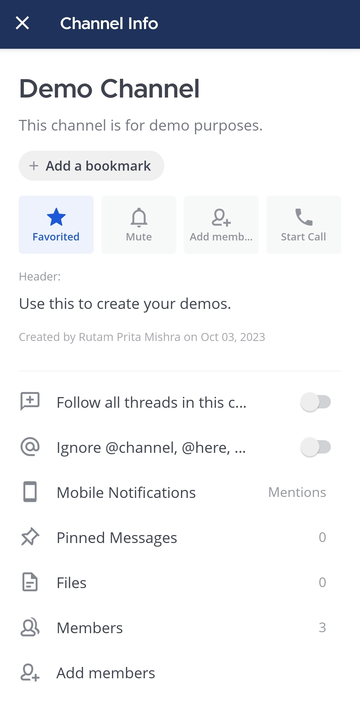

Mark channels as favorites
==========================

.. include:: ../../_static/badges/all-commercial.rst
  :start-after: :nosearch:

You can mark public and private channels, as well as direct and group messages as favorites so they're easy to access later. Favorite channels display in the **Favorites** category in the channel sidebar.

To mark a channel as a **Favorite**:

.. tab:: Web/Desktop

  1. Open a channel.
  2. Select on the star icon next to the channel name.

  At the top of the page, select the |favorite-icon| icon next to the channel name.

  .. image:: ../../images/favorite-channel-desktop.png
    :alt: Mark a channel as a favorite.

  To remove a channel from your **Favorites** list, select the |favorite-icon| icon again.

  Alternatively to mark channels as favorites, select the channel name, select the **View Info** |channel-info| icon, then select **Favorite** in the right pane. Select **Favorited** to remove the channel from your list of favorites.

.. tab:: Mobile

  1. Tap the channel you want to mark as a favorite.

  .. image:: ../../images/mobile-select-a-channel.jpg
      :alt: Select a channel that you want to mark as favorite.
      :scale: 30

  2. Tap the |more-icon-vertical| icon located in the top right corner of the app.

  .. image:: ../../images/mobile-select-more-options-for-a-channel.jpg
      :alt: Tap on More options to access available options for the channel.
      :scale: 30

  3. Tap **Favorite**.

  .. image:: ../../images/mobile-select-view-info-for-a-channel.jpg
      :alt: Tap on Favorite to mark the channel as one of the favorites.
      :scale: 30

  Alternatively, you can mark a favorite channel as follows:

  1. In a channel, tap the channel name at the top of the screen.

  .. image:: ../../images/mobile-select-more-options-for-a-channel.jpg
      :alt: Tap on the channel name to view available options for the channel.
      :scale: 30

  2. Tap on **Favorite**

  .. image:: ../../images/mobile-favorite-a-channel-within-channel.jpg
      :alt: Tap on Favorite to mark the channel as one of the favorites.
      :scale: 30
  
To remove a channel from the **Favorites** list, tap the **Favorited** option.

