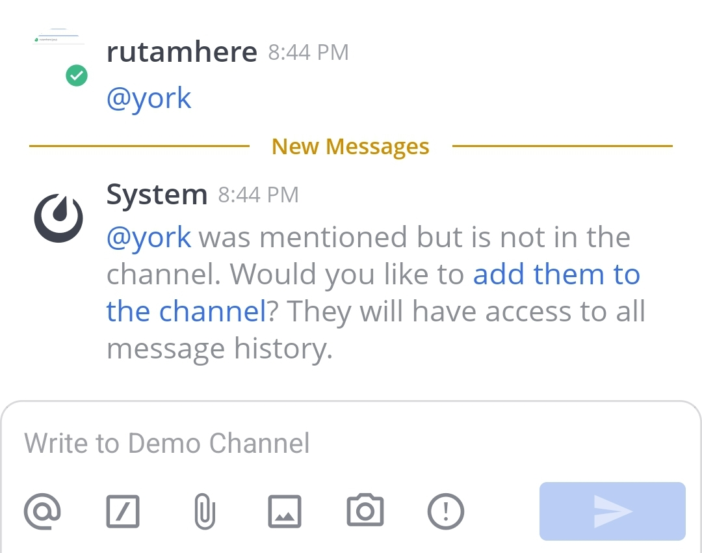

Manage channel members
=======================

.. include:: ../../_static/badges/all-commercial.rst
  :start-after: :nosearch:

Add members to a channel
------------------------

Any member of a channel can add other members to public or private channels, unless your system admin has restricted access to do so.

When a channel has :doc:`attribute-based access controls </administration-guide/manage/admin/attribute-based-access-control>` enabled, you'll see details about which user attributes are permitted access to the channel. Only users who meet the requirements appear in search results when adding members to that channel.

.. tab:: Web/Desktop

  To add members to a channel:

  1. Select the channel name at the top of the center pane to access the drop-down menu, then select **Add Members**.

     .. image:: ../../images/add-member-to-channel.png
      :alt: Use options available through the channel name to add a member to a channel.

  2. Search for users, select users, then select **Add** to add users to the current channel. Mattermost notifies you when a user is already a member of the channel.

     .. tip::

        - From Mattermost v7.8, people you've messaged directly are listed first, followed by all users in alphabetical order.
        - Alternatively, to add members to a channel, select the channel name, select the **View Info** |channel-info| icon, select **Members** in the right pane, and then select **Add**. If the channel has access control restrictions, you'll see details about required attributes at the top of the right pane.

.. tab:: Mobile

  To add members to a channel:

  1. Tap the channel name at the top of the screen.

     .. image:: ../../images/mobile-channel-name-click.jpg
        :alt: Click on the channel name to explore available options.
        :scale: 30

  2. Tap **Add members**.

     .. image:: ../../images/mobile-edit-channel.jpg
        :alt: Tap on Add members to add members to the channel.
        :scale: 30

  3. Select members to add to the channel. You can scroll through the alphabetical list of members, or search for members in the Search field.

     .. image:: ../../images/mobile-select-members-to-add-to-a-channel.jpg
        :alt: Select a user from the list and search one using the search field that you want to add to the channel.
        :scale: 30

  4. Tap **Add Members**.

     .. image:: ../../images/mobile-add-selected-member-to-a-channel.jpg
        :alt: Click on Add Members to add the member(s) to the current channel.
        :scale: 30

Mention users
~~~~~~~~~~~~~~

You can also :doc:`@mention users </end-user-guide/collaborate/mention-people>` to add them to a channel. If they're not a channel member, Mattermost prompts you to add them.

Add users from their profile
~~~~~~~~~~~~~~~~~~~~~~~~~~~~

Using a web browser or the desktop app, you can also add users to channels within their profile pop-over.

1. Select a user's profile image.
2. Tap on |add-user-icon| icon.

   .. image:: ../../images/add-member-pop.jpg
     :alt: Use options on a user's profile pop-over to add a member to a channel.
     :scale: 30

3. Type to find a channel name, then select a channel and choose **Add**.

   .. image:: ../../images/mobile-add-user-from-profile.jpg
     :alt: Type the channel name and tap on Add to add the user to it.
     :scale: 30

Leave a channel
----------------

You can leave public or private channels any time.

.. tab:: Web/Desktop

  Select the channel name at the top of the center pane to access the drop-down menu, then select **Leave Channel**. When you have permission to manage channel members, you can also leave a channel by going to **View Info > Members > Manage** and selecting your own name.

.. tab:: Mobile

  1. In a channel, tap |more-icon-vertical| in the top right corner.

     .. image:: ../../images/mobile-select-more-options-for-a-channel.jpg
        :alt: Tap on More options to access available options for the channel you want to leave.
        :scale: 30

  2. Tap **Leave channel**.

     .. image:: ../../images/mobile-select-view-info-for-a-channel.jpg
        :alt: Tap on Leave channel to leave the current channel.
        :scale: 30

  3. Tap on **Leave** to confirm you choice.

     .. image:: ../../images/mobile-confirm-leave-a-channel.jpg
        :alt: Tap on Leave to confirm your choice.
        :scale: 30

Remove other members from a channel
-----------------------------------

Any member of a channel can remove other members from a channel.

.. tab:: Web/Desktop

  You have two ways to remove members from a channel:

  - Select the channel name at the top of the center pane to access the drop-down menu, then select **Manage Members**. Select the member's :doc:`user role </end-user-guide/collaborate/learn-about-roles>`, then select **Remove from Channel**.
  - Select the channel's **View Info** |channel-info| icon, and select **Members** in the right pane. From there, select **Manage**, select a user's role, then select **Remove from Channel**.

  .. image:: ../../images/remove-member-from-channel.png
    :alt: Use options available through the channel name to remove a member from a channel.

.. tab:: Mobile

  1. In a channel, tap |more-icon-vertical| in the top right corner.

     .. image:: ../../images/mobile-select-more-options-for-a-channel.jpg
        :alt: Tap on More options to access available options for the channel you want to leave.
        :scale: 30

  2. Tap **View Info**.

     .. image:: ../../images/mobile-select-view-info-for-a-channel.jpg
        :alt: Tap on View info to view additional information about the channel.
        :scale: 30

  3. Tap **Members**.

     .. image:: ../../images/mobile-edit-channel.jpg
        :alt: Tap on View info to view additional information about the channel.
        :scale: 30

  4. Tap **Manage** in the top right corner of the screen.

     .. image:: ../../images/mobile-view-members-of-a-channel.jpg
        :alt: Tap on Manage to access the user role of the members.
        :scale: 30

  5. Tap a user role to change it, and tap **Remove from Channel**.

     .. image:: ../../images/mobile-manage-channel-members-list.jpg
        :alt: Tap on Manage to access the user role of the members.
        :scale: 30

     .. image:: ../../images/mobile-remove-user-from-a-channel.jpg
        :alt: Tap on Remove from channel to remove the selected user.
        :scale: 30

  6. Tap **Remove**.

     .. image:: ../../images/mobile-confirm-remove-user-from-channel.jpg
        :alt: Tap on Remove to confirm your choice.
        :scale: 30

  7. Tap **Done**.

     .. image:: ../../images/mobile-exit-after-removing-user-from-a-channel.jpg
        :alt: Tap on Done to exit and return to the channel.
        :scale: 30