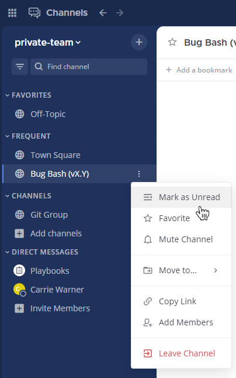

Mark messages as unread
=======================

.. include:: ../../_static/badges/all-commercial.rst
  :start-after: :nosearch:

If you read messages in a channel, but don't have time to address them right away, you can mark that channel as unread. Hover over the channel name in the channel sidebar, select the **More** |more-icon-vertical| option, then select **Mark as Unread**.

.. tip::

  Marking messages as unread displays those channels as bold in the channel sidebar.