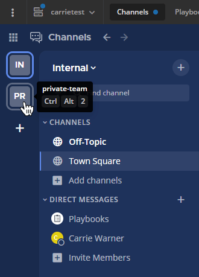
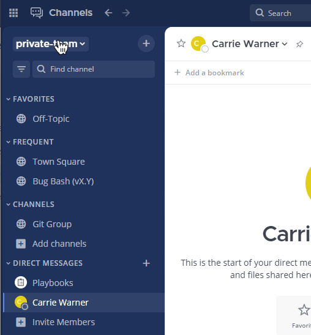

Organize using teams
====================

.. include:: ../../_static/badges/all-commercial.rst
  :start-after: :nosearch:

.. toctree::
   :maxdepth: 1
   :hidden:
   :titlesonly:

   Team settings </end-user-guide/collaborate/team-settings>
   Team keyboard shortcuts </end-user-guide/collaborate/team-keyboard-shortcuts>

A team is a digital :doc:`workspace </end-user-guide/end-user-guide-index>` where you and your teammates can collaborate in Mattermost. Depending on how Mattermost is :ref:`set up <administration-guide/configure/experimental-configuration-settings:primary team>` in your organization, you can belong to one team or multiple teams, and :ref:`access to the team <end-user-guide/collaborate/team-settings:access settings>` can be open or restricted.

Users with the **Create Teams** permission can `create new teams <#create-a-team>`__ and :doc:`manage team settings </end-user-guide/collaborate/team-settings>` for existing teams. System admins can grant the **Create Team** permission to roles via the :ref:`System scheme <administration-guide/onboard/advanced-permissions:system scheme>` or the :ref:`Team override scheme <administration-guide/onboard/advanced-permissions:team override scheme>`.

Single team versus multiple teams
----------------------------------

Mattermost can be deployed both to a single team and to multiple teams. Currently, we recommend deploying to a single team for the following reasons:

- Single team deployments promote communication across the organization. When you add multiple teams, groups can become isolated.
- We don't yet support search or channels across teams, which can impact the cross-team user experience. This includes general searches, saved posts, and recent mentions.
- Integrations (e.g., webhooks and slash commands) are only persistent across single team deployments.

However, some Mattermost customers prefer multiple team deployments for the following reasons:

- Teams are useful when there is a purpose for each of them. For example, one team is used for staff members and another team for external users.
- Performance is better when users are scattered across multiple teams instead of all in the same one. With multiple teams, there is less content to load per team or channel switch and database queries are faster.
- Creating a shared team for all users, and using advanced permissions to control who can create channels and add members to the shared team, improves cross-team collaboration when using multiple teams. Additionally, an annoucement banner can be used to provide system-wide announcements.

Team sidebar
------------

If you belong to more than one team, a team sidebar displays to the left of the channel sidebar. Drag teams to reorder them in the sidebar. You can also use keyboard shortcuts to navigate between teams.

Create a team
--------------

You can create a team using a web browser or the desktop app by selecting a team name, and then selecting **Create a Team**, unless your system admin has disabled your ability to do so.

Team name and URL selection
~~~~~~~~~~~~~~~~~~~~~~~~~~~

There are a few details and restrictions to consider when selecting a team name and team URL.

Team name
^^^^^^^^^

This is the display name of your team that appears in menus and headings.

- Team names can contain any letters, numbers, or symbols.
- Team names are case sensitive.
- Team names must be 2 - 64 characters in length.

Team URL
^^^^^^^^

The team URL is part of the web address that navigates to your team on the system domain, ``https://domain.com/teamurl/``.

- Teams may contain only lowercase letters, numbers, and dashes.
- Teams must start with a letter and cannot end in a dash.
- Teams must be 2 - 64 characters in length.
- Team names cannot start with the following restricted words: ``admin``, ``api``, ``channel``, ``claim``, ``error``, ``files``, ``help``, ``landing``, ``login``, ``mfa``, ``oauth``, ``plug``, ``plugins``, ``post``, ``signup``, or ``playbooks``.

Join a team
-----------

You can join any open teams, or join any team you receive an invitation to join.

If you haven't yet joined any teams in Mattermost, you're prompted to join available teams when you :doc:`log in to Mattermost </end-user-guide/access/access-your-workspace>`.

You can be a member of multiple teams at the same time. To join additional teams, select the current team name, choose **Join Another Team**, and select the name of the team you want to join.

Leave a team
------------

Users can also choose to remove themselves from a team, from **Team menu > Leave Team**. This will remove the user from the team, and from all public channels and private channels on the team.

They will only be able to rejoin the team if it's open, or if they receive a new invitation. If they do rejoin, they will no longer be a part of their old channels.

Remove people from teams
------------------------

Team admins can remove users from a team via **Team menu > Manage Members > Remove From Team** in the dropdown menu beside a user entry.

When a user is removed from a team, the team will no longer be visible or accessible in their team sidebar. If they currently have the team open, they are redirected to the first team that appears in their team sidebar. If they didn't belong to any other teams, the user is sent to the team selection page.

Removing a user from the team does not deactivate the account. The user will still be able to log in to the site, and join other teams. They will also be able to rejoin the team they were removed from if they receive another invite, or if the team is set to :ref:`"Allow anyone with an account on this server to join this team" <end-user-guide/collaborate/team-settings:users on this server>`. If the user does rejoin the team, they will no longer belong to the channels they were previously a part of, and they will lose all Admin privileges if they had them previously.

A system admin can also remove users from teams via **System Console > Users**, and selecting the dropdown beside a user entry and selecting **Manage Teams**. The list of teams an individual user belongs to can be viewed on the user's profile page via **System Console > Users** and selecting the member's name from the list provided in the **User Configuration** screen.

Archive a team
--------------

A Mattermost system admin can archive teams they no longer need by going to **System Console > Teams**, selecting a team, and selecting **Archive Team**. Archived teams can be unarchived if needed.

When a team is archived, the team will no longer be visible or accessible in the team sidebar for any user. If users currently have the team open when it's being archived, users are redirected to the first time that appears in their team sidebar.  If users didn't belong to any other teams, users are sent to the team selection page.

.. note::

  Archiving a team doesn't remove the team data from the Mattermost database. Teams may still be accessible by using the Mattermost API. 