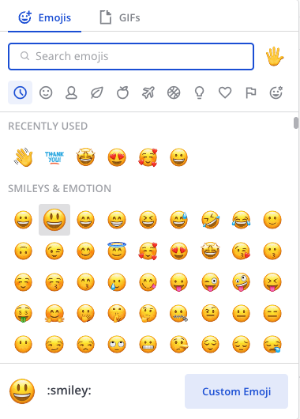

React with emojis and GIFs
===========================

.. include:: ../../_static/badges/all-commercial.rst
  :start-after: :nosearch:

Emojis and GIFs are small, digital images, animated images, or icons you can use to communicate or express concepts such as emotions, humor, and physical gestures in your messages.

From Mattermost v10.10, text emoticons (such as ``:)`` or ``:D``) are automatically converted to emoji characters in your messages by default. You can :ref:`disable this auto-rendering <end-user-guide/preferences/manage-your-display-options:render emoticons as emojis>` if you prefer to keep emoticons as text. 

Quick emoji reactions
-----------------------

You can react with up to 50 emojis per message. Recently used emojis are sorted based on how often you've used them. Don't see your most recently used emojis? Enable quick reactions by going to **Settings > Display** and enabling **Quick reactions on messages**.

.. tab:: Web/Desktop

  Hover over a message to select a recently used emoji.

    .. image:: ../../images/recent-emojis.png
      :alt: React to messages quickly by selecting one of your most recently used emojis.

.. tab:: Mobile

  Long press on a message, and then select a recently used emoji.

Include emojis and GIFs in messages
-----------------------------------

.. tip::

  Can't find the perfect emoji? `Upload your own custom emoji <#upload-custom-emojis>`__.

.. tab:: Web/Desktop

  Select the **Smile** icon |smile-icon| inside the Mattermost message input box to open the emoji and GIF picker. 

  Select an emoji from the **Emojis** tab, or switch to the **GIFs** tab to search for a GIF.

  You can also specify emojis based on their name. Type ``:`` followed by at least two characters of the word describing the emoji. This opens an emoji autocomplete. Descriptions include skin tone details for people-based emojis, where supported.

  .. image:: ../../images/emojiautocomplete.png
    :alt: Emoji autocomplete

.. tab:: Mobile

  Select the |smile-icon| to add an emoji. Mattermost accesses the emojis and GIFs available on your mobile device. You can also specify emojis based on their name. Type at least two characters of the word describing the emoji. This opens an emoji autocomplete.

  .. image:: ../../images/mobile-include-emojis-for-a-message-reaction.gif
    :alt: Tap and hold on a message to access the recent emojis or even choose other ones.
    :scale: 50

Manage emojis
-------------

Using Mattermost in a web browser or the desktop app, you can select recently used emojis, select a default skin tone for people-based emojis, as well as manage custom emojis. From Mattermost mobile v2.37.0, you can select custom emojis and apply custom skin tones on mobile devices.

Select default skin tone
~~~~~~~~~~~~~~~~~~~~~~~~

Select the **Skin tone** icon in the top right corner of the emoji picker to specify the skin tone you prefer to use for people-based emojis by default. You can select an alternate skin tone at any time.

.. image:: ../../images/emoji-skin-tone.png
  :alt: Select a default skin tone preference for people-based emojis.

Upload custom emojis
--------------------

Using Mattermost in a web browser or the desktop app, you can upload new emojis that everyone in your Mattermost :doc:`workspace </end-user-guide/end-user-guide-index>` can access to react to messages, unless your system admin has :ref:`disabled your ability to do so <administration-guide/configure/site-configuration-settings:enable custom emoji>`.

1. From the emoji picker, select **Custom Emoji**. 

2. Enter a name for your custom emoji. This is the name that shows up in the emoji autocomplete.
3. Choose **Select**, then select the image to use for the emoji. Small, square pictures work best when selecting an image to upload. The file can be any JPG, GIF, or PNG that's up to 512 KiB in size.
4. Select **Save**. Once saved, your emoji is added to the list of custom emoji.

.. image:: ../../images/add_custom_emoji.png
  :alt: Name and upload custom emojis to Mattermost.

4. To use your custom emoji in a message, select it from the emoji picker, or type ``:`` followed by your emoji name to bring it up in the emoji autocomplete.

Remove custom emojis
~~~~~~~~~~~~~~~~~~~~

Using Mattermost in a web browser or the desktop app, you can remove custom emojis that you uploaded to Mattermost.

1. Open the emoji picker.
2. Select **Custom Emoji**.
3. If required, use the Search bar to find your custom emoji in the list.
4. Under **Actions** select **Delete**.
5. Choose **Delete** to confirm.

.. image:: ../../images/delete_custom_emoji.png
  :alt: Remove custom emoji