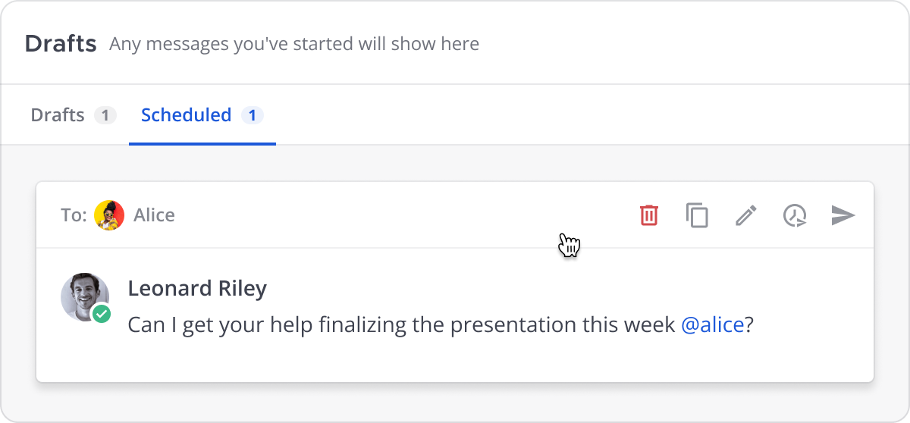

Schedule messages
==================

.. include:: ../../_static/badges/all-commercial.rst
  :start-after: :nosearch:

There are times when you want to send a message, but you don’t want it sent immediately. For example, it may be after working hours for the recipient. Scheduled messages can include a :doc:`priority </end-user-guide/collaborate/message-priority>`, :ref:`request acknowledgements <end-user-guide/collaborate/message-priority:request acknowledgements>`, include :doc:`file attachments </end-user-guide/collaborate/share-files-in-messages>`, and include anything that a non-scheduled message can contain, except :doc:`slash commands </integrations-guide/run-slash-commands>`.

.. tab:: Web/Desktop

    From Mattermost v10.3, you can schedule messages to send in the future. Compose a message, then select the right side of **Send** to schedule when the message will be sent. You can choose from a fixed time or set a custom time, and Mattermost displays both your local time and the recipient’s local time.

    .. image:: ../../images/schedule-a-message.png
        :alt: Compose a message and select the right side of the **Send** button to schedule when the message will be sent.
        :scale: 70

.. tab:: Mobile

    From Mattermost mobile v2.28, you can schedule messages to send in the future. Compose a message, then long press on **Send** to schedule when the message will be sent. You can choose from a fixed time or set a custom time, and Mattermost displays both your local time and the recipient’s local time.

Manage scheduled messages
-------------------------

Once you schedule a message to send in the future, that message is available within the :ref:`Drafts view <end-user-guide/collaborate/send-messages:draft messages>`, under the **Scheduled** tab.

You can manage scheduled messages with the following actions:

- **Delete scheduled post**: Confirm that you want to delete the message.
- **Edit scheduled post**: Make changes to the draft inline before its sent.
- **Copy text**: Copy the draft text.
- **Reschedule message**: Change when the message should be sent.
- **Send now**: Confirm that you want to send the message immediately.

.. note::

    Once you schedule a message, file attachments are read-only and can't be changed.

Troubleshoot scheduled messages
-------------------------------

Scheduled messages may fail for the following reasons:

- You're no longer a member of the channel.
- The channel is archived.
- The channel is read-only.
- The Mattermost server was down for more than 24 hours. Mattermost processes scheduled posts up to 24 hours old, so in cases where the server is down for short time, scheduled messages will be processed. Scheduled messages older than 24 hours may fail to send.

If a scheduled message fails to send, you'll be alerted 2 ways:

- A red badge displays a total scheduled post count in the left pane next to **Drafts**. |scheduled-message-total|
- An alert banner dislays on the **Scheduled** tab

.. note::

    You can't reschedule a failed message, but you can schedule a new replacement message.