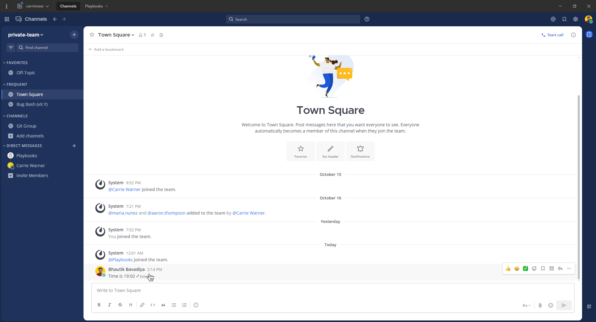

Send messages
=============

.. include:: ../../_static/badges/allplans-cloud-selfhosted.rst
  :start-after: :nosearch:

You can send messages in public and private channels as well as to other users in Mattermost.

.. tip::

  - When you send messages in a channel, depending on the :doc:`channel actions configured </end-user-guide/collaborate/create-channels>`, specific words in the post can trigger a prompt to run a playbook. Access **Channel Actions** from the channel name drop-down menu in the center pane to see what automatic actions have been configured for the current channel.
  - If you're sending a direct message to another user, Mattermost warns you when the recipient's availability is set to :ref:`Do Not Disturb <end-user-guide/preferences/set-your-status-availability:set your availability>`, and when the recipient's local time is outside of regular business hours (between 10PM and 6AM). This warning displays directly above the message text field.

.. tab:: Web/Desktop

  Enter a message in the text field, then select **Send** |send-icon| to send the message. 

  .. tip::
    
    You can also use a keyboard to send messages:
  
    - Press :kbd:`Enter` on Windows or Linux, or :kbd:`↵` on Mac. 
    - You can configure Mattermost to require :kbd:`Shift` :kbd:`Enter` on Windows or Linux, or :kbd:`⇧` :kbd:`↵` on Mac to send multi-line messages. Select the **gear** |gear| icon to go to **Settings**, then select **Advanced > Send messages on CTRL+ENTER**.

.. tab:: Mobile

  1. Tap the text field at the bottom of the Mattermost app to type a message.

  .. image:: ../../images/mobile-type-a-message-in-a-channel.jpg
    :alt: Type a message in the text box at the bottom of the mobile app.
    :scale: 30

  2. Tap **Send** |send-icon| icon to send it in the channel.

  .. image:: ../../images/mobile-sending-a-message.gif
    :alt: Tap on the send icon to send the message in the channel.
    :scale: 50

Draft messages
--------------

From Mattermost v7.7, when composing new messages, it's easy to return to a message in progress later, unless your system admin has :ref:`disabled global drafts <administration-guide/configure/site-configuration-settings:enable server syncing of message drafts>` in the System Console.

By default, message drafts are synchronized on the Mattermost server and are accessible everywhere you access Mattermost, including a web browser or the desktop app. Limit drafts to your current Mattermost client only by going to **Settings > Advanced > Allow message drafts to sync with the server** to disable draft synchronization.

.. tab:: Web/Desktop

  Draft messages are added to a **Drafts** view available at the top of the channel sidebar. 

  .. image:: ../../images/Global-Drafts-Animated-GIF.gif
    :width: 700
    :alt: Global drafts makes it easy for you to find all messages in progress.

.. tab:: Mobile

  When composing a message, you can simply choose to complete it later. The partially composed message is kept in the text field and an **Edit** option |edit-icon| displays next to the channel name.

  From Mattermost v10.5, you'll find local draft messages under **Drafts**. Drafts synchronized to the Mattermost server will be listed under **Drafts** in a future mobile app release.

  .. image:: ../../images/mobile-draft-a-message.gif
    :alt: You can sync a daft message by exiting the channel mid-way while composing the message.
    :scale: 50

Edit messages
--------------

All users can edit their own sent messages, unless the system admin has :doc:`restricted the ability to do so </administration-guide/onboard/advanced-permissions>`.

.. tab:: Web/Desktop

  1. Using Mattermost in a web browser or the desktop app, select the **More** |more-icon| icon next to a message that you've sent.

    .. image:: ../../images/more-actions.png
      :alt: Select the More option to edit or delete a sent message.

  2. Select **Edit** to edit your own messages. Editing a message won't trigger new :doc:`@mention notifications </end-user-guide/collaborate/mention-people>`, or :doc:`desktop notifications </end-user-guide/preferences/manage-your-notifications>`.

  .. tip::

    From Mattermost v10.5, using a web browser or the Mattermost Desktop app, you can also change or remove message attachments when editing your sent messages.

.. tab:: Mobile

  1. Long press on the message that you want to edit and tap on **Edit**.

  .. image:: ../../images/mobile-edit-a-message.gif
    :alt: Tap and hold on a message that you want to edit.
    :scale: 50

  2. Type the updated message and tap on **Save**.

  .. image:: ../../images/mobile-editing-a-message.jpg
    :alt: Type the updated message and tap save to save the edited message.
    :scale: 30

  .. tip::

    From Mattermost server v10.11, when editing messages on mobile, you can also view, delete, and save message attachments. This provides the same attachment management capabilities available on web and desktop platforms.

Delete messages
----------------

.. tab:: Web/Desktop

  All users can delete their own sent messages, unless the system admin has :doc:`restricted the ability to do so </administration-guide/onboard/advanced-permissions>`.

  1. Using Mattermost in a web browser or the desktop app, select the **More** |more-icon| icon next to a message that you want to delete.
  2. Select **Delete** to delete your own messages. Select **Delete** again to confirm.

.. tab:: Mobile

  1. Long Press on the message you want to delete and tap on **Delete**.

  .. image:: ../../images/mobile-delete-a-message.gif
    :alt: Tap and hold on the message that you want to delete.
    :scale: 50

  2. Tap on **Delete** again to confirm your choice.

  .. image:: ../../images/mobile-confirm-delete-a-message.jpg
    :alt: Confirm your choice to delete the message.
    :scale: 30

Restore a previous version of an edited message
-----------------------------------------------

From Mattermost v7.9, `Mattermost Enterprise or Professional <https://mattermost.com/pricing>`__ customers can `edit or delete messages <#edit-or-delete-messages>`__ after sending them if your system admin hasn't restricted the ability to do so using :doc:`advanced permissions </administration-guide/onboard/advanced-permissions>`.

Message recipients can't see your message edit history, and restoring a previous message version won't trigger new :doc:`@mention notifications </end-user-guide/collaborate/mention-people>`.

.. note::
  
  Restoring a previous version of the message is available in the Mattermost desktop app or a web browser. The ability to restore using the mobile app isn't supported.

1. Select the word **Edited** next to your message. 
2. In the right pane, review all previous versions of the message.
3. Select the **Restore** |restore-edit| icon next to the version you want to restore.
4. Select **Confirm**.

Do more with your messages
--------------------------

.. tip::

  Using a RTL plugin, Mattermost can automatically detect and display messages written using right-to-left scripts, such as Arabic, Hebrew, or Persian. Your system admin must install the `RTL Plugin <https://github.com/QueraTeam/mattermost-rtl>`_ to enable this functionality.

Express yourself in Mattermost messages using the following features:

- :doc:`Schedule messages </end-user-guide/collaborate/schedule-messages>`
- :doc:`Set message priority </end-user-guide/collaborate/message-priority>`
- :doc:`Format messages </end-user-guide/collaborate/format-messages>`
- :doc:`Mention people </end-user-guide/collaborate/mention-people>`
- :doc:`Share files </end-user-guide/collaborate/share-files-in-messages>`
- :doc:`Share links to channels and messages </end-user-guide/collaborate/share-links>`
