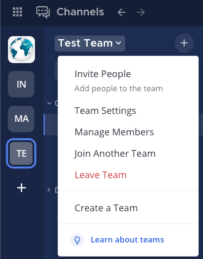
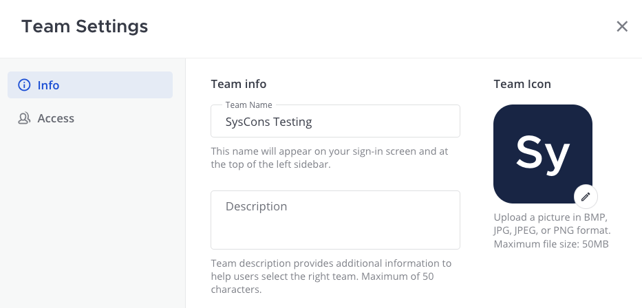

Team settings
=============

.. include:: ../../_static/badges/all-commercial.rst
  :start-after: :nosearch:

Team settings enable system and team administrators to adjust settings applied to a specific team. Using Mattermost in a web browser or the desktop app, select the team name to access **Team Settings**.

Info settings
-------------

Info settings provide configuration options for how teams are displayed to users.

Team name
~~~~~~~~~

Your **Team Name** is displayed on the login screen, and in the top of the channel sidebar for your team.

Team names can contain any letters, numbers, or symbols, must be 2 - 64 characters in length, and are case-sensitive.

.. note::

  Team names don't support `some unicode characters <https://www.w3.org/TR/unicode-xml/#Charlist>`__.

Team description
~~~~~~~~~~~~~~~~

Your **Team Description** is displayed when viewing the list of teams available to join and in the tooltip when hovering over the team name in the team sidebar.

You can enter a description up to 50 characters in length.

.. note::

  Team descriptions don't support `some unicode characters <https://www.w3.org/TR/unicode-xml/#Charlist>`__.

Team icon
~~~~~~~~~

A **Team Icon** displays in the team sidebar. By default, the team icon contains the first two letters of the team name.

To customize the team icon:

1. Select **Team Settings**.

2. Select the Team Icon **Edit** option.

3. Select an icon image in BMP, JPG, or PNG format. We recommend using square images with a solid background color since transparency in PNG icons fills with a white background in the team sidebar.

4. Select **Save**.

.. tip::
  When a team icon is configured, select **Remove image** to reset the team icon to the default icon containing the first two letters of the team name.

Access settings
---------------

Access settings enable the ability to control who can join the team.

Discoverability
~~~~~~~~~~~~~~~

System and team administrators control whether the team is public or private using two selection cards:

- **Public Team** — anyone on the server can find and join. The team appears on the server landing page and in the **Teams you can join** page.
- **Private Team** — only invited members can join. The team isn't listed for users who aren't already members.

.. note::

  From Mattermost v11.10, these cards replace the **Allow any user to join** checkbox. This change applies to every team on every deployment. **Public Team** is equivalent to the checkbox being enabled, and **Private Team** is equivalent to it being disabled.

.. important::

  Switching a team from **Public Team** to **Private Team** regenerates the team's invite code. This creates a new invitation link and invalidates any link shared previously.

.. tip::

  When a team is set to **Public Team**, users looking for more teams to join will also see this team in the list when they select the |plus| icon in the team sidebar.

On teams managed by AD/LDAP group synchronization, the cards aren't shown. Instead, the Access tab displays a message noting that members of the team are added and removed by linked groups.

Users with a specific email domain
~~~~~~~~~~~~~~~~~~~~~~~~~~~~~~~~~~~

System and team administrators can limit who can join the team based on their email domain. Enable this option to specify approved email domains. Separate multiple email domains using spaces, commas, pressing :kbd:`Tab`, or pressing :kbd:`Enter`.

When enabled, only users that have an email domain from the approved domain list is able to join the team. The setting's intent is solely to gate joining a team. Once joined, team members will be able to update their email to a non-approved domain without any restrictions. Additionally, team members who joined prior to approved domains being specified won't be removed from the team once approved email domains are configured and enforced.

.. important::

  Mattermost deployments using :ref:`email authentication <administration-guide/configure/authentication-configuration-settings:enable sign-in with email>` must also enable the :ref:`require email verification configuration setting <administration-guide/configure/authentication-configuration-settings:require email verification>` for domain restrictions to be effective.

Invite code
~~~~~~~~~~~

The **Invite Code** is used as part of the URL in team invitation links. Select **Regenerate** to create a new invitation link and invalidate any previous link.

Team Membership
---------------

.. include:: ../../_static/badges/entry-adv.rst
  :start-after: :nosearch:

From Mattermost v11.10, the **Team Membership** tab is available to Team Admins when :doc:`Attribute-Based Access Control (ABAC) </administration-guide/manage/admin/attribute-based-access-control>` is enabled by a System Admin. It allows Team Admins to view the system policy applied to their team and define attribute-based rules that control who can be a member of the team itself.

On private teams these rules are enforced: users who don't match can't join, and members who no longer match are removed at the next sync. On public teams the rules are advisory — qualifying users are highlighted as recommended, but anyone can still join.

See :doc:`Team membership access policies </administration-guide/manage/admin/abac-team-membership>` for full details.

Channel Membership
------------------

.. include:: ../../_static/badges/entry-adv.rst
  :start-after: :nosearch:

The **Channel Membership** tab is available to Team Admins when :doc:`Attribute-Based Access Control (ABAC) </administration-guide/manage/admin/attribute-based-access-control>` is enabled by a System Admin. It allows Team Admins to create and manage attribute-based membership policies that control access to private channels within the team.

.. note::

  This tab was previously labelled **Membership Policies**. It was renamed in Mattermost v11.10 to distinguish it from the new **Team Membership** tab.

See :doc:`Team-level channel membership policies </administration-guide/manage/admin/abac-team-channel-policies>` for full details.
