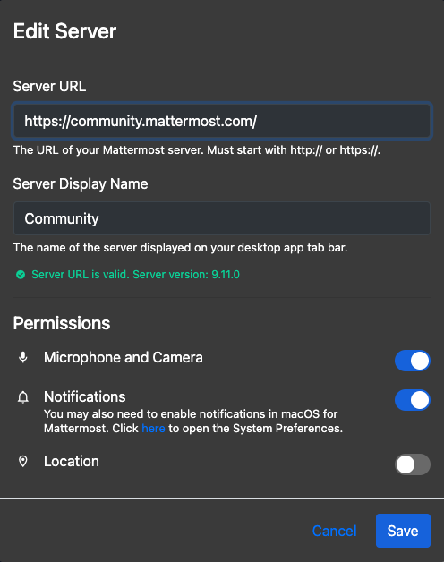

Connect to multiple Mattermost workspaces
=========================================

.. include:: ../../_static/badges/all-commercial.rst
  :start-after: :nosearch:

Using the Mattermost desktop or mobile app, you can connect to multiple Mattermost servers from a single interface, and manage system permissions.

Add a server
------------

.. tab:: Web/Desktop

  The **Server** list is located in the top left corner of the window and displays all servers available. Drag to reorder the servers in the list. You can also navigate the server options using :doc:`keyboard shortcuts </end-user-guide/collaborate/keyboard-shortcuts>`.

  .. note::

    If you're using the desktop app prior to release v5.0, individual servers display as separate tabs at the top of the window instead of the top left corner of the window as a list, and servers are managed by going to **… > File > Settings** on Windows and **Mattermost > Preferences** on Mac.

  1. Select **Add a server**.

    .. image:: ../../images/desktop-server-add.png
      :alt: Connect the desktop app to a Mattermost Server using options located in the top left corner of the Mattermost screen.

  2. Enter the server URL. Server URLs must begin with either ``http://`` or ``https://``.

    .. tip::

      Can't find your Mattermost server URL? Ask your company’s IT department or your Mattermost system admin for your organization’s **Mattermost Site URL**. It’ll look something like ``https://example.com/company/mattermost``, ``mattermost.yourcompanydomain.com``, or ``chat.yourcompanydomain.com``. These URLs could also end in ``.net``.

  3. Enter the server's Display Name.
  4. [Desktop only] If your server requires an authentication secret, you'll be prompted to enter it when you connect. Enter the secret provided by your administrator and select **OK**.
  5. Select **Add**.

.. tab:: Mobile

  Tap the **Servers** |servers-icon| icon located in the top left corner of the window to access all available servers and to add new servers.

  1. Tap **Add a server**.
  2. Enter the server URL. Server URLs must begin with either ``http://`` or ``https://``.

  .. tip::

      Can't find your Mattermost server URL? Ask your company’s IT department or your Mattermost system admin for your organization’s **Mattermost Site URL**. It’ll look something like ``https://example.com/company/mattermost``, ``mattermost.yourcompanydomain.com``, or ``chat.yourcompanydomain.com``. These URLs could also end in ``.net``.

  3. Enter the server's Display Name.
  4. Optionally toggle the **Advanced Options** section to enter an **Authentication secret**. This is an additional security measure that some organizations use. Your system admin can provide you with the secret if required.

    .. image:: ../../images/mobile-server-add-psk.jpg
      :alt: Mobile app server setup screen showing the optional authentication secret field.
      :width: 300px

  5. Tap **Done**.

Edit a server
--------------

.. tab:: Web/Desktop

  1. Hover over a server and select the **Edit** icon.

      .. image:: ../../images/desktop-edit-server.png
        :alt: Edit an existing Mattermost server connection using options located in the top right corner of the Mattermost screen.

  2. Modify the server's display name or URL, then select **Save**.

    [Desktop only] To update an authentication secret, connect to the server. If the secret has changed, you'll be prompted to enter the new one provided by your system admin.

.. tab:: Mobile

  1. Swipe left on an existing server entry to reveal additional options. Tap **Edit**.

    .. image:: ../../images/swipe-left-to-remove.gif
      :width: 300px
      :alt: In the Mattermost mobile app, swipe left on an existing server connection entry to edit the connection.

  2. Modify the server's display name or authentication secret, and then tap **Save**.

    .. image:: ../../images/mobile-edit-server.jpg
      :alt: Mobile app edit server screen showing display name fields.
      :width: 300px

    To view or update the authentication secret, expand the **Advanced Options** section. If a secret is currently configured, it will be pre-filled in the field.

Remove a server
----------------

Removing a server from your desktop app doesn't delete its data. You can add the server back any time.

.. tab:: Web/Desktop

  1. Hover over a server and select **Remove**.

      .. image:: ../../images/desktop-remove-server.png
        :alt: Remove a Mattermost server connection using options located in the top right corner of the Mattermost screen.

  2. Select **Remove** when prompted to confirm.

.. tab:: Mobile

  Tap the **Servers** |servers-icon| icon located in the top left corner of the window to access all available servers and to add new servers.

  Swipe left on an existing server entry to reveal additional options. Tap **Remove**.

  .. image:: ../../images/swipe-left-to-remove.gif
    :width: 400px
    :alt: In the Mattermost mobile app, swipe left on an existing server connection entry to delete the connection.

Switch between workspaces
--------------------------

Select a workspace from the **Servers** list in the top left of the desktop app. See :doc:`keyboard shortcuts </end-user-guide/collaborate/keyboard-shortcuts>` for more navigation options.

Manage system permissions
-------------------------

From Mattermost desktop v5.9, you can manage system permissions when creating or managing existing Mattermost server connections, including: microphone access, camera access, notifications, and location.

Granting a system permission sets it to **Accept**, and revoking it sets it to **Always Deny**.

.. note::

  - You can't manage system permissions when using the Mattermost mobile app.
  - You'll be prompted to accept or deny notifications after adding a new server connection, and any time you open the desktop app if you haven't explicitly accepted or denied system permissions.
  - You may also need to enable notifications for Mattermost within your operating system preferences.

Open multiple workspace contexts
---------------------------------

From desktop v6.0, you can keep multiple workspaces open at the same time and work across them without constant switching to improve situational awareness and operational efficiency. This capability is especially useful for organizations that operate in distributed or multi-domain environments, as it enhances cross-system interoperability and command-level situational awareness.

Select the **New tab** |plus| icon at the top of the desktop app to open a new tab for the current workspace. You can drag and drop to reorder the tabs in the main desktop window.

Open internal Mattermost links in a new tab or window by right-clicking on the link and selecting **Open in new tab** or **Open in new window**.

- Convert tabs to new windows by right-clicking the tab label and selecting **Move to new window**. 
- Convert pop-out windows back to tabs in the main window by right-clicking on the window title and selecting **Move to main window**.
- Close pop-out windows by right-clicking on the window title and selecting **Close window**.

.. tip::

  You can manage windows and tabs from the Desktop app's **File** menu, and review all open tabs from the **Windows** menu.