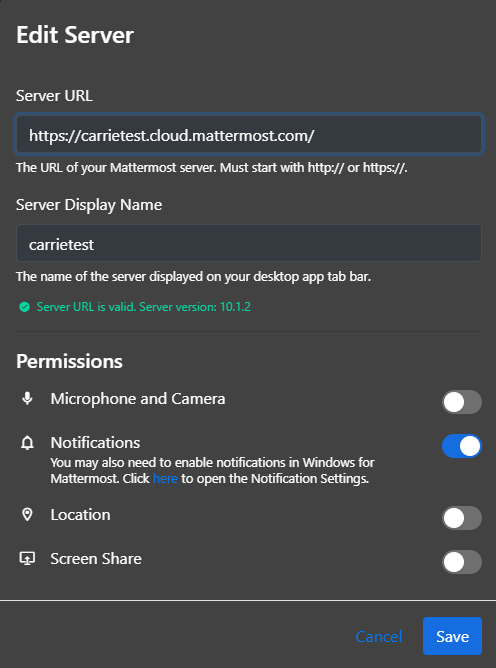

Connect to multiple Mattermost workspaces
=========================================

.. include:: ../../_static/badges/allplans-cloud-selfhosted.rst
  :start-after: :nosearch:

Using the Mattermost desktop or mobile app, you can connect to multiple Mattermost servers from a single interface, and manage system permissions.

.. note::

  You can't create and manage multiple server connections when using Mattermost in a web browser.

Add a server
------------

.. tab:: Web/Desktop

  The **Server** list is located in the top left corner of the window and displays all servers available. Drag to reorder the servers in the list. You can also navigate the server options using :doc:`keyboard shortcuts </end-user-guide/collaborate/keyboard-shortcuts>`.

  .. note::

    If you're using the desktop app prior to release v5.0, individual servers display as separate tabs at the top of the window instead of the top left corner of the window as a list, and servers are managed by going to **… > File > Settings** on Windows and **Mattermost > Preferences** on Mac.

  1. Select **Add a server**.

    .. image:: ../../images/desktop-server-add.png
      :alt: Connect the desktop app to a Mattermost Server using options located in the top left corner of the Mattermost screen.

  2. Enter the server URL. Server URLs must begin with either ``http://`` or ``https://``.

    .. tip::

      Can't find your Mattermost server URL? Ask your company’s IT department or your Mattermost system admin for your organization’s **Mattermost Site URL**. It’ll look something like ``https://example.com/company/mattermost``, ``mattermost.yourcompanydomain.com``, or ``chat.yourcompanydomain.com``. These URLs could also end in ``.net``.

  3. Enter the server's Display Name.
  4. Optionally toggle the **Advanced settings** section to enter a **Pre-authentication Secret**. This is an additional security measure that some organizations use to control access to the Mattermost server. Your system admin can provide you with the **Pre-authentication Secret** value if required.

    .. image:: ../../images/desktop-server-add-2.jpg
      :alt: Desktop app server setup dialog showing the optional pre-authentication secret field.

    .. tip::

      If your server requires a pre-authentication secret for enhanced security, ask your system administrator for the **Pre-authentication Secret** value. This is an additional security measure that some organizations use to control access to their Mattermost server.

  5. Select **Add**.

.. tab:: Mobile

  Tap the **Servers** |servers-icon| icon located in the top left corner of the window to access all available servers and to add new servers.

  1. Tap **Add a server**.
  2. Enter the server URL. Server URLs must begin with either ``http://`` or ``https://``.

  .. tip::

      Can't find your Mattermost server URL? Ask your company’s IT department or your Mattermost system admin for your organization’s **Mattermost Site URL**. It’ll look something like ``https://example.com/company/mattermost``, ``mattermost.yourcompanydomain.com``, or ``chat.yourcompanydomain.com``. These URLs could also end in ``.net``.

  3. Enter the server's Display Name.
  4. Optionally, enter a **Pre-authentication Secret** if required by your server configuration.

    .. image:: ../../images/mobile-server-add-psk.jpg
      :alt: Mobile app server setup screen showing the optional pre-authentication secret field.
      :width: 300px

  5. Tap **Done**.

Edit a server
--------------

.. tab:: Web/Desktop

  1. Hover over a server and select the **Edit** icon.

      .. image:: ../../images/desktop-edit-server.png
        :alt: Edit an existing Mattermost server connection using options located in the top right corner of the Mattermost screen.

  2. Modify the server's display name, URL, or pre-authentication secret, then select **Save**.

    .. image:: ../../images/desktop-edit-server-2.jpg
      :alt: Edit server dialog showing display name, URL, and pre-authentication secret fields.

.. tab:: Mobile

  1. Swipe left on an existing server entry to reveal additional options. Tap **Edit**.

    .. image:: ../../images/swipe-left-to-remove.gif
      :width: 300px
      :alt: In the Mattermost mobile app, swipe left on an existing server connection entry to edit the connection.

  2. Modify the server's display name then tap **Save**.

    .. image:: ../../images/mobile-edit-server.jpg
      :alt: Mobile app edit server screen showing display name fields.
      :width: 300px

Remove a server
----------------

Removing a server from your desktop app doesn't delete its data. You can add the server back any time.

.. tab:: Web/Desktop

  1. Hover over a server and select **Remove**.

      .. image:: ../../images/desktop-remove-server.png
        :alt: Remove a Mattermost server connection using options located in the top right corner of the Mattermost screen.

  2. Select **Remove** when prompted to confirm.

.. tab:: Mobile

  Tap the **Servers** |servers-icon| icon located in the top left corner of the window to access all available servers and to add new servers.

  Swipe left on an existing server entry to reveal additional options. Tap **Remove**.

  .. image:: ../../images/swipe-left-to-remove.gif
    :width: 400px
    :alt: In the Mattermost mobile app, swipe left on an existing server connection entry to delete the connection.

Manage system permissions
-------------------------

From Mattermost desktop v5.9, you can manage system permissions when creating or managing existing Mattermost server connections, including: microphone access, camera access, notifications, and location.

Granting a system permission sets it to **Accept**, and revoking it sets it to **Always Deny**.

.. note::

  - You can't manage system permissions when using the Mattermost mobile app.
  - You'll be prompted to accept or deny notifications after adding a new server connection, and any time you open the desktop app if you haven't explicitly accepted or denied system permissions.
  - You may also need to enable notifications for Mattermost within your operating system preferences.
