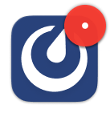

Manage your desktop notifications
=================================

.. include:: ../../_static/badges/all-commercial.rst
  :start-after: :nosearch:

.. |numbered-badge| image:: ../../images/numbered-badge.png
  :alt: A numbered badge means you have at least 1 unread message, @mention, or one of your keywords has triggered a notification.
  :width: 50px

Enable notifications
--------------------

From Mattermost v9.9 and desktop app v5.5, Mattermost prompts you to enable notifications in the desktop app the first time you connect to a Mattermost server.

- When you select **Allow**, you won't be asked again. You'll start receiving notifications in the desktop app for all Mattermost activity with `badges <#badge-based-notifications>`__, `banner alerts <#banner-alerts>`__ and `sounds <#notification-sounds>`__. See the section below on `customizing your notifications <#customize-your-notifications>`__ based on how you prefer to be notified about Mattermost activity in the desktop app.
- If you dismiss this prompt, you won't receive Mattermost notifications in the desktop app, and you'll be prompted again the next time you open Mattermost in the desktop app, or go to **Settings > Notifications > Desktop and mobile notifications**.
- If you select **Deny** or **Deny Permanently**, you won't be asked again. You won't receive Mattermost notifications in the desktop app. You can change this preference by :ref:`editing the server connection <end-user-guide/preferences/connect-multiple-workspaces:edit a server>` to :ref:`manage your notification permissions <end-user-guide/preferences/connect-multiple-workspaces:manage system permissions>`.

.. note::

  You may also need to enable notifications in Windows, macOS, or Linux for Mattermost by changing your System Preferences.

Badge-based notifications
-------------------------

Mattermost desktop app icons display the following types of badges:

- A numbered badge for unread :ref:`direct <end-user-guide/collaborate/channel-types:direct message channels>` :ref:`group <end-user-guide/collaborate/channel-types:group message channels>` messages, :doc:`@mentions </end-user-guide/preferences/manage-your-mentions-keywords-notifications>`, and :doc:`keywords </end-user-guide/preferences/manage-your-mentions-keywords-notifications>` you're actively watching. |numbered-badge|
- A dot badge for unread activity. |dot-badge|

Banner alerts
-------------

Banner alerts in the desktop app are popup windows that display for a limited time in the top right corner of your screen that summarizes the new activity.

Notification sounds
--------------------

By default, desktop app notifications include audible sounds.

Customize your notifications
----------------------------

By default, you are notified when you're @mentioned, when you receive a direct or group message, or for matches to keywords you're following. 

Want to receive notifications about replies to threads you’re following? Select **Notify me about replies to threads I’m following**.

Want notifications for all new messages? Select **Desktop and mobile notifications > All new messages**

Desktop app users can also :doc:`customize their desktop app experience </end-user-guide/preferences/customize-desktop-app-experience>` further based on their platform operating system.

Change or disable sounds
~~~~~~~~~~~~~~~~~~~~~~~~

You can change or disable notification sounds by going to **Desktop notification sounds > Message notification sound**.

Incoming Call notifications
~~~~~~~~~~~~~~~~~~~~~~~~~~~

Want to hear a sound when a Mattermost call starts? If your Mattermost admin :ref:`enables this Beta feature <administration-guide/configure/plugins-configuration-settings:enable call ringing>`, you can choose the sound that plays when a call is started within a direct or group message by going to **Desktop notification sounds > Incoming call sound**.

Disable all desktop notifications
~~~~~~~~~~~~~~~~~~~~~~~~~~~~~~~~~

Select **Desktop and mobile notifications > Nothing** to disable all desktop and :doc:`web notifications </end-user-guide/preferences/manage-your-web-notifications>`.

Clear the **Use different settings for my mobile devices** to additionally disable all Mattermost mobile notifications everywhere you use Mattermost.

Additionally, macOS users can disable notifications for all unread activity in the desktop app by :doc:`customizing your desktop app experience </end-user-guide/preferences/customize-desktop-app-experience>` to disable the **Show red badge on Dock icon to indicate unread messages** option.

Frequently asked questions
---------------------------

What does a Mattermost icon with an exclamation point mean?
~~~~~~~~~~~~~~~~~~~~~~~~~~~~~~~~~~~~~~~~~~~~~~~~~~~~~~~~~~~

.. image:: ../../images/server-logout-indicator.png
  :alt: A Mattermost logo with an exclamation point means you're logged out of at least 1 Mattermost server you connect to using the desktop app.

A Mattermost icon with an exclamation point means that you're logged out of at least 1 Mattermost server you connect to using the desktop app. Log back in to any servers as needed. See the :doc:`Connect to multiple workspaces </end-user-guide/preferences/connect-multiple-workspaces>` documentation for details.

If the icon continues to display, refresh the **Playbooks** and/or **Boards** tabs located at the top of the desktop app window.