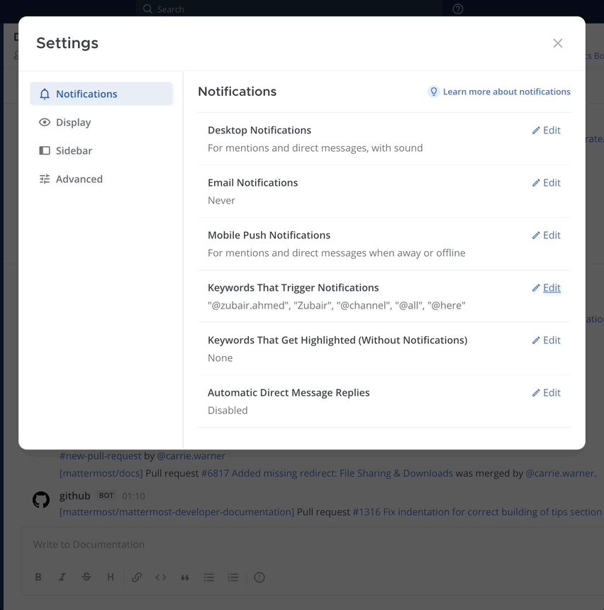
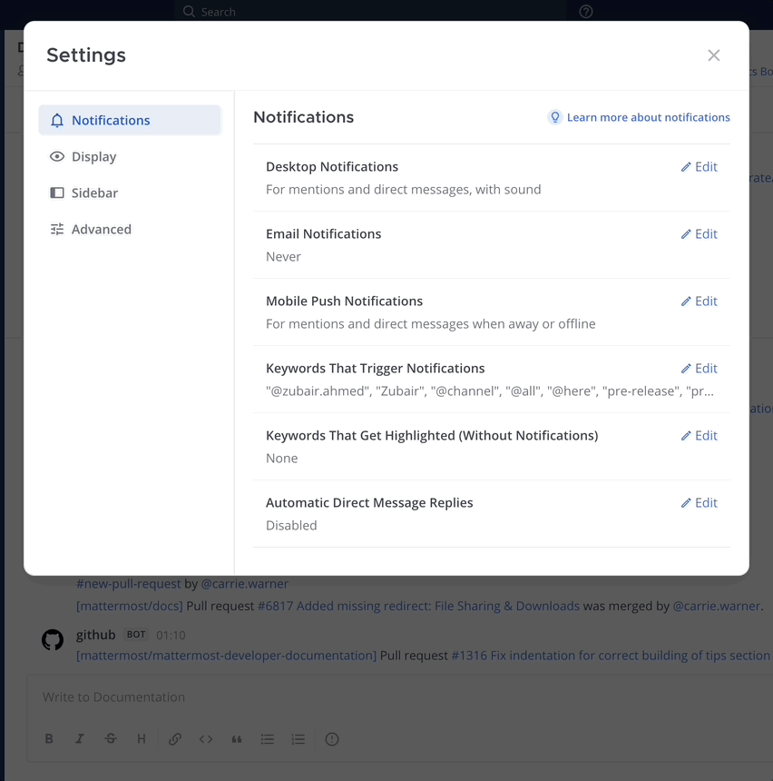

Manage your @mention and keyword notifications
==============================================

.. include:: ../../_static/badges/all-commercial.rst
  :start-after: :nosearch:

You're :doc:`notified </end-user-guide/preferences/manage-your-notifications>` in a :doc:`web browser </end-user-guide/preferences/manage-your-web-notifications>`, the :doc:`desktop app </end-user-guide/preferences/manage-your-desktop-notifications>`, and on your :doc:`mobile device </end-user-guide/preferences/manage-your-mobile-notifications>`, when you're @mentioned by your username or first name, @mentioned as part of a user group, and for matches to keywords you're following.

You're also notified when someone uses channel-wide :doc:`@mentions </end-user-guide/collaborate/mention-people>` including :ref:`@channel and @all <end-user-guide/collaborate/mention-people:@channel and @all>`, as well as :ref:`@here <end-user-guide/collaborate/mention-people:@here>`.

For all other messages, channels appear bolded to indicate unread activity.

Customize notification keywords
--------------------------------

Using a web browser or the desktop app, you can customize keywords to trigger notifications. Keywords aren't case-sensitive.

For example, you can receive notifications for all messages and threads related to a specific topic, project name, or customer.

.. tip::

  Separate multiple keywords using commas or by pressing :kbd:`Tab`, and use :kbd:`Backspace` to manage keywords.

Passively track keywords (no notification)
------------------------------------------

From Mattermost v9.3, Mattermost Enterprise and Professional customers interested calling attention to specific topics of interest across channels can do so without sending notifications to a Mattermost client.
        
Using a web browser or the desktop app, you can passively track key terms by specifying single or multiple words to be highlighted in all channels you're a member of. Keywords and phrases are automatically highlighted using a color based on your :doc:`Mattermost theme </end-user-guide/preferences/customize-your-theme>`.

