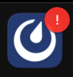

Manage your mobile notifications
=================================

.. include:: ../../_static/badges/all-commercial.rst
  :start-after: :nosearch:

.. |numbered-badge| image:: ../../images/numbered-badge.png
  :alt: A numbered badge means you have at least 1 unread message, @mention, or one of your keywords has triggered a notification.
  :width: 50px

Enable notifications
--------------------

From Mattermost mobile v2.34, the Mattermost **Settings > Notifications** screen alerts you when notifications are disabled by your device. Follow the link in the notification to enable device-level notifications.

From Mattermost v9.9, Mattermost prompts you to enable notifications in the mobile app the first time you open the app.

Once Mattermost notifications are enabled at the device level and in the mobile app, you'll start receiving notifications for all Mattermost activity with `badges <#badge-based-notifications>`__, and `push notifications <#push-notifications>`__. See the section below on `customizing your notifications <#customize-your-notifications>`__ based on how you prefer to be notified about Mattermost activity on your mobile device.

.. note::

  You may also need to enable notifications in iOS or Android for Mattermost by changing your device preferences.

Badge-based notifications
-------------------------

Mattermost mobile app icons display numbered badges for unread :ref:`direct <end-user-guide/collaborate/channel-types:direct message channels>` and :ref:`group <end-user-guide/collaborate/channel-types:group message channels>` messages, and :doc:`@mentions </end-user-guide/preferences/manage-your-mentions-keywords-notifications>`, :doc:`keywords </end-user-guide/preferences/manage-your-mentions-keywords-notifications>` you're actively watching.

|numbered-badge|

.. note::

  - The Mattermost mobile app doesn't display dot badges indicating other unread activity by design. The activity you're directly involved in is prioritized over other activity.
  - Android users may see Mattermost notifications in the Android Notification Shade while the Mattermost icon shows no badge. This is because the Android notification system may also display badges unread activity.

Push notifications
------------------

You'll see mobile push notification messages on your device as follows:

- **iOS**: On the Lock Screen, Notification Center, and as Banners/Alerts based on your iOS settings.
- **Android**: On the Lock Screen, Notification Shade, and as Banners/Heads-Up Notifications based on your Android settings.

Customize your notifications
----------------------------

You can manage your mobile notifications in both the desktop app and the mobile app.

.. tab:: Desktop app

  In the desktop app, manage your mobile notification preferences by selecting the **Settings** |gear| icon located in the top right corner of the screen, and select **Notifications > Desktop and mobile notifications**.

  By default, you receive mobile notifications for @mentions, direct messages, and group messages when your Mattermost availability is :ref:`Online, Away, or Offline <end-user-guide/preferences/set-your-status-availability:set your availability>`. You won't receive Mattermost notifications on your device if you're actively using Mattermost in a web browser.

  - Want to receive fewer mobile notifications? Under **Trigger mobile notifications when I am**, select **Away or Offline** or **Offline**.

  - Want different desktop and mobile notifications? Select **Use different settings for my mobile devices**, and then select **All new messages**, or **Mentions, direct messages and group messages**.

.. tab:: Mobile app

  In the mobile app, tap your profile picture, then tap **Settings > Notifications**.

  - Tap **Mentions** to disable notifications based on keywords that trigger mentions, including first name, username, channel-wide @mentions, and keywords you've specified.
  - Tap **Push Notifications** to choose what to be notified about.

  You can also :ref:`manage email notifications <end-user-guide/preferences/manage-your-notifications:email notifications>` and :ref:`send automatic replies to direct messages <end-user-guide/preferences/manage-your-thread-reply-notifications:send automatic replies to direct messages>` directly from your device.

Incoming Call notifications
~~~~~~~~~~~~~~~~~~~~~~~~~~~

Want to hear a sound on your mobile device when a Mattermost call starts? If your Mattermost admin :ref:`enables this Beta feature <administration-guide/configure/plugins-configuration-settings:enable call ringing>`, select **Call Notifications** to choose the sound that plays when a call is started within a direct or group message you're participating in.

.. tip::

  - From Mattermost mobile app v2.19, incoming call sounds also include device vibration, as well as vibration-only when your device is in silent mode.
  - If you prefer a separate call sound on mobile, your mobile change applies only to your mobile device.

Disable all mobile notifications
~~~~~~~~~~~~~~~~~~~~~~~~~~~~~~~~

To disable all Mattermost mobile notifications, tap **Push Notifications > Nothing**.

Frequently asked questions
--------------------------

Are mobile notification counts the same as other Mattermost clients?
~~~~~~~~~~~~~~~~~~~~~~~~~~~~~~~~~~~~~~~~~~~~~~~~~~~~~~~~~~~~~~~~~~~~~

No. You're only notified of unread threads with @mentions on your mobile device. You're not notified of general unread activity on mobile.

What does a Mattermost icon with an exclamation point mean?
~~~~~~~~~~~~~~~~~~~~~~~~~~~~~~~~~~~~~~~~~~~~~~~~~~~~~~~~~~~

A Mattermost icon with an exclamation point means that you're logged out of at least 1 Mattermost server you connect to using the mobile app. Log back in to any servers as needed. See the :doc:`Connect to multiple workspaces </end-user-guide/preferences/connect-multiple-workspaces>` documentation for details.