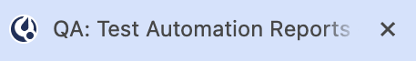

Manage your web notifications
==============================

.. include:: ../../_static/badges/all-commercial.rst
  :start-after: :nosearch:

Enable notifications
--------------------

From Mattermost v9.10, Mattermost prompts you to grant permission to your web browser to show notifications. 

- When you select **Enable notifications**, you won't be asked again. You'll start receiving notifications in your web browser for all Mattermost activity with `badges <#badge-based-notifications>`__ and `sounds <#notification-sounds>`__. See the section below on `customizing your notifications <#customize-your-notifications>`__ based on how you prefer to be notified about Mattermost activity in a web browser.
- If you dismiss this prompt, you won't receive Mattermost notifications in the web browser, and you'll be prompted again the next time you open Mattermost in a web browser, or go to **Settings > Notifications > Desktop and mobile notifications**.
- If you select **Deny** or **Deny Permanently**, you won't be asked again. You won't receive Mattermost notifications in the web browser. You can change this preference by granting notification permissions for Mattermost in the web browser.

Badge-based notifications
-------------------------

In a web browser, Mattermost icons display the following types of badges:

- Numbered badges for unread :ref:`direct <end-user-guide/collaborate/channel-types:direct message channels>` :ref:`group <end-user-guide/collaborate/channel-types:group message channels>` messages, :doc:`@mentions </end-user-guide/preferences/manage-your-mentions-keywords-notifications>`, and :doc:`keywords </end-user-guide/preferences/manage-your-mentions-keywords-notifications>` you're actively watching.

A red dot badge means you have unread @mentions, keywords, direct messages, and group messages. 
|chrome-mention-badge|

A black dot badge means you have unread activity in channels you're a member of. 
|chrome-activity-badge|

Notification sounds
--------------------

By default, web-based notifications include audible sounds.

Customize your notifications
----------------------------

.. tip::

  Mattermost notification settings labeled as Desktop also configure your web-based notifications when using Mattermost in a web browser.

Reduce web notifications
~~~~~~~~~~~~~~~~~~~~~~~~~

To reduce the number of notifications you receive, select **Desktop and mobile notifications > Mentions, direct messages, and group messages**, and save your changes. You can set this preference across all channels or for specific channels.

With limited notifications enabled, you can also choose to receive notifications about replies to threads you're following by selecting **Notify me about replies to threads I'm following**.

Change or disable sounds
~~~~~~~~~~~~~~~~~~~~~~~~

You can change or disable notification sounds by going to **Desktop notification sounds > Message notification sound**.

Incoming Call notifications
~~~~~~~~~~~~~~~~~~~~~~~~~~~

Want to hear a sound when a Mattermost call starts? If your Mattermost admin :ref:`enables this Beta feature <administration-guide/configure/plugins-configuration-settings:enable call ringing>`, you can choose the sound that plays when a call is started within a direct or group message by going to **Desktop notification sounds > Incoming call sound**.

Disable all web notifications
~~~~~~~~~~~~~~~~~~~~~~~~~~~~~

Select **Desktop and mobile notifications > Nothing** to disable all web and desktop notifications.

Clear the **Use different settings for my mobile devices** to additionally disable all Mattermost mobile notifications everywhere you use Mattermost.

Frequently asked questions
--------------------------

Why am I prompted repeatedly enable notifications I don't want?
~~~~~~~~~~~~~~~~~~~~~~~~~~~~~~~~~~~~~~~~~~~~~~~~~~~~~~~~~~~~~~~

Mattermost will continue to prompt you to grant permission to the browser to show notifications until you respond to the prompt. If you want to disable all Mattermost notifications, select **Enable notifications** when prompted, and then `disable all Mattermost web notifications <#disable-all-web-notifications>`__.
