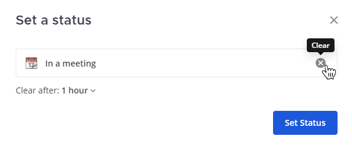
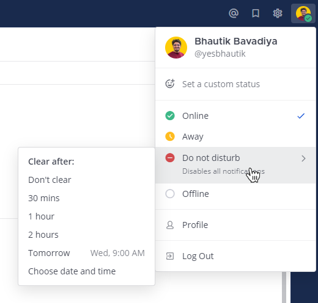

Set your status and availability
=================================

.. include:: ../../_static/badges/all-commercial.rst
  :start-after: :nosearch:

Let your team know whether you're available by setting a :ref:`custom status <end-user-guide/preferences/set-your-status-availability:set a custom status>` and your :ref:`availability <end-user-guide/preferences/set-your-status-availability:set your availability>` in Mattermost. 

Set a custom status
--------------------

Set a custom status to display a descriptive status message and optional emoji next to your name in Mattermost. Other members can see your status anywhere they can see your name, such as the channel sidebar and in conversations. To set a custom status in Mattermost:

.. tab:: Web/Desktop

  1. Select your profile picture, then select **Set a custom status**.
  2. Choose from a list of suggested statuses, or enter a new emoji and status. The Speech bubble emoji 💬  is used by default if you don't specify an emoji. A custom status can be a maximum of 100 characters in length.
  3. Specify when to clear your custom status.
  4. Select **Set Status**.

.. tab:: Mobile

  1. Select your profile picture, then selecting **Set a status**.
  2. Choose from a list of suggested statuses, reuse a recent status, or tap to enter a status and select an emoji. The Speech bubble emoji 💬  is used by default if you don't specify an emoji. A custom status can be a maximum of 100 characters in length.
  3. Specify when to clear your custom status.
  4. Tap **Done**. 

.. tip::

  - Custom statuses are enabled by default in Mattermost. System admins can disable this feature by going to **System Console > Site Configuration > Users and Teams > Enable Custom Statuses**. Disabling this feature also removes the ``Update your status`` prompts in Mattermost.

Clear a custom status
~~~~~~~~~~~~~~~~~~~~~~

To clear a custom status, select your profile picture, then select **Clear Status**, or select the **Clear** option next to your current status.

Set your availability
---------------------

To set your availability, select your profile picture, then specify your availability as  **Online**, **Away**, **Do Not Disturb**, or **Offline**.

+------------------+--------------------------------------------------------------------------------------------------------------------------------------+
| **Availability** | **Description**                                                                                                                      |
+==================+======================================================================================================================================+
| |online|         | Online:                                                                                                                              |
|                  |                                                                                                                                      |
|                  | - Set automatically for you when you're active on Mattermost using a browser, the desktop app, or the mobile app.                    |
|                  | - When using the desktop app, any mouse or keyboard activity keeps your availability set to **Online**.                              |
|                  | - By default, notifications are sent to the browser, the desktop app, and the mobile app.                                            |
+------------------+--------------------------------------------------------------------------------------------------------------------------------------+
| |away|           | Away:                                                                                                                                |
|                  |                                                                                                                                      |
|                  | - Set automatically for you when you've been inactive for more than 5 minutes. System admins can change this                         | 
|                  |   value using an experimental configuation setting called                                                                            |
|                  |   :ref:`user status away timeout <administration-guide/configure/experimental-configuration-settings:user status away timeout>`.     |
|                  |                                                                                                                                      |
|                  | - You're inactive in Mattermost when you're not: typing in or navigating between channels, switching to                              |
|                  |   another browser tab, or when you've minimized or moved the browser window to the background.                                       |
|                  |                                                                                                                                      |
|                  | - You can manually set yourself as **Away** any time.                                                                                |
|                  | - By default, notifications are sent to your Mattermost mobile app.                                                                  |
+------------------+--------------------------------------------------------------------------------------------------------------------------------------+
| |dnd|            | Do Not Disturb:                                                                                                                      |
|                  |                                                                                                                                      |
|                  | - Set your availability as **Do Not Disturb** any time you don't want notifications for a period of time.                            |
+------------------+--------------------------------------------------------------------------------------------------------------------------------------+
| |offline|        | Offline:                                                                                                                             |
|                  |                                                                                                                                      |
|                  | - Set automatically for you when you exit the Mattermost desktop app or close the browser window, sleep or                           |
|                  |   lock your computer, or on mobile when you change apps, close the Mattermost mobile app, or lock your                               |
|                  |   mobile device screen.                                                                                                              |
|                  | - You can manually set yourself as **Offline** any time.                                                                             |
|                  | - By default, notifications are sent to your Mattermost mobile app.                                                                  |
+------------------+--------------------------------------------------------------------------------------------------------------------------------------+

Other members can see your availability anywhere they can see your name, such as the channel sidebar, within conversations, and within direct messages.

Set your availability as Do Not Disturb
~~~~~~~~~~~~~~~~~~~~~~~~~~~~~~~~~~~~~~~

Set your availability to **Do Not Disturb** to disable all desktop, email, and push notifications when you are unavailable or need to concentrate.

You can specify how long to disable notifications by selecting a preset expiration, by setting a custom expiration, or by setting your status as **Don't clear**. Your availability automatically reverts to its previous setting once the expiration is reached (this may take up to five minutes).

