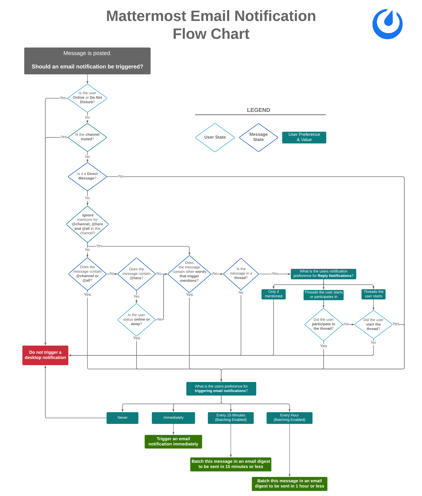

Troubleshoot notifications
==========================

.. include:: ../../_static/badges/all-commercial.rst
  :start-after: :nosearch:

The Mattermost notifications you receive depend on your `Mattermost preferences <#check-your-mattermost-preferences>`__, the `Mattermost client <#check-your-mattermost-client-settings>`__ you're using, and the `operating system (OS) <#check-your-operating-system-settings>`__ you're running Mattermost on.

Send yourself a test notification
----------------------------------

From Mattermost v10.3, you can send yourself a test notification by selecting **Settings** |gear|, and going to the **Notifications** options.

Under **Troubleshooting notifications** select the **Send a test notification** option. If notifications are working, you'll receive a system-bot direct message in Mattermost confirming that notifications are working. 

If you don't receive a system-bot direct message, see the following sections for troubleshooting steps you can follow to ensure you're receiving the notifications you want.

Check your Mattermost preferences
----------------------------------

Start by ensuring that your Mattermost preferences have notifications enabled.

.. tab:: Desktop

  1. Select **Settings** |gear| in the top right corner of Mattermost.
  2. Select **Desktop and mobile notifications**.

  If **Send notifications for** is set to **Nothing**, then Mattermost notifications are currently disabled. Select either the **All new messages** or **Mentions, direct messages, and group messages** option instead, and save your changes.

  .. image:: ../../images/desktop-notification-check.gif
    :alt: Select the Gear icon to enable Mattermost notifications.

.. tab:: Web

  1. Select **Settings** |gear| in the top right corner of Mattermost.
  2. Select **Desktop and mobile notifications**.

  If **Send notifications for** is set to **Nothing**, then Mattermost notifications are currently disabled. Select either the **All new messages** or **Mentions, direct messages, and group messages** option instead.

.. tab:: Mobile

    1. Tap on your profile picture in the bottom right corner of Mattermost.
    2. Tap **Settings** |gear|.
    3. Tap **Notifications**.
    4. Tap **Push Notifications**.
    5. Ensure that **All new messages** or **Mentions, direct messages, and group messages** option is selected.
    6. Under **Trigger push notifications when…**, select **Online, away or offline** to always receive notifications.

We recommend checking your Mattermost client settings next.

Check your Mattermost client settings
-------------------------------------

.. tab:: Desktop

    Ensure notifications are enabled in your Mattermost server connection.

    1. Select the Mattermost Server option in the top left of the desktop app, then edit the server details.
    2. Under **Permissions**, enable **Notifications** and save your changes.

    .. image:: ../../images/desktop-server-notification-check.gif
      :alt: Select the server option to enable Mattermost notifications.

.. tab:: Web

  If you prefer to use Mattermost in a web browser, you must grant notification permissions for Mattermost in the web browser. If you don't, the web browser can block you from receiving Mattermost notifications. 
  
  Select the **Chrome**, **Edge**, **Firefox**, or **Safari** tab below based on your preferred web browser:

  .. tab:: Chrome

    Grant notification permissions for Mattermost in your Chrome web browser.

    1. From the Chrome menu, select **Settings**.
    2. Select **Privacy and Security** in the left pane.
    3. Expand **Site settings**. 
    4. Under **Permissions**, expand **Notifications**.
    5. Enable the **Sites can ask to send notifications** option, and add your Mattermost workspace URL to the **Allowed to send notifications** list. 

  .. tab:: Edge

    Grant notification permissions for Mattermost in your Edge web browser.

    1. From the Edge menu, select the **Settings and more (...)** option.
    2. Select **Cookies and Site Permissions** in the left pane.
    3. Under **All Permissions**, **select Notifications**.
    4. Add your Mattermost workspace URL to the **Allow** section.

  .. tab:: Firefox

    Grant notification permissions for Mattermost in your Firefox web browser. 

    1. From the Firefox menu, select **Settings**.
    2. Select **Privacy and Security** in the left pane.
    3. Under **Permissions**, select the **Settings** option for **Notifications**.
    4. Enable notifications for your Mattermost workspace URL in the **Permissions** list.

  .. tab:: Safari

    Grant notification permissions for Mattermost in your Safari web browser. 

    1. From the Safari menu, select **Preferences**.
    2. Select **Websites** and select **Notifications** in the left pane.
    3. Enable notifications for your Mattermost site.

.. tab:: Mobile 

  Ensure that your mobile device isn't blocking device settings. Visit the **Android** or **iOS** tab below based on your mobile device type.
  
  .. note::
  
    From Mattermost mobile v2.34, if your device has notifications disabled, a banner displays in the Mattermost mobile **Settings > Notifications** screen with a quick link to help you restore device-level notifications.

  .. tab:: Android

    Ensure that your Android device isn't blocking Mattermost notifications by granting notification permission for Mattermost in device settings.

    1. Open the Android **Settings app**, and tap **Application Manager**.
    2. Locate **Google Play Services** and enable notifications for it. 
    3. Locate **Mattermost** and enable notifications for it. 

    Also ensure that your Android device isn't set to **Do Not Disturb** mode which is designed to block notifications. See the `Android help <https://support.google.com/android/answer/9069335#zippy=%2Cturn-interruptions-back-on>`_ documentation to learn more.

  .. tab:: iOS

    Ensure that your iOS device isn't blocking Mattermost notifications by granting notification permission for Mattermost in device settings.

    1. Open the iOS **Settings app** and tap **Notifications**.
    2. In the list of apps, tap **Mattermost**. 
    3. Enable the **Allow notifications** toggle and set **Notification Delivery** to **Immediate Delivery**.

    Also ensure that your iOS device isn't set to **Do Not Disturb** mode or a **Focus mode** designed to block notifications. See the `iOS support <https://support.apple.com/en-ca/105112>`_ documentation to learn more.

We recommend checking your operating system settings next.

Check your Operating System settings
------------------------------------

The operating system you're running Mattermost on can also block Mattermost notifications. Select the **Linux**, **macOS**, or **Windows** tab based on your operating system:

.. tab:: Windows

    If you're using Mattermost on a Windows machine, you must enable notifications from Mattermost and turn off both Do Not Disturb mode and Focus Assist. If you don't, Windows can block you from receiving Mattermost notifications.
    
    1. Open **Windows Settings** and go to **System > Notifications & actions**.
    2. Ensure that **Get notifications from apps and other senders**, is enabled.
    3. Find Mattermost in the list and enable notifications.

    Also ensure that Windows’ **Do Not Disturb** mode and **Focus Assist** is turned off. See the Windows support docmentation on `Do Not Disturb mode <https://support.microsoft.com/en-us/windows/turn-off-notifications-in-windows-during-certain-times-81ed1b25-809b-741d-549c-7696474d15d3>`_ and `Focus Assist <https://support.microsoft.com/en-us/windows/make-it-easier-to-focus-on-tasks-0d259fd9-e9d0-702c-c027-007f0e78eaf2>`_ to learn more.

.. tab:: Linux

    If you're using Mattermost on a Linux machine, you must enable pop-up notifications from Mattermost and turn off Do Not Disturb mode. If you don't, Linux can block you from receiving Mattermost notifications.

    1. Open **Settings**, then go to **Notifications**.
    2. Enable the **Show Pop-up Notifications** option.
    3. Enable the **Show Notification Center** to review and manage your Mattermost notifications. 

    Also ensure that **Do Not Disturb** mode is turned off.

.. tab:: macOS

    If you're using Mattermost on a macOS machine, you must enable application notifications for Mattermost and turn off focus mode. If you don't, macOS can block you from receiving Mattermost notifications.
    
    1. Open **System Settings** and go to **Notifications**.
    2. Under **Application Notifications**, ensure notifications are enabled.

    Also ensure that macOS’ **Focus mode** is turned off. See the Apple Support `Focus mode <https://support.apple.com/en-ca/guide/mac-help/mchl999b7c1a/mac>`_ documentation to learn more.

Frequently Asked Questions
---------------------------

What determines if a desktop notification should be triggered?
~~~~~~~~~~~~~~~~~~~~~~~~~~~~~~~~~~~~~~~~~~~~~~~~~~~~~~~~~~~~~~

Desktop notifications are triggered under to following conditions. Click to expand the flow chart.

.. image:: ../../images/desktop_notification_chart.png
  :alt: A flow diagram shows how Mattermost Desktop App notifications are triggered when a message is posted.
  :width: 239px
  :height: 232px

What determines if an email notification should be triggered?
~~~~~~~~~~~~~~~~~~~~~~~~~~~~~~~~~~~~~~~~~~~~~~~~~~~~~~~~~~~~~~

Email notifications are triggered under to following conditions. Click to expand the flow chart.

What determines if a mobile push notification should be triggered?
~~~~~~~~~~~~~~~~~~~~~~~~~~~~~~~~~~~~~~~~~~~~~~~~~~~~~~~~~~~~~~~~~~~~

Mobile push notifications are triggered under to following conditions. Click to expand the flow chart.

.. image:: ../../images/push_notification_chart.png
  :alt: A flow diagram shows how Mattermost mobile push notifications are triggered when a message is posted.
  :width: 239px
  :height: 232px

.. _tpns:

Are mobile push notifications free?
~~~~~~~~~~~~~~~~~~~~~~~~~~~~~~~~~~~

Yes, push notifications are free if you compile your own `push-proxy service <https://github.com/mattermost/mattermost-push-proxy>`__. Push notifications are also free if you use the hosted Test Push Notification Service (TPNS) provided by Mattermost, Inc.

TPNS, hosted at `https://push-test.mattermost.com <https://push-test.mattermost.com>`_, offers transport-level encryption, but not production-level service level agreements (SLAs).

If you need production-level SLAs for push notifications, you can either compile your own push-proxy service, with your own key, or you can use a paid option and become a Mattermost Professional subscriber `agreeing to our Conditions of Use <https://mattermost.com/terms-of-use/>`_, which enables you to use a production-level Hosted Push Notification Service (HPNS) at ``https://push.mattermost.com``.

Learn more about :ref:`our push notification service <administration-guide/configure/environment-configuration-settings:enable push notifications>`.

`Book a live demo <https://mattermost.com/request-demo/>`_  or `talk to a Mattermost expert <https://mattermost.com/contact-sales/>`_ to explore tailored solutions for your organization's secure collaboration needs. Or try Mattermost yourself with a `1-hour preview <https://mattermost.com/sign-up/>`_ for instant access to a live sandbox environment.