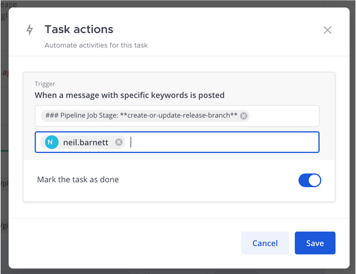

Work with tasks
===============

.. include:: ../../_static/badges/all-commercial.rst
  :start-after: :nosearch:

Tasks and due dates
-------------------

In some workflows, there are time constraints on tasks and others may have more flexible timeframes. Associating tasks with deliverable dates provides visibility into workloads and helps everyone stay accountable during the run.

To assign a due date to a task, select the **Toggle Run Details** icon to open the **Run Details** screen. Hover over the task you’d like to edit and select the calendar icon to assign a due date. Due dates can be used to sort tasks in the run overview.

When a due date is assigned to a task, and the task is overdue or due today, a reminder is added to the playbook's daily digest along with tasks that don't have an assigned due date. As tasks are completed, they're removed from the daily digest reminders. You can refresh the list of assigned tasks at any time using the ``/playbook todo`` slash command.

Due dates can be entered in text (e.g., "two minutes ago") or numerically (e.g., "15 March 2023").

Task actions
------------

You can automatically complete tasks in a playbook run using keyword triggers. When the keywords you've entered are mentioned in the run, the task is marked as completed.

For this feature, you should use a string of text rather than individual words. The search is an ``ANY`` search, meaning that if you used the individual words "target" and "completed", either of those words will trigger the action to be marked as complete. If you're using phrases that have formatting, make sure you use the Markdown formatting in the text field.

When you edit a task, you'll see the following: 

- The text to search for in the messages
- Ability to limit this for posts from a specific user (or bot)
- Option to mark the task as done (or not).

Conditional tasks
------------------

From Mattermost v11.1, using Mattermost in a web browser or the desktop app, tasks can be conditionally included in playbook runs based on property values or runtime conditions. This enables adaptive workflows where tasks are only presented when they're relevant to the current context. For example:

- **Security incidents**: Include additional forensic tasks for incidents classified as security-related.
- **Customer tier workflows**: Show different approval processes based on customer subscription level.
- **Geographic operations**: Include region-specific compliance tasks based on the location property.
- **Skill-based assignments**: Automatically assign tasks to team members based on areas of expertise.

When you run a playbook, conditional tasks are evaluated and automatically added to or removed from the checklist based on the defined conditions. This reduces cognitive load by showing only relevant tasks and ensures that critical steps aren't overlooked in different scenarios.

Configure conditional logic
~~~~~~~~~~~~~~~~~~~~~~~~~~~~

To set up conditional behavior in your playbook:

1. Go to **Product menu > Playbooks**.
2. Select the playbook you want to edit.
3. Select the **Outline** tab.
4. Under **Tasks**, select the **Conditions** option for each task.
5. Define when the task or checklist should be included:

  - **Property-based conditions**: Tasks appear only when specific playbook property values are set (e.g., show escalation tasks only for high-severity incidents).
  - **Status-based conditions**: Tasks are added based on the current run status.
  - **Time-based conditions**: Tasks appear after certain time periods or at specific times.
  - **User-based conditions**: Tasks are shown based on run participants or assignees.

.. note::

  - Conditional tasks are evaluated at the start of each playbook run and dynamically updated as properties or conditions change during the run.
  - You can combine multiple conditions using AND/OR logic to create complex inclusion criteria.
  - If no conditions are set for a task, it will always be included in the playbook run.
  - System admins and channel admins for the playbook run channel can edit task conditions via **Channel Actions**. Editing the settings in the run channel only affect that channel and don't apply to the playbook itself. To change the behavior of all future runs associated with the playbook, edit the playbook directly via the **Actions** menu.

Task inbox
----------

In addition to the daily digest, you also have access to a task inbox. The task inbox provides you with a cross-run overview of the tasks you're accountable for, sorted by due date.

You can:

- Access each task directly, without having to visit the individual runs.
- Mark tasks as complete or skip them.
- Change the task assignee from yourself to another team member. The task will then be removed from your inbox.
- You can change the due date of tasks to manage priorities and urgency.

To view your task inbox, access the **Playbooks** tab in Mattermost. In the header, next to your profile image, select the tasks list icon. A list of every task assigned to you from every run that's in progress is displayed.

From Mattermost v11.0 and mobile app v2.23.0, mobile users can perform the following task management operations on playbook runs:

Mobile task management
----------------------

From Mattermost v11.0 and mobile app v2.23.0, mobile users can perform the following task management operations on playbook runs:

Interact with playbook tasks
~~~~~~~~~~~~~~~~~~~~~~~~~~~~~

- **Task interaction**: Tap on any task to open a detailed bottom sheet view with task options and information.
- **Check/Uncheck tasks**: Complete or reopen tasks directly from the Mattermost mobile app.
- **Skip/Unskip tasks**: Mark tasks as skipped or return them to active status as workflow requirements change.

Update tasks
~~~~~~~~~~~~~

- **Update assignee**: Change who is responsible for completing a task directly from the mobile app.
- **Modify due dates**: Adjust task deadlines to accommodate changing priorities and schedules.
- **Edit task commands**: Update slash commands or instructions associated with tasks.
- **Change run ownership**: Transfer run ownership between team members.

These mobile capabilities provide full task management functionality for teams working with playbooks while on mobile devices, complementing your existing desktop and web browser experiences.