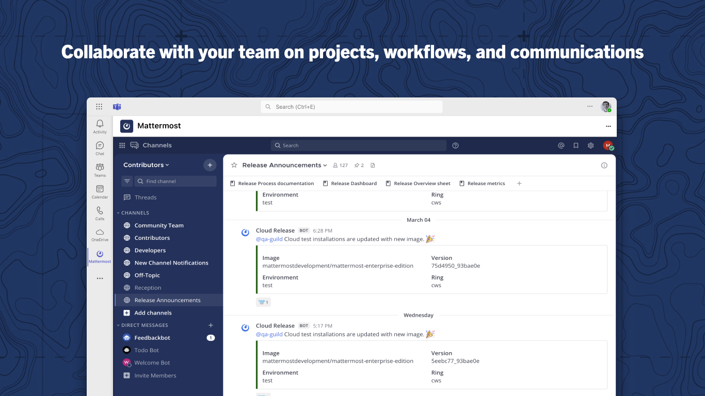

Community for Mattermost
========================

.. include:: ../_static/badges/all-commercial.rst
  :start-after: :nosearch:

Join the `Mattermost Community server <https://community.mattermost.com/>`_ directly from your Microsoft 365, Microsoft Outlook, or Microsoft Teams instance!

Use the Mattermost for Microsoft Teams integration to stay connected with thousands of users, contributors, and Mattermost staff directly from the tools you use every day. Join thousands of Mattermost users, contributors, and staff members in a vibrant community where you can ask questions, get support, share ideas, and contribute to shaping the future of Mattermost.

This app is designed to work with Microsoft 365, Outlook, and Teams. A free Mattermost account is required to access the Mattermost Community server.

Setup
-----

Admin setup
~~~~~~~~~~~~

A Microsoft Teams administrator must make the Community for Mattermost app available to all users.

1. Go to the Microsoft Teams Admin Center.
2. Select **Teams Apps > Manage Apps**.
3. Search for **Community for Mattermost** and select it.
4. Under the **Users and Groups** tab, enable the app for all users.

End user setup
~~~~~~~~~~~~~~~

Once enabled for all, any Microsoft 365 user can complete the steps below to access the Community for Mattermost app within their Microsoft environment:

1. Sign in to your Microsoft Teams account from a `web browser <https://teams.microsoft.com/v2/?clientexperience=t2>`_ or the desktop application.

2. Select the **[+] Apps** button in the Teams sidebar.

3. Search for **Mattermost for Microsoft 365** and then select **Add** to install the application.

4. (Optional) Pin the Mattermost app to your Teams sidebar by right-clicking on it and selecting **Pin**.

5. Once the Mattermost app is installed, you'll be connected to the public Mattermost Community instance.

Getting started
----------------

Once you've installed the app, here are some ways to get started:

- **Ask questions**: Use the `~ask-anything <https://community.mattermost.com/core/channels/ask-anything>`_ channel in Mattermost to ask technical questions or get support from the community.

- **Stay informed**: Follow the `~release-announcements <https://community.mattermost.com/core/channels/release-announcements>`_ channel to keep up with the latest news about upcoming releases and updates from the Mattermost team.

- **Contribute**: If you're interested in contributing to Mattermost, join the `~developers <https://community.mattermost.com/core/channels/developers>`_ channel to connect with other contributors.

- **Share feedback**: Your Mattermost ideas and feedback are valuable! Share your thoughts in the `~user-feedback <https://community.mattermost.com/core/channels/user-feedback>`_ channel.

Key features
------------

- **Direct Access**: Access the Community for Mattermost app directly from a tab without switching applications or opening a browser.
- **Seamless Integration**: Experience the full functionality of Community for Mattermost within a familiar interface.
- **Real-time Collaboration**: Engage with the Mattermost community in real-time discussions on product features, technical questions, and best practices.
- **Product Support**: Get help from both Mattermost staff and experienced community members.
- **Contribute to Development**: Participate in discussions that shape the future direction of Mattermost products.
- **Knowledge Sharing**: Learn implementation strategies and best practices from a diverse community of users.
- **Stay Updated**: Keep up with the latest Mattermost announcements, updates, and roadmap information.

Benefits
--------

- Seamlessly communicate with the Mattermost community using application tabs.
- Evaluate a showcase deployment of Mattermost capabilities in consideration of self-hosting the platform within your Azure or on-prem environments.
- Share input with Mattermost staff and developers on future improvements to the platform.

FAQ
---

Where can I get support for the Mattermost for Microsoft 365 app?
~~~~~~~~~~~~~~~~~~~~~~~~~~~~~~~~~~~~~~~~~~~~~~~~~~~~~~~~~~~~~~~~~

You can browse existing open issues or submit a new issue for support `in GitHub <https://github.com/mattermost/mattermost-teams-tab/issues>`_.

Do I need a Mattermost account to use this application?
~~~~~~~~~~~~~~~~~~~~~~~~~~~~~~~~~~~~~~~~~~~~~~~~~~~~~~~

Yes, you'll need to create a free Mattermost account on the Mattermost Community server when you first access it through the app.

Can I use this app to connect to my organization's Mattermost server?
~~~~~~~~~~~~~~~~~~~~~~~~~~~~~~~~~~~~~~~~~~~~~~~~~~~~~~~~~~~~~~~~~~~~~

No, this app is specifically designed to connect to the public Mattermost Community instance. If you're interested in connecting to your own Mattermost instance, 
talk to a `Mattermost Expert <https://mattermost.com/contact-sales/>`_.