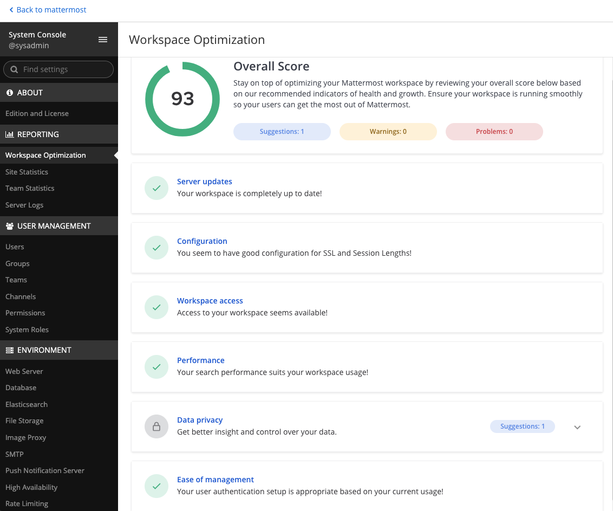

Administrator Onboarding Tasks
==============================

|all-plans| |self-hosted|

.. |all-plans| image:: ../images/all-plans-badge.png
  :scale: 30
  :target: https://mattermost.com/pricing
  :alt: Available in Mattermost Free and Starter subscription plans.

.. |self-hosted| image:: ../images/self-hosted-badge.png
  :scale: 30
  :target: https://mattermost.com/deploy
  :alt: Available for Mattermost Self-Hosted deployments.

Once you've successfully `installed <https://docs.mattermost.com/guides/deployment.html#install-guides>`__ or `upgraded <https://docs.mattermost.com/upgrade/upgrading-mattermost-server.html>`__ Mattermost, before rolling out Mattermost to your organization, it's important to take some time to review your workspace configuration to deliver the best possible Mattermost user experience.

We recommend reviewing configuration settings to ensure that:

- `Your workspace is accessible and performant <#review-mattermost-workspace-configuration>`__.
- `The right people see and do the right things in Mattermost <#configure-user-permissions>`__.
- `Users can sign in to Mattermost quickly and easily <#configure-user-authentication>`__.

We also encourage you to explore all of the settings available in the System Console. See our `configuration settings <https://docs.mattermost.com/configure/configuration-settings.html>`__ documentation for details on all supported options.

.. tip::
  
  - Looking for more structure and guidance to plan out your Mattermost rollout? See our `Enterprise roll out checklist <https://docs.mattermost.com/getting-started/enterprise-roll-out-checklist.html>`__ documentation for details. 
  - You can also manage Mattermost configuration settings in the ``config.json`` configuration file, located in the ``mattermost/config`` directory. See our `configuration settings <https://docs.mattermost.com/configure/configuration-settings.html>`__ documentation for details on ``config.json`` file equivalents.
  - Anything you can do through the Mattermost interface you can also do through the `Mattermost REST API <https://api.mattermost.com/>`__. 
  - You can share important announcements within Mattermost by `displaying an announcement banner <https://docs.mattermost.com/manage/announcement-banner.html>`__ visible to all users.

Review Mattermost workspace configuration
-----------------------------------------

1. First, visit the **System Console > Environment** page to ensure your workspace is accessible and performant. 

+------------------------------+-----------------------------------------------------------------------------------------------------------------------------------------------------------------------------------------------------+
| Go to...                     | To...                                                                                                                                                                                               |
+==============================+=====================================================================================================================================================================================================+
| **Web Server**               | Ensure your workspace is accessible online. See the `Web server <https://docs.mattermost.com/configure/configuration-settings.html#web-server>`__ documentation for details.                        |
+------------------------------+-----------------------------------------------------------------------------------------------------------------------------------------------------------------------------------------------------+
| **Database**                 | Ensure that data management is configured for your needs. See the `Database <https://docs.mattermost.com/configure/configuration-settings.html#database>`__ documentation for details.              |
|                              |                                                                                                                                                                                                     |
|                              | If you have a `High Availability <https://docs.mattermost.com/scale/high-availability-cluster.html>`__  environment using PostgreSQL, we also recommend specific optimizations.                     |
|                              | See the `High Availability cluster recommendations <https://docs.mattermost.com/scale/high-availability-cluster.html#recommended-configuration-settings>`__ documentation for details.              |
+------------------------------+-----------------------------------------------------------------------------------------------------------------------------------------------------------------------------------------------------+
| **File Storage**             | Ensure that file storage is configured for your needs. See the `file storage <https://docs.mattermost.com/configure/configuration-settings.html#file-storage>`__ documentation for details.         |
+------------------------------+-----------------------------------------------------------------------------------------------------------------------------------------------------------------------------------------------------+
| **SMTP**                     | Enable real-time Mattermost notifications for your users. See the `SMTP <https://docs.mattermost.com/configure/configuration-settings.html#smtp>`__ documentation for details.                      |
+------------------------------+-----------------------------------------------------------------------------------------------------------------------------------------------------------------------------------------------------+
| **Push Notification Server** | Real-time `mobile push notifications <https://docs.mattermost.com/configure/configuration-settings.html#enable-push-notifications>`__ are enabled by default.                                       |
|                              | You can control the `content included in notifications <https://docs.mattermost.com/configure/configuration-settings.html#push-notification-contents>`__.                                           |
|                              | See the `Push notification server <https://docs.mattermost.com/configure/configuration-settings.html#push-notification-server>`__ documentation for details.                                        |
|                              |                                                                                                                                                                                                     |
|                              | **Additional notification notes:**                                                                                                                                                                  |
|                              |                                                                                                                                                                                                     |
|                              | Mattermost subscription plans provide access to Mattermost's Hosted Push Notification Service featuring encrypted TLS connections and production-level uptime service level agreements.             |
|                              | See the `HPNS <https://docs.mattermost.com/deploy/mobile-hpns.html#hosted-push-notifications-service-hpns>`__ documentation for details.                                                            |
|                              |                                                                                                                                                                                                     |
|                              | Mattermost Enterprise customers can `enable ID-Only push notifications <https://docs.mattermost.com/configure/configuration-settings.html#push-notification-contents>`__ so push notification       |
|                              | content is not passed through Apple Push Notification Service (APNS) or Google Firebase Cloud Messaging (FCM) before reaching the device.                                                           |
|                              | The ID-only push notification setting `offers a high level of privacy <https://mattermost.com/blog/id-only-push-notifications/>`__.                                                                 |
+------------------------------+-----------------------------------------------------------------------------------------------------------------------------------------------------------------------------------------------------+

2. Next, visit the **System Console > Site Configuration** page to customize key links and enhance file sharing functionality:

+--------------------------------+-------------------------------------------------------------------------------------------------------------------------------------------------------------------------------------------------------+
| Go to...                       | To...                                                                                                                                                                                                 |
+================================+=======================================================================================================================================================================================================+
| **Customization**              | Brand and customize how your users interact with your Mattermost workspace by:                                                                                                                        |
|                                |                                                                                                                                                                                                       |
|                                | - Customizing the `support email <https://docs.mattermost.com/configure/configuration-settings.html#support-email>`__ for email notifications, onboarding tutorials, and support questions.       |
|                                | - Customizing the `help link <https://docs.mattermost.com/configure/configuration-settings.html#help-link>`__ to link to your help desk ticketing system.                                             |
+--------------------------------+-------------------------------------------------------------------------------------------------------------------------------------------------------------------------------------------------------+
| **File Sharing and Downloads** | `File sharing <https://docs.mattermost.com/configure/configuration-settings.html#allow-file-sharing>`__ is enabled by default.                                                                        |
|                                | You can control of the `maximum size of file attachments <https://docs.mattermost.com/configure/configuration-settings.html#maximum-image-resolution>`__.                                             |
|                                |                                                                                                                                                                                                       |
|                                | If your organization frequently works with SVG files, `enable previews of SVG attachments <https://docs.mattermost.com/configure/configuration-settings.html#enable-svgs>`__.                         |
|                                |                                                                                                                                                                                                       |
|                                | For additional security and protection with file attachments, a `ClamAV antivirus <https://mattermost.com/marketplace/antivirus-plugin/>`__                                                           |
|                                | integration is available which scans files uploaded to Mattermost.                                                                                                                                    |
+--------------------------------+-------------------------------------------------------------------------------------------------------------------------------------------------------------------------------------------------------+

3. From Mattermost v6.5, you can also review a dashboard of insights related to the health of your Mattermost workspace by going to **System Console > Reporting > Workplace Optimization**. See the `optimize your Mattermost workspace <https://docs.mattermost.com/configure/optimize-your-workspace.html>`__ documentation for details. 

On the dashboard, you can see whether there's a Mattermost update you should install. Mattermost releases regular updates to `Mattermost Team Edition <https://mattermost.com/>`_ and `Mattermost Enterprise Edition <https://mattermost.com/pricing-self-managed/>`_. The `Mattermost Changelog <https://docs.mattermost.com/install/self-managed-changelog.html>`_ provides all information about changes in each version. When you upgrade your Mattermost server frequently, your users can access new features, improved user experiences, bug fixes, security fixes, and Mobile App compatibility. Upgrading your Mattermost server only takes a few minutes. See the `Upgrade Guide <https://docs.mattermost.com/upgrade/upgrading-mattermost-server.html>`__ for step-by-step instructions.

Mattermost Enterprise customers can `enable Elasticsearch <https://docs.mattermost.com/scale/elasticsearch.html>`__ for optimized search performance at enterprise-scale. `Elasticsearch <https://docs.mattermost.com/scale/elasticsearch.html>`__ solves many known issues with full text database search, such as dots, dashes, and email addresses returning unexpected results. `Set up an Elasticsearch server <https://docs.mattermost.com/scale/elasticsearch.html#setting-up-an-elasticsearch-server>`__ and `enable Elasticsearch <https://docs.mattermost.com/configure/configuration-settings.html#elasticsearch>`__.

Now you have a functional, performant Mattermost workspace. Next, you want to control product access. 

Configure user permissions
---------------------------

Once your Mattermost workspace is configured for your needs, focus next on ensuring the right people can see and do the right things in Mattermost, such as creating teams and managing channels, by controlling product access with `advanced permissions <https://docs.mattermost.com/onboard/advanced-permissions.html>`__, `learning about teams <https://docs.mattermost.com/welcome/about-teams.html>`__, and `working with channels <https://docs.mattermost.com/guides/channels.html#work-with-channels>`__.

.. image:: ../images/advanced-permissions.png
    :alt: Control product access with granular Mattermost permissions.

.. tip::

  Mattermost won’t limit you to the number of teams you can create; however, a public team and an internal team are typically sufficient. See our `creating teams <https://docs.mattermost.com/welcome/about-teams.html#create-a-team>`__ and our `team settings <https://docs.mattermost.com/welcome/team-settings.html>`__ documentation for details.

With permissions, you have controls in place over who can do what and where based on the roles and areas of ownership in your organization. Next you want to make it easy for your users to get into Mattermost every day.

Configure user authentication
-----------------------------

Make onboarding and account provisioning easier through automation with directory services integrations. You likely already have your users grouped by role, location, or level. Mattermost provides identity management, single sign-on, and automatic account provisioning to make it easy for you to integrate with your existing identity and access management (IAM) services and systems with `Active Directory and LDAP <https://docs.mattermost.com/onboard/ad-ldap.html>`__ and `SAML 2.0 SSO <https://docs.mattermost.com/onboard/sso-saml.html>`__. These integrations feature providers like `Active Directory Federation Services <https://docs.mattermost.com/onboard/ad-ldap.html#configure-ad-ldap-deployments-with-multiple-domains>`__, `Okta <https://docs.mattermost.com/onboard/sso-saml-okta.html>`__, `GitLab <https://docs.mattermost.com/onboard/sso-gitlab.html>`__, `Google <https://docs.mattermost.com/onboard/sso-google.html>`__, and `Office 365 <https://docs.mattermost.com/onboard/sso-office.html>`__

- Begin to onboard users by `enabling account creation <https://docs.mattermost.com/configure/configuration-settings.html#enable-account-creation>`__ or by connecting an authentication service to assist with user provisioning.

- For bulk onboarding, enable `AD/LDAP group synchronization <https://docs.mattermost.com/configure/configuration-settings.html#enable-ad-ldap-group-sync>`__ to ensure new users are added to default teams and channels as they join Mattermost. See our `AD/LDAP groups <https://docs.mattermost.com/onboard/ad-ldap-groups-synchronization.html>`__ documentation to learn more.

- See our `migration guide <https://docs.mattermost.com/onboard/migrating-to-mattermost.html#migration-guide>`_ and `bulk loading documentation <https://docs.mattermost.com/onboard/bulk-loading-data.html>`_ for additional details.

Extend Mattermost functionality with integrations
-------------------------------------------------

Once you've explored the many ways you can configure your Mattermost workspace, and considered our workspace recommendations, you may want to explore many more ways you can extend your Mattermost functionality with integrations. Mattermost features powerful collaboration using context-rich actions. When you extend Mattermost functionality with integrations like `Zoom <https://mattermost.com/marketplace/zoom-plugin/>`__, `Jira <https://mattermost.com/marketplace/jira-plugin/>`__, `GitHub <https://mattermost.com/marketplace/github-plugin/>`__ or `GitLab <https://mattermost.com/marketplace/gitlab-plugin/>`__, moving around the ecosystem and staying informed is as simple as sending a message and subscribing channels to project or repository updates. 

More common Mattermost integrations your users may love:

- Create polls with `Matterpoll <https://mattermost.com/marketplace/matterpoll/>`__.
- Share GIFs with `GIF Commands <https://mattermost.com/marketplace/giphy-plugin/>`__.
- Create and share memes with `Memes <https://mattermost.com/marketplace/memes-plugin/>`__.
- Set personal reminders with `Remind <https://mattermost.com/marketplace/remind-plugin/>`__.
- Create and share to do items with `Todo <https://github.com/mattermost/mattermost-plugin-todo>`__.
- Customize welcome messages for new users with `WelcomeBot <https://mattermost.com/marketplace/welcomebot-plugin/>`__.

Visit the `Mattermost Marketplace <https://mattermost.com/marketplace/>`__ to learn about the many ways you can extend Mattermost functionality for your needs. To enable and manage plugins, go to **System Console > Plugins**. Then, download plugins from the Mattermost Marketplace.

To enable integrations such as webhooks, slash commands, OAuth2.0, and bots, go to **System Console > Integrations**. See our `developer and integrations documentation <https://developers.mattermost.com/integrate/other-integrations/>`__ for details.

Important Mattermost administration notes 
-----------------------------------------

**DO NOT manipulate the Mattermost database**

- In particular, DO NOT manually delete data from the database directly. Mattermost is designed as a continuous archive and cannot be supported after manual manipulation.
- If you need to permanently delete a team or user, use the `mattermost user delete <https://docs.mattermost.com/manage/command-line-tools.html#mattermost-user-delete>`__ CLI command, or use the `mmctl user delete <https://docs.mattermost.com/manage/mmctl-command-line-tool.html#mmctl-user-delete>`__ command.

Create a System Admin account from the command line
~~~~~~~~~~~~~~~~~~~~~~~~~~~~~~~~~~~~~~~~~~~~~~~~~~~

- If the System Admin leaves the organization or is otherwise unavailable, you can use the command line interface to assign the *system_admin* role to an existing user. In the ``/opt/mattermost`` directory, type ``sudo -u mattermost bin/mattermost roles system_admin {user-name}``, where *{user-name}* is the username of the person with the new role. For more information about using the command line interface, see `command line tools <https://docs.mattermost.com/manage/command-line-tools.html>`__.
- The user needs to log out and log back in before the *system_admin* role is applied.
  
Migrate to AD/LDAP or SAML from email-based authentication
~~~~~~~~~~~~~~~~~~~~~~~~~~~~~~~~~~~~~~~~~~~~~~~~~~~~~~~~~~

- Mattermost Professional or Enterprise customers can migrate from email authentication to Active Directory/LDAP or to SAML Single Sign-on. To set up Active Directory/LDAP, see `Active Directory/LDAP Setup <https://docs.mattermost.com/onboard/ad-ldap.html#active-directory-ldap-setup-e10-e20>`_. To set up SAML Single Sign-on, see `SAML Single-Sign-On <https://docs.mattermost.com/onboard/sso-saml.html>`_.
- After the new authentication method is enabled, existing users cannot use the new method until they go to **Settings > Security > Sign-in method** and select **Switch to using AD/LDAP** or **Switch to using SAML Single Sign-on**. After they have switched, they can no longer use their email and password to sign in.  
  
Deactivate a user
~~~~~~~~~~~~~~~~~

System Admins can go to **System Console > Users** for a list of all users on the server. Search and filter the list to make finding users easier. Select the user's role, then choose **Deactivate**. To preserve audit history, users are typically never deleted from the system. 

If permanently deleting a user is necessary (e.g. for the purposes of `GDPR <https://gdpr-info.eu/>`__), an `mmctl command <https://docs.mattermost.com/manage/mmctl-command-line-tool.html>`__ or a `CLI command <https://docs.mattermost.com/manage/command-line-tools.html>`_ can be used to do so. AD/LDAP user accounts can't be deactivated from Mattermost; they must be deactivated from your Active Directory.

Check for a valid license in Enterprise Edition without logging in
~~~~~~~~~~~~~~~~~~~~~~~~~~~~~~~~~~~~~~~~~~~~~~~~~~~~~~~~~~~~~~~~~~~

If you manage a self-hosted Mattermost deployment, open the log file ``mattermost.log``. It's usually in the ``mattermost/logs/`` directory but might be elsewhere on your system. Find the last occurrence of a log entry that starts with the text ``[INFO] License key``. If the license key is valid, the complete line should be similar to the following example:

.. code-block:: text

  [2017/05/19 16:51:40 UTC] [INFO] License key valid unlocking enterprise features.
