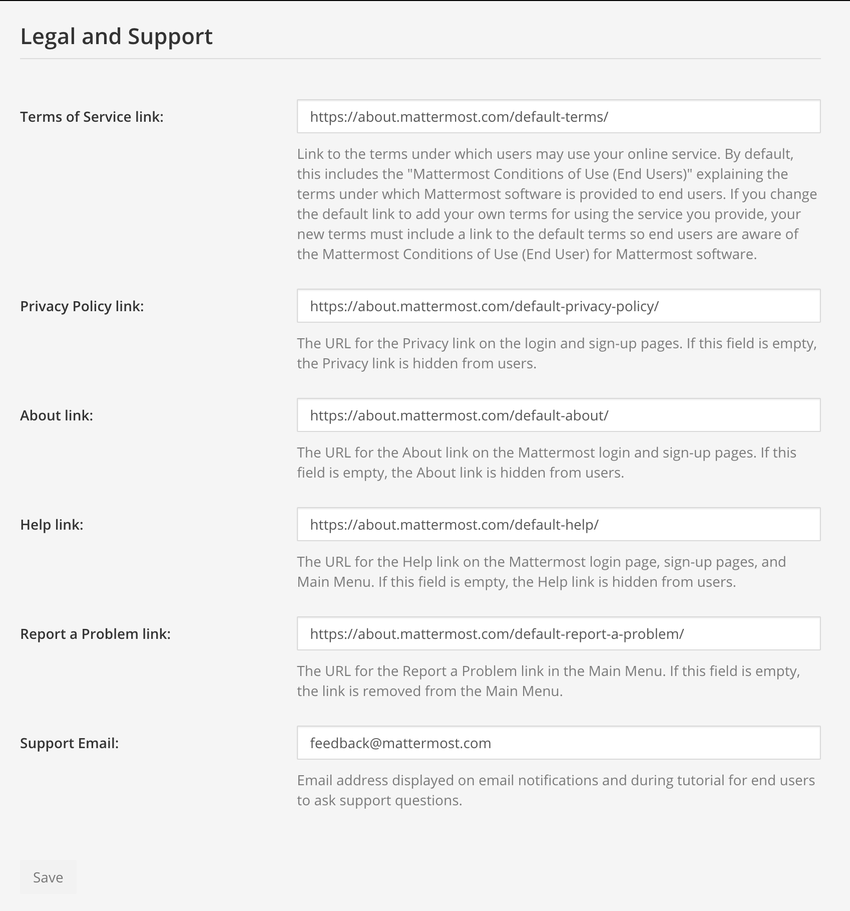

Implementation Plan
===================

1 Introduction
--------------

1.1 Purpose
~~~~~~~~~~~

Mattermost is an open source, private cloud alternative to proprietary SaaS collaboration solutions designed to offer organizations superior control, data sovereignty, configurability, freedom from lock-in, and enhanced security by keeping vital communications behind your firewall. You've chosen to implement Mattermost in our supported `editions:`_

.. _`editions:`: https://mattermost.com/product/

- **Team Edition**
- **Enterprise Edition (E10)** which adds additional features to the platform including `AD/LDAP Integration <https://docs.mattermost.com/onboard/ad-ldap.html>`__, `Multi-Factor Authentication ("MFA") <https://docs.mattermost.com/onboard/multi-factor-authentication.html>`__, `Encrypted Push Notifications <https://docs.mattermost.com/deploy/mobile-hpns.html>`__, `Branding <https://docs.mattermost.com/configure/custom-branding-tools.html>`__, `Advanced Access Control Policy <https://docs.mattermost.com/onboard/advanced-permissions.html>`__, and next business day support.
- **Enterprise Edition (E20)** includes E10 features plus `SAML 2.0 Authentication <https://docs.mattermost.com/onboard/sso-saml.html>`__, `Compliance Reporting <https://docs.mattermost.com/comply/compliance-reporting-oversight.html>`__, `High Availability <https://docs.mattermost.com/scale/high-availability-cluster.html>`__, `Elasticsearch <https://docs.mattermost.com/scale/elasticsearch.html>`__, `Performance Monitoring <https://docs.mattermost.com/scale/performance-monitoring.html>`__, `Data Retention Policy <https://docs.mattermost.com/comply/data-retention-policy.html>`__, and enterprise-class support.

The purpose of this Implementation Plan is to:

- Describe the solution to be deployed;
- Outline the process for implementing the solution (key personnel, tasks, schedule, etc.);
- Identify support required during the implementation process.

2 System Overview
-----------------

This section provides a brief overview of the system to be implemented, including a description of the system and its organization.

2.1 System Description
~~~~~~~~~~~~~~~~~~~~~~

Mattermost is a collaboration solution designed to remove organizational friction. You're implementing Mattermost in order to:

1. **[STATE REASON]**
2. **[STATE REASON]**
3. **[STATE REASON]**

In this implementation, you are planning to deploy Mattermost to **[NUMBER OF USERS]** users on the following teams:

1. **[TEAM 1]**
2. **[TEAM 2]**
3. **[TEAM 3]**

2.2  System Organization
~~~~~~~~~~~~~~~~~~~~~~~~

A Mattermost Enterprise E20 implementation consists of the following system components:

- **Mattermost Server**
  - The Mattermost Server is a single binary that includes the RESTful JSON web service, authentication client, authentication provider, notification service, and data management service. The Mattermost Server can be deployed in stand-alone or high availability mode where two or more servers are clustered together using gossip protocol and a proxy server that routes traffic from client applications to healthy servers in the cluster.
- **Mattermost Database**
  - A MySQL or PostgreSQL database in stand-alone or high-availability configurations (master with read replicas). When choosing the database, consider the `inherent search limitations of the database type <https://docs.mattermost.com/install/requirements.html#database-software>`__ and whether `Elasticsearch <https://docs.mattermost.com/scale/elasticsearch.html>`__ is most appropriate for your deployment.
- **Mattermost Push Notification Service**
  - Hosted or on-prem service that pushes notifications to Mattermost Android and Mattermost iOS mobile applications.
- **Mattermost Client Applications**
  - Client applications are available for Mattermost for the following platforms: Android, iOS, Windows, OSX, and Linux (Beta).
- **Mattermost Web Client**
  - Mattermost users can use their favorite Web browser to connect to their Mattermost server in place of the Mattermost mobile and desktop applications.
- **Proxy Server**
  - The use of a proxy server (NGINX, Apache, HAProxy, ELB, etc.) is recommended with Mattermost to obtain the benefits of: SSL termination, HTTP to HTTPS redirection, port mapping :80 to :8065, and the creation of standard request logs.

The following diagram is a high-level illustration of the Mattermost platform and how its various components interact with each other within a network:

.. image:: ../images/network_diagram.png

**Reference**: https://docs.mattermost.com/deploy/deployment-overview.html

A recommended installation of Mattermost Enterprise E20 configured with a redundant, highly available, highly scalable mode, with application (Mattermost Server) and database high availability features enabled, will require the following physical, or virtual, servers:

+-------------------+---------+---------------+--------+----------+
| Task              | Qty     | CPU           | Memory | Storage  |
+===================+=========+===============+========+==========+
| Mattermost Server | 2       | 2 vCPUs/cores | 4 GB   | 45-90 GB |
+-------------------+---------+---------------+--------+----------+
| Database Server   | 2       | 2 vCPUs/cores | 8 GB   | 100 GB   |
+-------------------+---------+---------------+--------+----------+
| Proxy             | 2       | 1 vCPUs/cores | 4 GB   | 10 GB    |
+-------------------+---------+---------------+--------+----------+

.. note::
  Mattermost hardware sizing guidance can be found here: https://docs.mattermost.com/install/requirements.html#hardware-requirements

2.3 Project References
~~~~~~~~~~~~~~~~~~~~~~

This section provides a bibliography of key project references and deliverables that have been produced before this point in the project development.

- Mattermost Product Overview: https://docs.mattermost.com/about/product.html
- Mattermost Software/Hardware Requirements: https://docs.mattermost.com/install/requirements.html 
- Mattermost Security Features: https://docs.mattermost.com/about/security.html 
- Mattermost Channels: https://docs.mattermost.com/guides/messaging.html
- Mattermost Playbooks: https://docs.mattermost.com/guides/playbooks.html
- Mattermost Boards: https://www.focalboard.com/guide/user/

2.4 Glossary
~~~~~~~~~~~~

Provide a glossary of all terms and abbreviations used in the manual.  If it is several pages in length, it may be placed in an appendix.

3 Management Overview
---------------------

The subsequent sections provide a brief description of the implementation and major tasks involved in this section.

3.1 Description of Implementation
~~~~~~~~~~~~~~~~~~~~~~~~~~~~~~~~~

3.2 Team
~~~~~~~~

In this section, identify the System Proponent, the name of the responsible organization(s), and titles and telephone numbers of the staff who serve as points of contact for the system implementation.  These points of contact could include the Project Manager. Program Manager, Security Manager.  Database Administrator, Configuration Management Manager, or other managers with responsibilities relating to the system implementation.  The site implementation representative for each field installation or implementation site should also be included, if appropriate.  List all managers and staff with whom the implementation must be coordinated.

3.2.1 Team Members
^^^^^^^^^^^^^^^^^^

+----------+-----------------+----------------------+--------------+
| Name     | Title           | Email                | Phone        |
+==========+=================+======================+==============+
| Jane Doe | Project Manager | jane.doe@company.com | 111.111.1111 |
+----------+-----------------+----------------------+--------------+
|          |                 |                      |              |
+----------+-----------------+----------------------+--------------+
|          |                 |                      |              |
+----------+-----------------+----------------------+--------------+

3.3 Major Tasks
~~~~~~~~~~~~~~~

This section provides a brief description of each major task required for the implementation of the system. Add as many subsections as necessary to this section to describe all the major tasks adequately. The tasks described in this section are not site-specific, but generic or overall project tasks that are required to install hardware and software, prepare data, and verify the system. 

3.3.1 Create System Architecture Document
^^^^^^^^^^^^^^^^^^^^^^^^^^^^^^^^^^^^^^^^^

The System Architecture Document is used to document the environments that Mattermost will be deployed to including:

- The environment (development, staging, production, etc.)
- Server, or virtual machine, specifications
- IP addresses and DNS
- Network diagram

**Reference**: https://docs.mattermost.com/deploy/deployment-overview.html

3.3.2 Gather Required Software and Documentation
^^^^^^^^^^^^^^^^^^^^^^^^^^^^^^^^^^^^^^^^^^^^^^^^

Gather all of the software and documentation required for a successful implementation of the Mattermost platform and place it within the organization’s configuration management system.

3.3.3 Prepare Deployment Environments
^^^^^^^^^^^^^^^^^^^^^^^^^^^^^^^^^^^^^

Build out the required deployment environments (development, staging, production, etc.) and implement configuration management (using a tool like Chef, Puppet, Salt, etc.)

**Reference**: https://docs.mattermost.com/install/requirements.html

3.3.4 Install Software
^^^^^^^^^^^^^^^^^^^^^^

Install and configure Mattermost and its component software (MySQL or PostgreSQL, Nginx or another proxy, etc.)

**Reference**: https://docs.mattermost.com/guides/deployment.html#install-guides

Install in High Availability (E20): https://docs.mattermost.com/scale/high-availability-cluster.html 

3.3.5 Test Deployment
^^^^^^^^^^^^^^^^^^^^^

Verify that the software has been deployed successfully in each environment. Create, or update, automated tests to verify deployments.

**Reference**: https://docs.mattermost.com/manage/health-checks.html

3.3.6 Bulk Load Data
^^^^^^^^^^^^^^^^^^^^

Large quantities of data can be imported from a JSON file into Mattermost at the command line using the bulk loading feature. This feature is most suitable for migrating data from an existing system, or for pre-populating a new installation with data.

You can import the following data types:

- Teams
- Channels (Public and Private)
- Users
- Users’ Team memberships
- Users’ Channel memberships
- Users’ notification preferences
- Posts (regular, non-reply posts)
- Direct Message and Group Message channels
- Direct Messages and Group Messages

**Reference**: https://docs.mattermost.com/onboard/bulk-loading-data.html 

3.3.7 Implement Backup
^^^^^^^^^^^^^^^^^^^^^^

Implement backup procedures to protect data stored within the Mattermost database, files uploaded by users, and the Mattermost config.json file.

**Reference**: https://docs.mattermost.com/deploy/backup-disaster-recovery.html

3.3.8 Implement Monitoring
^^^^^^^^^^^^^^^^^^^^^^^^^^

Mattermost E20 supports integrated health and performance monitoring with Prometheus and Grafana. A guide to the statistics collected and reported on is available in the reference below:

**Reference**: https://docs.mattermost.com/scale/performance-monitoring.html

3.3.9 AD/LDAP Setup (E10, E20)
^^^^^^^^^^^^^^^^^^^^^^^^^^^^^^

Mattermost supports AD/LDAP integration for user authentication and user attribute syncing. 

**Reference**: https://docs.mattermost.com/onboard/ad-ldap.html 

3.3.10 Multi-Factor Authentication (E10, E20)
^^^^^^^^^^^^^^^^^^^^^^^^^^^^^^^^^^^^^^^^^^^^^

Configure multi-factor authentication (“MFA”) if required as part of your IT security policy. Compatible with Google Authenticator

**Reference**: https://docs.mattermost.com/onboard/multi-factor-authentication.html

3.3.11 SAML Single-Sign-On (E20)
^^^^^^^^^^^^^^^^^^^^^^^^^^^^^^^^

Mattermost can be configured to act as a SAML 2.0 Service Provider. Mattermost officially supports Okta, OneLogin and Microsoft ADFS as the identity providers (IDPs).

**Reference**: https://docs.mattermost.com/onboard/sso-saml.html

3.3.12 Train Administrators
^^^^^^^^^^^^^^^^^^^^^^^^^^^

Train administrators on the tasks required to manage Mattermost.

**Reference**: https://docs.mattermost.com/getting-started/admin-onboarding-tasks.html

3.3.13 Update Legal and Support Settings
^^^^^^^^^^^^^^^^^^^^^^^^^^^^^^^^^^^^^^^^

Mattermost has configuration settings for the terms of service, privacy policy, and support URLs and emails. It is highly recommended that you modify these in your configuration so that your users have the correct legal information and can contact administrators to resolve account issues. You can find these under **System Console > Legal and Support** in prior versions or **System Console** > **Site Configuration** > **Customization** in versions after 5.12.

3.3.14 Onboard Users
^^^^^^^^^^^^^^^^^^^^

Send all users a welcome email with instructions on how to get started using Mattermost including links to the mobile applications and the User Guide.

**References**: 
- Links to download Mattermost apps:  https://mattermost.com/download/#mattermostApps 
- Welcome email to new users: https://docs.mattermost.com/getting-started/welcome-email-to-end-users.html 

3.4 Implementation Schedule
~~~~~~~~~~~~~~~~~~~~~~~~~~~

In this section, provide a schedule of activities to be accomplished during implementation.  Show the required tasks (described in Section 3.3, Major Tasks) in chronological order, with the beginning and end dates of each task.

+----+--------------------------------------------+------------+------------+
|    | Task                                       | Start Date | End Date   |
+====+============================================+============+============+
| 1  | Create System Architecture Document        | xx/xx/xxxx | xx/xx/xxxx |
+----+--------------------------------------------+------------+------------+
| 2  | Gather Required Software and Documentation |            |            |
+----+--------------------------------------------+------------+------------+
| 3  | Prepare Deployment Environments            |            |            |
+----+--------------------------------------------+------------+------------+
| 4  | Install Software                           |            |            |
+----+--------------------------------------------+------------+------------+
| 5  | Test Deployment                            |            |            |
+----+--------------------------------------------+------------+------------+
| 6  | Bulk Load Data                             |            |            |
+----+--------------------------------------------+------------+------------+
| 7  | Implement Backup                           |            |            |
+----+--------------------------------------------+------------+------------+
| 8  | Implement Monitoring                       |            |            |
+----+--------------------------------------------+------------+------------+
| 9  | Train Administrators                       |            |            |
+----+--------------------------------------------+------------+------------+
| 10 | Onboard Users                              |            |            |
+----+--------------------------------------------+------------+------------+

3.5 Security
~~~~~~~~~~~~

If appropriate for the system to be implemented, include an overview of the system security features and requirements during the implementation.

3.5.1 System Security Features
^^^^^^^^^^^^^^^^^^^^^^^^^^^^^^

The Mattermost platform will be secured in the following ways:

- Mattermost will be hosted entirely on-premises behind your company firewall with access restricted to VPN connections;
- Mobile access to Mattermost will be further restricted by the use of multi-factor authorization;
- Transmissions to and from Mattermost will be encrypted using TLS;
- Encryption-at-rest will be applied using your company's standards;
- Mattermost’s integrity and audit controls store a complete history of messages, including edits and deletes, along with all files uploaded. User interface actions for “deleting” messages and channels remove the data only from the user interface; the data is retained within your database. If your compliance guidelines require it, you can turn off users’ ability to edit and delete their messages after they are posted.
- Mattermost will be protected against brute force attacks by its rate limiting API;
- Authentication to Mattermost will be controlled using your company's Active Directory/LDAP/SAML directory server. 

**Reference**: https://docs.mattermost.com/about/security.html

3.5.2 Security During Implementation
^^^^^^^^^^^^^^^^^^^^^^^^^^^^^^^^^^^^

This section addresses security issues specifically related to the implementation effort, if any. For example, if LAN servers or workstations will be installed at a site with sensitive data preloaded on non-removable hard disk drives, address how security would be provided for the data on these devices during shipping, transport, and installation because theft of the devices could compromise the sensitive data.

4 Implementation Support
------------------------

This section describes the support software, materials, equipment, and facilities required for the implementation, as well as the personnel requirements and training necessary for the implementation.  The information provided in this section is not site-specific.  If there are additional support requirements not covered by the subsequent sections, others may be added as needed.

4.1 Hardware, Software, Facilities, and Materials
~~~~~~~~~~~~~~~~~~~~~~~~~~~~~~~~~~~~~~~~~~~~~~~~~

In this section, list support software, materials, equipment, and facilities required for the implementation, if any.

4.1.1 Hardware
^^^^^^^^^^^^^^

This section provides a list of support equipment and includes all hardware used for testing time implementation.  For example, if a client/server database is implemented on a LAN, a network monitor or “sniffer” might be used, along with test programs. to determine the performance of the database and LAN at high-utilization rates.  If the equipment is site-specific, list it in Section 5, Implementation Requirements by Site.

4.1.2 Software
^^^^^^^^^^^^^^

This section provides a list of software and databases required to support the implementation. Identify the software by name, code, or acronym.  Identify which software is commercial off-the-shelf and which is State-specific.  Identify any software used to facilitate the implementation process.  If the software is site-specific, list it in Section 4.

4.1.3 Facilities
^^^^^^^^^^^^^^^^

In this section, identify the physical facilities and accommodations required during implementation.  Examples include physical workspace for assembling and testing hardware components, desk space for software installers, and classroom space for training the implementation stall.  Specify the hours per day needed, number of days, and anticipated dates. If the facilities needed are site-specific, provide this information in Section 4, Implementation Requirements by Site.

4.1.4 Material
^^^^^^^^^^^^^^

This section provides a list of required support materials, such as magnetic tapes and disk packs.

4.2 Personnel
~~~~~~~~~~~~~

This section describes personnel requirements and any known or proposed staffing requirements, if appropriate.  Also describe the training, if any, to be provided for the implementation staff.

4.2.1 Personnel Requirements and Staffing
^^^^^^^^^^^^^^^^^^^^^^^^^^^^^^^^^^^^^^^^^

In this section, describe the number of personnel, length of time needed, types of skills, and skill levels for the staff required during the implementation period.  If particular staff members have been selected or proposed for the implementation, identify them and their roles in the implementation.

4.2.2 Training of Implementation Staff
^^^^^^^^^^^^^^^^^^^^^^^^^^^^^^^^^^^^^^

This section addresses the training, if any, necessary to prepare staff for implementing and maintaining the system; it does not address user training, which is the subject of the Training Plan. Describe the type and amount of training required for each of the following areas, if appropriate, for the system:
 
- System hardware/software installation
- System support
- System maintenance and modification

Present a training curriculum listing the courses that will be provided, a course sequence. and a proposed schedule. If appropriate, identify which courses particular types of staff should attend by job position description.
 
If training will be provided by one or more commercial vendors, identify them, the course name(s), and a brief description of the course content.
 
If the training will be provided by State staff, provide the course name(s) and an outline of the content of each course.  Identify the resources, support materials, and proposed instructors required to teach the course(s).

4.3 Performance Monitoring (E20)
~~~~~~~~~~~~~~~~~~~~~~~~~~~~~~~~

This section describes the performance monitoring tool and techniques and how it will be used to help decide if the implementation is successful: https://docs.mattermost.com/scale/performance-monitoring.html

4.4 Configuration Management Interface
~~~~~~~~~~~~~~~~~~~~~~~~~~~~~~~~~~~~~~

This section describes the interactions required with the Configuration Management (CM) representative on CM-related issues, such as when software listings will be distributed, and how to confirm that libraries have been moved from the development to the production environment.
