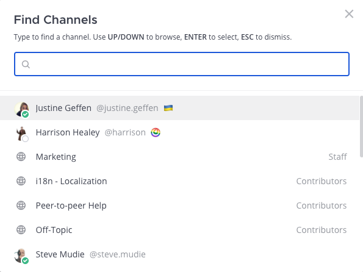

Managing Channels
==================

Channels can be created, joined, renamed, left, marked as a favorite, muted, unmuted, and archived.

Creating a channel
------------------

To create a new Public or Private channel, select the **+** symbol at the top of the channel sidebar, then select **Create New Channel**.

    .. image:: ../images/create-new-channel.png
        :alt: Create a channel.
    
Anyone can create Public channels or Private channels, unless the System Admin has `restricted the permissions <https://docs.mattermost.com/configure/configuration-settings.html#enable-public-channel-creation-for>`__.

Creating a Direct or Group Message
----------------------------------

To start a Direct or Group Message, select the **+** symbol at the top of the channel sidebar, then select **Open a Direct Message**. Or select the **+** symbol next to the **Direct Messages** category in the channel sidebar.

    .. image:: ../images/write-dm.png
        :alt: Access recent Direct Messages and Group Messages.
    
In the **Direct Messages** popup, identify your most recent conversations by relative timestamps.     

    .. image:: ../images/recent-direct-group-messages.png
        :alt: Write a Direct Message or Group Message.

Joining a channel
-----------------

To join a Public channel, select the **+** symbol at the top of the channel sidebar, then select **Browse Channels**. Search through the list of Public channels you can join, then select **Join**.

To join a Private channel, you need to be added to the channel by a member of that channel.

Adding members to a channel
---------------------------

Select the channel name at the top of the center pane to access the drop-down menu, then select **Add Members**. Any member of a channel can add up to 20 new members at a time by choosing **Add** next to a user's name. Users already added to the channel will not appear in this list.

    .. image:: ../images/add-member-to-channel.png

You can also add users to channels within their profile pop-over by choosing **Add to a Channel** and selecting the channel you want them to join.

    .. image:: ../images/add-member-pop.png
        :alt: Add a member to a channel.

Removing members from a channel
-------------------------------

Select the channel name at the top of the center pane to access the drop-down menu, then select **Manage Members**. Any member of a channel can remove other members by selecting the member’s channel role, then selecting **Remove from Channel**.

    .. image:: ../images/remove-member-from-channel.png
        :alt: Remove a member from a channel.

Naming a channel
----------------

Channels can be identified in two ways:

1. **Channel display name:** This appears in the Mattermost user interface. On Desktop, select the channel name at the top of the center pane to access the drop-down menu, then choose **Rename Channel**. Anyone can rename the channels they belong to, unless the System Admin has `restricted the permissions <https://docs.mattermost.com/configure/configuration-settings.html#enable-public-channel-creation-for>`__.
2. **Channel handle:** This is part of the channel URL. You can also change the channel handle when renaming a channel, but changing channel handles may break existing links.

For example, for the following channel, ``https://community.mattermost.com/core/channels/ux-design``:

- Channel display name: ``UX Design``
- Channel handle: ``ux-design`` 

Leaving a channel
-----------------

Select the channel name at the top of the center pane to access the drop-down menu, then select **Leave Channel**. Any team member who leaves a Private channel must be re-added by another channel member if they wish to rejoin. Team members will not receive mention notifications from channels of which they are not members.

Archiving a channel
-------------------

Select the channel name at the top of the center pane to access the drop-down menu, then select **Archive Channel**. Anyone can archive the Public channels or Private channels they belong to, unless the System Admin has restricted the permissions.

When a channel is archived, it is removed from the user interface, but a copy exists on the server in case it is needed for audit reasons at a later stage. Because of this, the URL of a newly created channel cannot be the same URL name as an archived channel.

In addition to this, when a channel is archived, by default the contents cannot be viewed, shared, or searched. If you want to be able to view or search the channel later, either:

1. Ask your System Admin to set ``ExperimentalViewArchivedChannels`` to ``true`` in ``config.json`` to allow users to view, share, and search for content of channels that have been archived; or
2. Leave the channel open, but post a message in the channel saying it's considered archived: such as ``# This channel is archived.``

System Admins `can archive channels in the System Console <https://docs.mattermost.com/manage/team-channel-members.html#team-profile>`_ without needing to be a channel member.

Unarchiving a channel
---------------------

Search for the channel if required. Then, open the channel, select the channel name at the top of the center pane to access the drop-down menu and select **Unarchive Channel**. System Admins and Team Admins can unarchive Public channels or Private channels they belonged to when it was archived.

    .. image:: ../images/unarchive-channel.png
        :alt: Unarchive a channel.

When a channel is unarchived, channel membership and all its content is restored, unless messages and files have been deleted based on the `data retention policy <https://docs.mattermost.com/configure/configuration-settings.html#data-retention-policy>`__.

In addition to this, System Admins can also unarchive channels `via the CLI <https://docs.mattermost.com/manage/command-line-tools.html#mattermost-channel-restore>`_ and Team Admins can unarchive them `via the API <https://api.mattermost.com/#tag/channels/paths/~1channels~1%7Bchannel_id%7D~1restore/post>`_.

Converting Public channels to Private channels (and vice versa)
---------------------------------------------------------------

Select the Public channel name at the top of the center pane to access the drop-down menu, then select **Convert to Private Channel**. Team and System Admins can convert Public channels to Private channels. Please note that default channels such as ``Town Square`` and ``Off-Topic`` cannot be converted to Private channels.

When a channel is converted, its history and membership are preserved. Membership in a Private channel is by invitation only. Publicly-shared files remain accessible to anyone with the link. 

.. note::
 
   Due to security concerns with sharing Private channel history, only System Admins can convert Private channels to Public channels via **System Console > Channels > Edit (Channel Configuration)**. Alternatively, perform this action using the `mmctl channel modify command <https://docs.mattermost.com/manage/mmctl-command-line-tool.html#mmctl-channel-modify>`__.

Favoriting a channel
--------------------

Favorite channels are a great way to organize your channel sidebar by choosing which Public channels, Private channels, and Direct Messages are most important to you.

To mark a channel as a favorite, open the channel:

**On desktop:** At the top of the page, select on the star icon next to the channel name.

    .. image:: ../images/favorite-channel-desktop.png
        :alt: Mark a channel as a favorite.
       
This adds the channel to a **Favorites** list at the top of the channel sidebar, so it's easy to access. To remove a channel from the **Favorites** list, select the star again.

    .. image:: ../images/favorites-list-sidebar.png
        :alt: Favorite channels in the channel sidebar.
       
**On mobile:** Select the channel name at the top of the center pane to access the drop-down menu, then select **Favorite**. To remove a channel from the **Favorites** list, select **Favorite** again.

Muting and unmuting a channel
-----------------------------

Select the channel name at the top of the center pane to access the drop-down menu, then select **Mute Channel**. 

Once a channel is muted:

- Email, desktop, and push notifications are disabled.
- A mute icon displays next to the channel name.
- The channel appears at reduced opacity in the channel sidebar, and the channel isn't marked as unread unless you're mentioned directly.

To unmute the channel, select the channel name again to access the drop-down menu, then select **Unmute Channel**.

Switching channels
------------------

Use the **Find channel** option in the channel sidebar, or press CMD/CTRL+K, to find other channels, visit recently reviewed channels, or review `member availability <https://docs.mattermost.com/messaging/setting-your-status-availability.html#setting-your-availability>`__ at a glance. 

Navigating recently viewed channels
-----------------------------------

Use the **History** arrows at the top of the sidebar to move back and forth through your channel history. 

- Select the left arrow to go back one page. 
- Select the right arrow to go forward one page.
