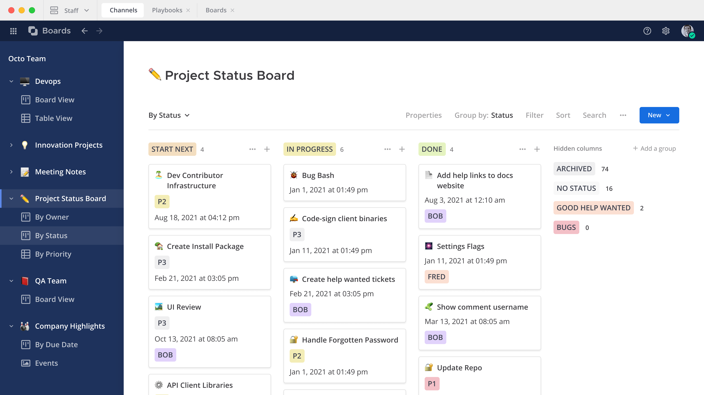

Mattermost Boards
=================

Mattermost Boards enable your team to manage projects and tasks via a familiar Kanban board structure. Keep everyone in your team and organization in the loop to stay on schedule with clearly defined tasks, owners, checklists, and deadlines. Keep everything your team needs in one place, including documents, images, and important hyperlinks.

This Mattermost Boards User Guide is for anyone who needs help using Mattermost project and task management capabilities.

The Basics
----------
.. toctree::
   :hidden:

   Overview </boards/overview>
   Get Started </boards/getting-started>
   Access Boards </boards/accessing-boards>
   Work With Boards </boards/working-with-boards>
   Work With Views </boards/working-with-views>
   Work with Cards </boards/work-with-cards>
   Share Boards </boards/sharing-boards> 
   Templates </boards/templates>

* :doc:`Overview </boards/overview>` - Learn about Mattermost Boards features.
* :doc:`Get Started </boards/getting-started>` - Enable Boards for your Mattermost instance.
* :doc:`Access Boards </boards/accessing-boards>` - Use Mattermost Channels to access your Boards.
* :doc:`Work With Boards </boards/working-with-boards>` - Create new Boards and manage their properties.
* :doc:`Work With Views </boards/working-with-views>` - Use Views to manage cards.
* :doc:`Work with Cards </boards/work-with-cards>` - Learn about the different property types in cards.
* :doc:`Share Boards </boards/sharing-boards>` - Share Boards with your team and manage sharing settings. 
* :doc:`Templates </boards/templates>` - Customize your Boards and Cards with Templates.
