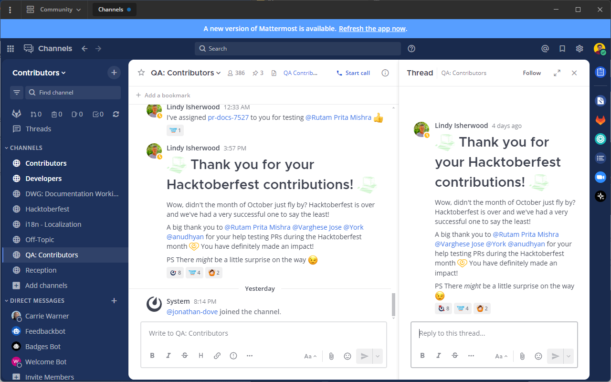

Mattermost Channels
===================

Mattermost Channels provide 1:1 and group messaging that features integrated voice/video conferencing, file, image, and link sharing, rich markdown formatting, and a fully searchable message history. Keep all of your team’s communications in one place and remove information and organizational silos.

This Mattermost Channels User Guide is designed for anyone who needs help using Mattermost messaging capabilities.

Access Your Workspace
---------------------

.. toctree::
   :maxdepth: 1
   :hidden:

   Log In to Your Workspace </messaging/signing-in>
   About Teams, Channels, and Messages </messaging/about-teams-channels-messages>
   Switch Between Teams </messaging/switching-between-teams>
   Log Out of Mattermost </messaging/logging-out>

* :doc:`Log In to Your Workspace </messaging/signing-in>` - Sign into a Mattermost server and navigate teams, channels, and messages to connect with your teammates. 
* :doc:`About Teams, Channels, and Messages </messaging/about-teams-channels-messages>` - Find out how to access all of the Mattermost Channels capabilities.
* :doc:`Switch Between Teams </messaging/switching-between-teams>` - Learn how to navigate between Mattermost Teams.
* :doc:`Log Out of Mattermost </messaging/logging-out>` - Look here if you get stuck trying to log out.

Work With Messages
------------------
.. toctree::
   :maxdepth: 1
   :hidden:

   Messaging Basics </messaging/messaging-basics>
   Send and Receive Messages </messaging/sending-receiving-messages>
   Organize Conversations </messaging/organizing-conversations>
   Text Formatting </messaging/formatting-text>
   Use Emojis </messaging/using-emoji>
   Mention Teammates </messaging/mentioning-teammates>
   Share Messages </messaging/sharing-messages>
   Share Files </messaging/sharing-files>
   Execute Commands </messaging/executing-slash-commands>
   Save Messages </messaging/saving-messages>
   Pin Messages </messaging/pinning-messages>
   Search </messaging/searching-in-mattermost>

* :doc:`Messaging Basics </messaging/messaging-basics>` - Learn about the basic functionality of Mattermost Channels.
* :doc:`Send and Receive Messages </messaging/sending-receiving-messages>` - Communicate with your team.
* :doc:`Collapsed Reply Threads </messaging/organizing-conversations>` - Use Collapsed Reply Threads to organize your messages.
* :doc:`Text Formatting </messaging/formatting-text>` - Use markdown to format message content.
* :doc:`Use Emojis </messaging/using-emoji>` - Express concepts, emotions, and physical gestures in your messages.
* :doc:`Mention Teammates </messaging/mentioning-teammates>` - Use mentions to get the attention of specific people.
* :doc:`Share Messages </messaging/sharing-messages>` - Share links to messages across channels.
* :doc:`Share Files </messaging/sharing-files>` - Share videos, voice recordings, and images in your Mattermost messages.
* :doc:`Execute Commands </messaging/executing-slash-commands>` - Use slash commands to execute Mattermost functionality.
* :doc:`Save Messages </messaging/saving-messages>` - Save messages to follow up later.
* :doc:`Pin Messages </messaging/pinning-messages>` - Pin useful messages to the top of a channel.
* :doc:`Search </messaging/searching-in-mattermost>` - Use search to find messages, replies, and contents of files across Mattermost Channels.

Manage Teams, Channels, and Members
-----------------------------------

.. toctree::
   :maxdepth: 1
   :hidden:

   Create Teams </messaging/creating-teams>
   Team Settings </messaging/team-settings>
   Manage Team Members </messaging/managing-members>
   Manage Channels </messaging/managing-channels>
   Channel Settings </messaging/channel-settings>
   Organize Channels </messaging/organizing-mattermost>

* :doc:`Create Teams </messaging/creating-teams>` - Create teams to group your organization’s users together.
* :doc:`Team Settings </messaging/team-settings>` - Configure team names, descriptions, icons, and invite settings.
* :doc:`Manage Team Members </messaging/managing-members>` - Invite users to teams, configure user roles, and disable user access.
* :doc:`Manage Channels </messaging/managing-channels>` - Create, join, rename, leave, favorite, mute, and archive Channels.
* :doc:`Channel Settings </messaging/channel-settings>` - Customize notification, headers, names, and descriptions of Channels.
* :doc:`Organize Channels </messaging/organizing-mattermost>` - Organize and navigate Channels.

Customize Channels
------------------

.. toctree::
   :maxdepth: 1
   :hidden:

   Set Status and Availability </messaging/setting-your-status-availability>
   Configure Notifications </messaging/configuring-notifications>
   Organize the Sidebar </messaging/organizing-your-sidebar>
   Account Settings </messaging/managing-account-settings>
   Theme Colors </messaging/customizing-theme-colors>
   Desktop App Configurations </messaging/managing-desktop-app-options>
   Manage Server Connections </messaging/managing-desktop-app-servers>

* :doc:`Set Status and Availability </messaging/setting-your-status-availability>` - Indicate your availability and set custom statuses.
* :doc:`Configure Notifications </messaging/configuring-notifications>` - Configure message alerts and desktop, email, and push notifications.
* :doc:`Organize the Sidebar </messaging/organizing-your-sidebar>` - Organize conversations in the sidebar to keep your workspace efficient.
* :doc:`Account Settings </messaging/managing-account-settings>` - Configure profile, security, notifications, themes, language, and more.
* :doc:`Theme Colors </messaging/customizing-theme-colors>` - Import themes or create your own custom theme.
* :doc:`Desktop App Configurations </messaging/managing-desktop-app-options>` - Configure settings on the Windows, Mac, and Linux Desktop Apps.
* :doc:`Manage Server Connections </messaging/managing-desktop-app-servers>` - Manage your connections to multiple Mattermost servers.

Navigate Channels
-----------------

.. toctree::
   :maxdepth: 1
   :hidden:

   Navigating Mattermost </messaging/navigating-mattermost>
   Keyboard Accessibility </messaging/keyboard-accessibility>
   Keyboard Shortcuts </messaging/keyboard-shortcuts>

* :doc:`Navigating Mattermost </messaging/navigating-mattermost>` - Find your way around Mattermost.
* :doc:`Keyboard Accessibility </messaging/keyboard-accessibility>` - Use navigational keyboard shortcuts to use Mattermost without a mouse.
* :doc:`Keyboard Shortcuts </messaging/keyboard-shortcuts>` - Use keyboard shortcuts to perform actions that help you navigate Mattermost Channels.

Extend Mattermost Channels
---------------------------
      
.. toctree::
   :maxdepth: 2
      
   Extending Channels with Integrations </messaging/extending-channels-with-integrations>
