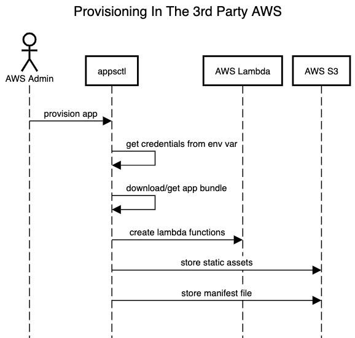
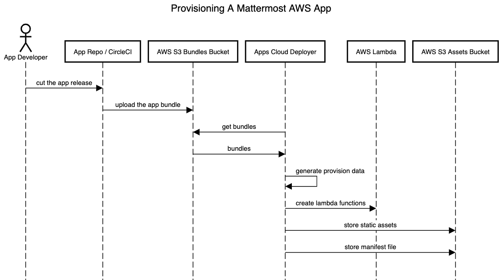

Deploy Apps to AWS
==================

Deployment in self-managed environments
~~~~~~~~~~~~~~~~~~~~~~~~~~~~~~~~~~~~~~~

An App designed and bundled for AWS Lambda can be deployed to the customer's own
AWS environment, and then installed on a self-managed ("on-prem") Mattermost
instance. Note that the only AWS-hosted apps available on Mattermost Cloud instances are the ones by Mattermost.

For details on how to develop and package apps for AWS see `Package / AWS <package-aws.html>`_.

There are three steps required to enable AWS applications on a self-managed Mattermost instance.

1. Initialize the AWS environment
~~~~~~~~~~~~~~~~~~~~~~~~~~~~~~~~~

Set up AWS S3 bucket
^^^^^^^^^^^^^^^^^^^^

You will need to create an S3 bucket within AWS or use an existing bucket.

1. Visit https://s3.console.aws.amazon.com
2. Create a bucket.
3. **Bucket name**: Give your bucket a name, later used in ``MM_APPS_S3_BUCKET`` environment variable.
4. **AWS Region**:
    a. Select your region
    b. Save the slug value for later, to be used in ``MM_APPS_AWS_REGION`` environment variable (Example: ``us-east-1``)
    - Corresponding Lambdas will be deployed in the same region
5. **Block Public Access settings for this bucket**
    a. (Optional) Check **Block *all* public access**
6. Select **Create Bucket**.

Create a privileged IAM user access key and secret
^^^^^^^^^^^^^^^^^^^^^^^^^^^^^^^^^^^^^^^^^^^^^^^^^^

You will need an access key and secret so that ``appsctl`` can deploy the app. These credentials can come from creating an IAM user, using a privileged IAM user, or even using the AWS account owners personal access key. Please follow the instructions provided by AWS (https://aws.amazon.com/premiumsupport/knowledge-center/create-access-key/) to complete these steps and save the ``Access key ID`` and ``Secret access key`` values.

Set AWS_DEPLOY environment variables
^^^^^^^^^^^^^^^^^^^^^^^^^^^^^^^^^^^^^

Open a terminal where you installed the Apps plugin and set the following variables to the AWS credentials just created and saved:

- ``MM_APPS_DEPLOY_AWS_ACCESS_KEY``
- ``MM_APPS_DEPLOY_AWS_SECRET_KEY``

Set the following environment variables based on bucket name and region from Step 1:

- ``MM_APPS_S3_BUCKET``
- ``MM_APPS_AWS_REGION``

Initialize the AWS resources
^^^^^^^^^^^^^^^^^^^^^^^^^^^^

The following command will create Mattermost invocation credentials and policy for use with AWS.

``go run ./cmd/appsctl aws init [flags...]``

It will create or update:

- An IAM user that will be used by the server to invoke the app (``mattermost-apps-invoke``).
- An IAM group that the user belongs to, that will be used by the server to invoke the app (``mattermost-apps-invoke-group``).
- An IAM policy used to control access to the Lambda and S3 resources, used by the invoke group (``mattermost-apps-invoke-policy``).
- An IAM role used to execute app's functions (``mattermost-apps-execute-lambda-role``) with the ``AWSLambdaBasicExecutionRole`` attached to it.

Optional Flags for the ``appsctl`` command:

- ``--create-access-key`` create a new access key and print it out.
- ``--create`` create resources that don't yet exist (user, group, role, access policy).
- ``--group`` name the group to invoke function(s), default ``mattermost-apps-invoke-group``.
- ``--policy`` name the policy used to invoke function(s), default ``mattermost-apps-invoke-policy``.
- ``--user`` name the user to invoke the lambda function(s), default ``mattermost-apps-invoke``.

The output of the command will contain two "Invoke" environment variables.

2. Enable AWS Upstream for Mattermost Apps
~~~~~~~~~~~~~~~~~~~~~~~~~~~~~~~~~~~~~~~~~~

To enable AWS Apps installation and use, the Mattermost server must be (re-)started with the following environment variables:

- ``MM_APPS_AWS_ACCESS_KEY`` An AWS Access Key ID for ``mattermost-apps-invoke`` user. If ``appsctl aws init --create-access-key`` was used, it can be found (once!) in the command's output.
- ``MM_APPS_AWS_SECRET_KEY`` The Secret Key for the access key above.
- ``MM_APPS_AWS_REGION`` The AWS region to use.
- ``MM_APPS_S3_BUCKET`` The name of the AWS bucket for static assets and manifests.

Restart the Mattermost server to complete your Mattermost and AWS setup. You can now deploy an app to AWS.

3. Deploy apps to AWS
~~~~~~~~~~~~~~~~~~~~~

Deploy an app to AWS
^^^^^^^^^^^^^^^^^^^^

To deploy AWS Apps from a bundle use ``appsctl aws deploy {aws-bundle.zip}`` command. It will deploy all necessary resources to AWS, update the invoke policy as needed, and "list" (upload the manifest of) the app in Mattermost server. ``--install`` can be used to automatically install the app once it's deployed.

Flags:

- ``--execute-role`` name of the role to use for executing the lambda function, default ``mattermost-apps-execute-lambda-role``
- ``--install`` install the app onto the Mattermost server once it's been successfully deployed.
- ``--policy`` name of the policy to use to invoke the lambda function, default ``mattermost-apps-invoke-policy``.
- ``--update`` update the lambda function that already exists.

The command requires that the following environment variables are set:

- ``MM_SERVICESETTINGS_SITEURL`` must be set to where the Mattermost server APIs can be accessed.
- ``MM_ADMIN_TOKEN`` must be set to access the Mattermost REST APIs.
- ``MM_APPS_AWS_REGION`` must be set to the AWS region where the resources are deployed and accessed.
- ``MM_APPS_S3_BUCKET`` must be the name of the S3 bucket used to store manifests and static assets.
- ``MM_APPS_DEPLOY_AWS_ACCESS_KEY``, ``MM_APPS_DEPLOY_AWS_SECRET_KEY`` are the priviledged credentials used to deploy functions and files to AWS.
- ``MM_APPS_AWS_ACCESS_KEY``, ``MM_APPS_AWS_SECRET_KEY`` are the "unprivileged" credentials used to invoke the functions, used only for the ``appsctl aws test`` command.

Once deployed, apps can be installed interactively in Mattermost using ``/apps install listed`` command which will show all the deployed apps available for installation in Mattermost.

Deployed app details
~~~~~~~~~~~~~~~~~~~~

AWS Lambda Functions Naming
----------------------------

AWS Lambda functions have semantic names, meaning that a function described in the ``manifest.json`` file translates to AWS as ``$appID_$appVersion_$functionName`` to avoid collisions with other apps' or other versions' functions. **appsctl** deploys lambda functions using this naming convention. For example, the name of a ``servicenow`` app's lambda function might be ``com-mattermost-servicenow_0-1-0_go-function``. **appsctl** handles the naming of AWS Lambda functions. The dedicated S3 bucket name is stored in the environment variable: ``MM_APPS_S3_BUCKET``.

Storage of App Assets and Manifests
------------------------------------

The AWS S3 bucket mentioned above is used to store all app static assets and manifest files.

All files in the static folder of the bundle are considered to be the app's static assets and are stored in the above-mentioned bucket. Stored assets also have semantic keys and are generated using the rule: ``static/$appID_$appVersion/filename``. For example, the ``servicenow`` app's static file key can be accessed at ``"static/com.mattermost.servicenow_0.1.0_app/photo.png"``.

Storage of Manifest File
------------------------

The ``manifest.json`` file of an app is stored in the same S3 bucket with the key: ``manifests/$appID_$appVersion.json``.

Flow of Deploying Custom Apps to AWS
-------------------------------------

Deployment in Mattermost Cloud
~~~~~~~~~~~~~~~~~~~~~~~~~~~~~~

In order to be deployed in Mattermost Cloud, an app bundle is uploaded to the specific S3 bucket. On a new app release, a bundle is created by GitLab CI and uploaded to S3. The |Mattermost apps cloud deployer|, running as a k8s cron job every hour, detects the S3 upload, and creates appropriate lambda functions, assets, and manifest the same way the **appsclt** does for the third-party accounts.

The deployer needs lambda function names, asset keys, and the manifest key to deploy the app. It calls the ``aws.GetProvisionDataFromFile(/PATH/TO/THE/APP/BUNDLE)`` from the Apps Plugin to get the deploy data. Same data can be generated using the command:

``appsctl generate-terraform-data /PATH/TO/YOUR/APP/BUNDLE``

Flow of deploying custom apps to AWS
-------------------------------------

.. |Mattermost apps cloud deployer| raw:: html

    <a href="https://github.com/mattermost/mattermost-apps-cloud-deployer" target="_blank">Mattermost apps cloud deployer</a>