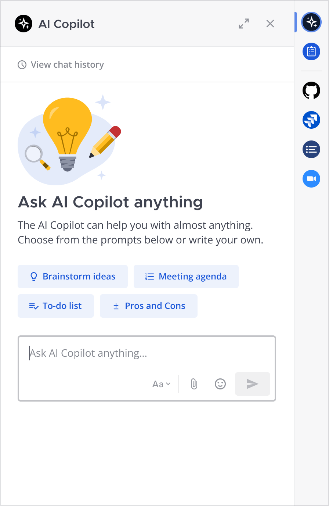

User Guide: Mattermost AI Copilot Plugin
========================================

This documentation outlines the AI-enhanced features available in the `Mattermost AI Copilot plugin <https://github.com/mattermost/mattermost-plugin-ai>`_. For the corresponding configuration guide for administrators, refer to the `Mattermost AI Copilot admin documentation <../guides/mattermost-ai-copilot-admin-guide>`_.

The AI Right-Hand Sidebar (RHS) 
-------------------------------

.. tip:: Access AI capabilities directly from the right-hand sidebar in Mattermost. Begin with suggested prompts or engage in a private thread with the AI for a tailored experience.

**Privately Chat with Your AI Copilot**

You can privately chat with your AI Copilot within Mattermost through the right-hand sidebar. This feature provides a convenient way to interact with AI for personalized assistance.

Contextual Interrogation
------------------------

.. tip:: If you have follow-up questions or need further insights, simply ask. The AI is designed to provide deeper understanding based on your inquiries.

**Engaging AI Bots for Enhanced Insights**

Invoke the power of AI by @ mentioning your AI bot in any thread. This action brings AI's capabilities to your conversation, allowing for quick extraction of information or transformation of discussions into charts, resources, documentation, articles, and more. With the integration of Mattermost Plugins, the potential to enhance your workflow is limitless.

Thread & Unread Channel Message Summarization
---------------------------------------------

**Summarize Threads and Unread Messages**

- **Summarize Thread**: Activate this feature to receive concise summaries of long discussions directly through Direct Message. This accelerates decision-making and improves information flow.
- **Summarize Unread Channel Messages**: Utilize AI to summarize new messages, identify next steps, and pinpoint unanswered questions, ensuring you stay on top of your communications.

Mattermost Calls Meeting Summarization
--------------------------------------

.. highlight:: Leverage the "Mattermost Calls" plugin to turn meeting recordings into actionable summaries. This feature ensures key points are captured and shared easily.

**Summarize Mattermost Calls**

Transform your Mattermost Calls recordings into detailed summaries with just a click. This enables easy sharing of meeting insights with your team and the broader organization, enhancing communication and productivity.

.. image:: ../images/copilot-Calls-Meeting-Summary.webp
  :alt: Easily share the updates from your Mattermost Calls with your team and broader organization by turning recordings into detailed summaries at the click of a button.
