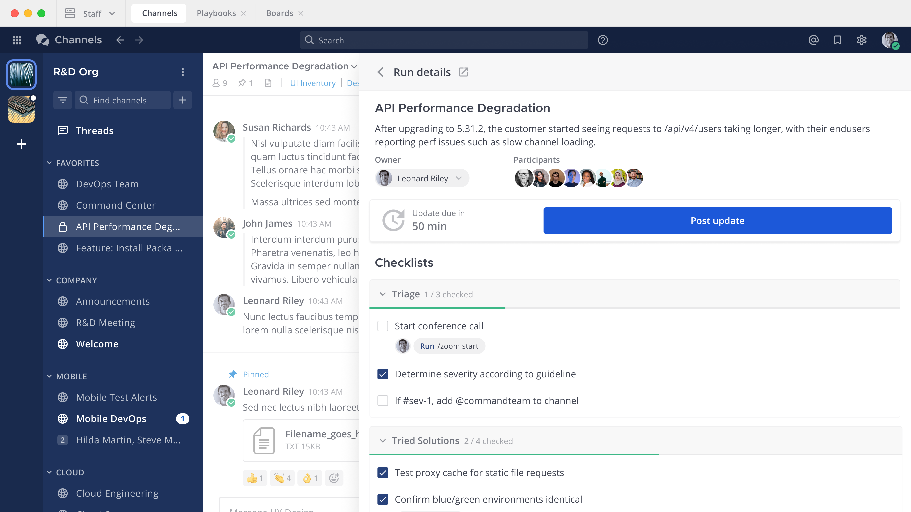

Mattermost Playbooks
====================

.. include:: ../_static/badges/allplans-cloud-selfhosted.rst
  :start-after: :nosearch:

Mattermost Playbooks are pre-built, configurable checklists that define a repeatable process for teams to achieve specific and predictable outcomes. With Playbooks, development teams can orchestrate prescribed workflows and define, streamline, and document complex, recurring operations. Playbooks help you stay in command with integrated communication, collaboration, and status dashboards to manage your entire workflow lifecycle.
    

   
This Mattermost Playbooks User Guide is for anyone who needs help using Mattermost workflow capabilities.

.. toctree::
   :hidden:

   Overview </playbooks/overview>
   Work with playbooks </playbooks/work-with-playbooks>
   Work with runs <playbooks/work-woth-runs>
   Notifications and updates </playbooks/notifications-and-updates>
   Share and collaborate </playbooks/share-and-collaborate>
   Metrics and goals </playbooks/metrics-and-goals>
   Interact with playbooks </playbooks/interact-with-playbooks>
   
* :doc:`Overview </playbooks/overview>` - Learn about Mattermost Playbooks features.
* :doc:`Work with playbooks </playbooks/work-with-playbooks>` - Customize a playbook for successful runs.
* :doc:`Work with runs <playbooks/work-woth-runs>` - Edit triggers and actions in an active run.
* :doc:`Notifications and updates </playbooks/notifications-and-updates>` - Keep track of all your active runs and tasks.
* :doc:`Share and collaborate </playbooks/share-and-collaborate>` - Reuse and share playbooks with your organization.
* :doc:`Metrics and goals </playbooks/metrics-and-goals>` - Use retrospectives to improve your workflows and provide detailed insight into your Playbooks.
* :doc:`Interact with playbooks </playbooks/interact-with-playbooks>` - Interact with playbooks using slash commands and the REST API. 
