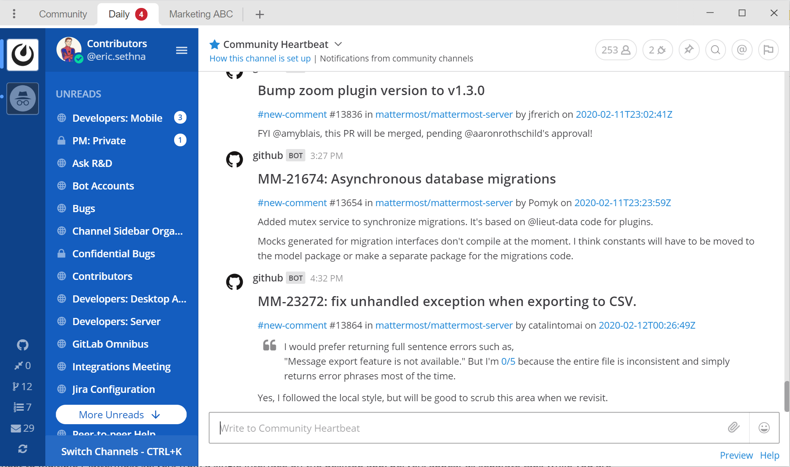
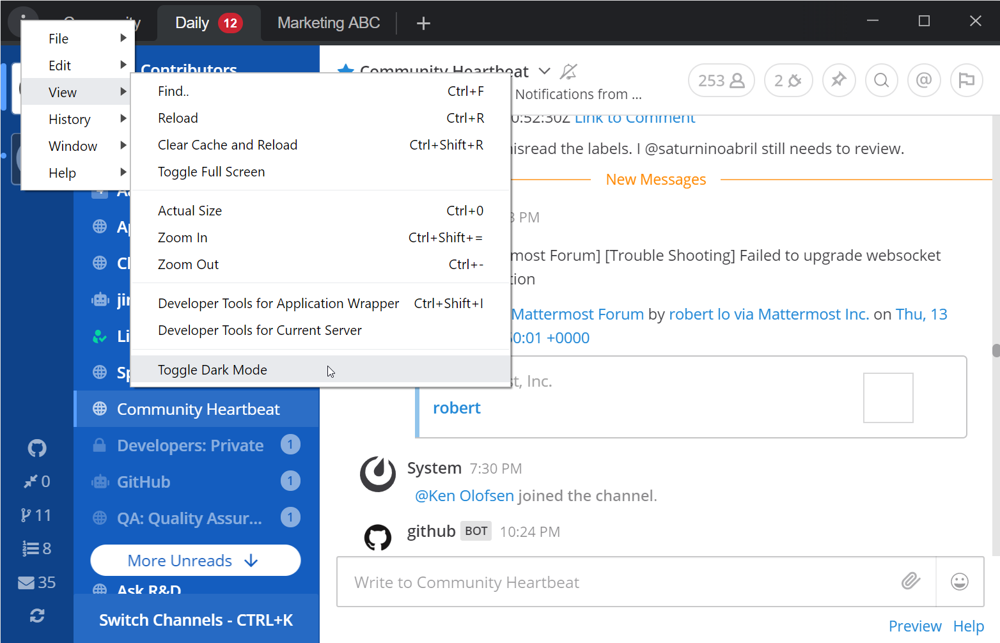

Using Mattermost Desktop App
============================

The Mattermost Desktop Applications are available for Windows, macOS, and Linux operating systems.

You can `download the apps directly from our download page <https://mattermost.com/download/#mattermostApps>`__ and visit our `installation guides <https://docs.mattermost.com/install/desktop.html>`__ for help during setup and for troubleshooting tips.

To view the latest updates, please see our `changelog <https://docs.mattermost.com/help/apps/desktop-changelog.html>`__.

Below are a few tips to get you started and to configure your experience on the desktop app:

.. contents::
    :backlinks: top
    :local:

Server Management
-----------------

You can connect to multiple Mattermost servers from a single interface on the desktop app. Servers appear as separate tabs at the top of the desktop window and can be reordered by dragging.

The Server Management section allows you to add, edit, and remove servers. 

Adding Servers
~~~~~~~~~~~~~~

To add a new server to your desktop app environment:

1. Select the **+** button in the desktop window bar at the top of the screen.
2. In the **Name** field, enter the name that you want for the tab.
3. In the **URL** field, enter the complete URL of the server that you want to connect to. URLs must begin with either ``http://`` or ``https://``.
4. Select **Add**.

Editing Servers
~~~~~~~~~~~~~~~

To edit a server in your desktop app environment:

1. On Windows, go to **... > File > Settings**. On Mac or Linux, go to **Mattermost > Preferences**.
2. Next to the server you want to update, select **Edit**.
3. Edit **Name** and/or **URL**.
4. Select **Save**.

Removing Servers
~~~~~~~~~~~~~~~~

To remove a server from your desktop app environment:

1. On Windows, go to **... > File > Settings**. On macOS or Linux, go to **Mattermost > Preferences**.
2. Next to the server or team that you want to remove, select **Remove**.
3. select **Remove**.

App Options
-----------

In addition to `Mattermost Account Settings <https://docs.mattermost.com/help/settings/account-settings.html>`__, the Desktop App provides additional options to customize your experience.

The options appear on the Settings page, available on Windows from **... > File > Settings**, or on Mac or Linux from **Mattermost > Preferences**.

Start app on login (Windows, Linux only)
    When enabled, the Mattermost application starts when you log in to your machine. This setting is enabled by default.

Check spelling
    When enabled, based on your system language configuration misspelled words in your messages are highlighted. This setting is enabled by default. You must restart the app to change this setting.

Show red badge on taskbar icon to indicate unread messages (Windows, macOS only)
    When enabled, a red badge is shown on the taskbar icon for unread messages with a number count indicating unread mentions or Direct Messages. If disabled, a red badge is only shown for unread mentions (with a number count). This setting is enabled by default.

Flash taskbar icon when a new message is received (Windows, Linux only)
    Configure whether the taskbar icon flashes for a few messages when a new message is received on any of your active teams and servers. This setting is enabled by default.
    
Bounce the Dock icon when receiving a notification (macOS only)
    When enabled, the Dock icon will either bounce once or bounce until the user opens the app when receiving a notification. This setting is enabled by default.

Show Mattermost icon in the menu bar (Mac only)
    When enabled, Mattermost icon is added to the Mac menu bar. This setting is disabled by default.

Show icon in the notification area (Linux only)
    When enabled, the Mattermost icon is added to the Linux notification area. This setting is enabled by default.

Leave app running in notification center when application window is closed (Linux only)
    When enabled, closing the application window leaves the Mattermost Desktop App running in your notification center. This can be useful if you want to check for unread mentions while away from the app. This setting is enabled by default.
    
Use GPU hardware acceleration
    When enabled, the Mattermost user interface is rendered more efficiently but can lead to decreased stability for some systems. This setting is enabled by default. You must restart the app to change this setting.
    
Download Location
~~~~~~~~~~~~~~~~~

You can specify where files downloaded from the Mattermost desktop app are saved on your local machine. By default, files are saved to the ``Downloads`` folder.

1. On Windows, go to **... > File > Settings**. On Mac or Linux, go to **Mattermost > Preferences**.
2. Select **Change**.
3. Select the location where you want files saved to your machine.
    
Dark Theme
~~~~~~~~~~

On macOS, the Mattermost desktop app respects the System Preferences appearance setting of the operating system to set the theme of the title bar. On Windows, you can toggle the theme of the Mattermost desktop app title bar in **... > View > Toggle Dark Mode**.  

