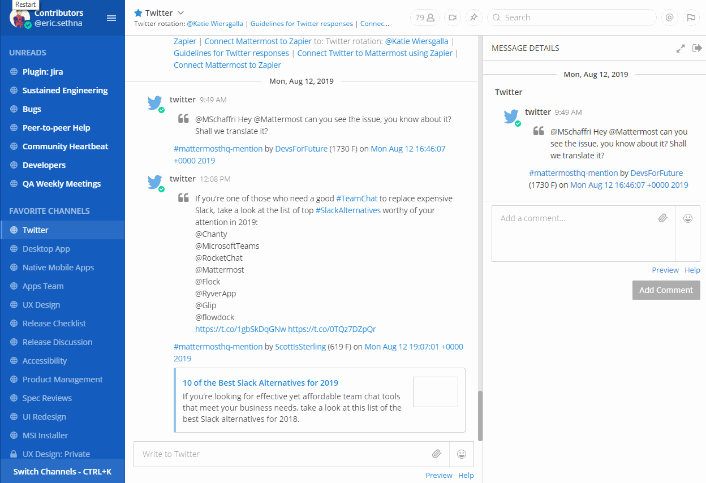
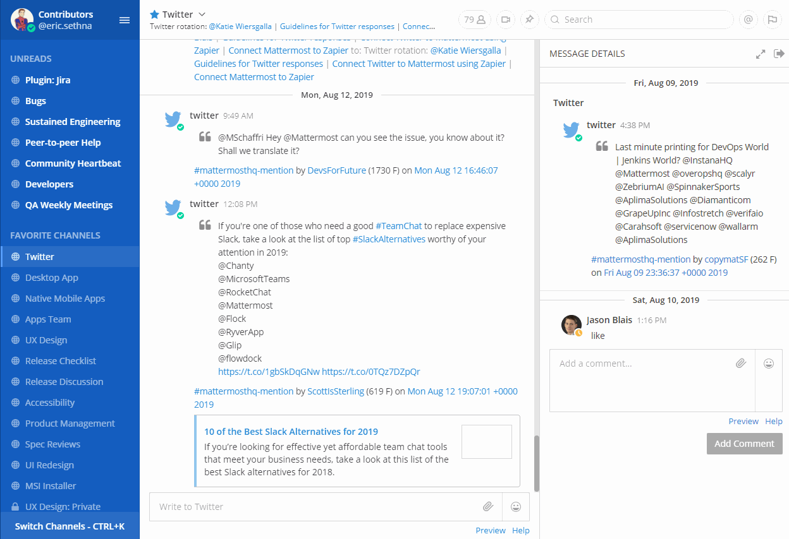
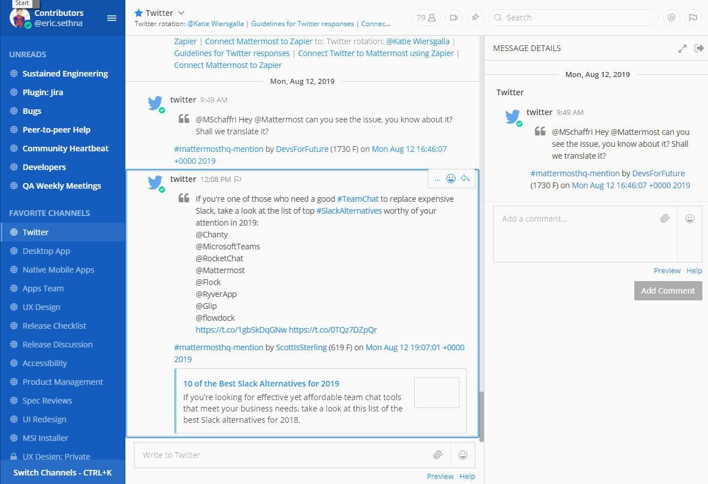

Keyboard Accessibility
======================
Navigational keyboard shortcuts help you use Mattermost without requiring a mouse. Below is a list of supported shortcuts. Elements in focus have a colored outline, as shown here:

.. image:: ../../images/focus.png

+----------------------------------------+----------------------------------------------------------------------------------+
| Shortcut                               | Description                                                                      |
+========================================+==================================================================================+
| F6 (CTRL+F6 on Browser)                | Move focus to the next section                                                   |
+----------------------------------------+----------------------------------------------------------------------------------+
| SHIFT+F6 (SHIFT+CTRL+F6 on Browser)    | Move focus to the previous section                                               |
+----------------------------------------+----------------------------------------------------------------------------------+
| TAB                                    | Move focus to the next element                                                   |
+----------------------------------------+----------------------------------------------------------------------------------+
| SHIFT+TAB                              | Move focus to the previous element                                               |
+----------------------------------------+----------------------------------------------------------------------------------+
| Up or DOWN                             | Move focus between messages in the post list or sections in the channel sidebar  |
+----------------------------------------+----------------------------------------------------------------------------------+
| ENTER                                  | Take action on the focused element                                               |
+----------------------------------------+----------------------------------------------------------------------------------+

Region Navigation
--------------------
Mattermost has eight regions that can be focused for navigation. Use **F6** (Desktop App) or **CTRL+F6** (Browser) repeatedly to move focus and loop through the regions in this order:

1. Message list region
2. Message input region
3. Right-hand side message list region
4. Right-hand side message input region
5. Team menu region
6. Channel sidebar region
7. Channel header region
8. Search

Message Navigation
------------------
When the message list region is focused, use the **UP** or **DOWN** arrow keys to navigate through messages. Press **TAB** to navigate through message actions

Message Composition
~~~~~~~~~~~~~~~~~~~
A custom label is composed for each message making it easier to read. Each message is made up of elements (e.g. author, timestamp, message content, etc.) which are read together in full sentences. Here’s the order they are read in:

Channel Sidebar Navigation
--------------------------
When the channel sidebar region is focused, use the **UP** or **DOWN** arrow keys to focus individual sidebar sections, such as Favorites, Public Channels, Private Channels and Direct Messages. Press **TAB** to navigate through channels or other buttons within a sidebar section.

