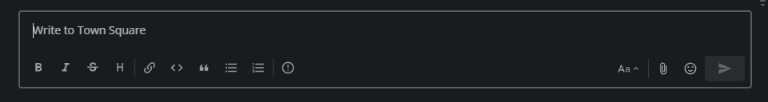

Keyboard Accessibility
======================
Navigational keyboard shortcuts help you use Mattermost without requiring a mouse. Below is a list of supported shortcuts. Elements in focus have a colored outline, as shown here:

+----------------------------------------+----------------------------------------------------------------------------------+
| Shortcut                               | Description                                                                      |
+========================================+==================================================================================+
| F6 (CTRL+F6 on Browser)                | Move focus to the next section                                                   |
+----------------------------------------+----------------------------------------------------------------------------------+
| SHIFT+F6 (SHIFT+CTRL+F6 on Browser)    | Move focus to the previous section                                               |
+----------------------------------------+----------------------------------------------------------------------------------+
| TAB                                    | Move focus to the next element                                                   |
+----------------------------------------+----------------------------------------------------------------------------------+
| SHIFT+TAB                              | Move focus to the previous element                                               |
+----------------------------------------+----------------------------------------------------------------------------------+
| Up or DOWN                             | Move focus between messages in the post list or sections in the channel sidebar  |
+----------------------------------------+----------------------------------------------------------------------------------+
| ENTER                                  | Take action on the focused element                                               |
+----------------------------------------+----------------------------------------------------------------------------------+

Region Navigation
--------------------
Mattermost has eight regions that can be focused for navigation. Use **F6** (Desktop App) or **CTRL+F6** (Browser) repeatedly to move focus and loop through the regions in this order:

1. Message list region
2. Message input region
3. Right-hand side message list region
4. Right-hand side message input region
5. Team menu region
6. Channel sidebar region
7. Channel header region
8. Search

.. image:: ../../images/section_loop.gif

Message Navigation
------------------
When the message list region is focused, use the **UP** or **DOWN** arrow keys to navigate through messages. Press **TAB** to navigate through message actions.

.. image:: ../../images/post_list_ada.gif

Message Composition
~~~~~~~~~~~~~~~~~~~
Mattermost is compatible with most popular screen readers. A custom readout is composed for each message by combining the message elements and reading them together in full sentences. Message elements will read in the following order:

1. Header: Author, timestamp, message type (i.e. parent post or reply)
2. Main Content: The message content typed by the author
3. Attachments: The number of attachments (if applicable)
4. Emoji Reactions: The number of unique emoji reactions (if applicable)
5. Flags/Pins: If a message is pinned or flagged (if applicable)

For example, a message read by a screen reader may sound like the following:

  .. code-block:: none
  
    Eric Sethna at 12:57pm Thursday June 13th wrote a reply "Thanks for the review", 3 attachments, 2 reactions, message is flagged and pinned.

Channel Sidebar Navigation
--------------------------
When the channel sidebar region is focused, use the **UP** or **DOWN** arrow keys to focus individual sidebar sections, such as Favorites, Public Channels, Private Channels and Direct Messages. Press **TAB** to navigate through channels or other buttons within a sidebar section.

.. image:: ../../images/sidebar_nav.gif
