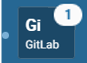

Configuring Notifications
=========================

Notifications in Mattermost alert you to unread messages and mentions.

Unreads and Mentions
----------------------------------------

Unread Messages Indicator
~~~~~~~~~~~~~~~~~~~~~~~~~~~~~~~~~~~~~~~~~~~~~~~~~~

The name of a channel in the left-hand sidebar shows as **bold** when
there are unread messages in the channel. Clicking on the channel
removes the bold indicator, and brings you to the earliest unread
message in the channel.

You can choose not to show unread indicators in a channel by clicking
**Channel Menu** > **Notification Preferences** > **Mark Channel
Unread** and selecting **Only for mentions**. This will only notify you if a mention is triggered on your name or a
keyword for which you're listening.

Mentions Indicator
~~~~~~~~~~~~~~~~~~~~~~~~~~~~~~~~~~~~~~~~~~~~~~~~~~~~

Mentions are triggered by `selected
keywords <https://docs.mattermost.com/help/settings/account-settings.html#words-that-trigger-mentions>`__
in a channel. Unread mentions are indicated by bold text and a mention counter next to
the channel name in the left-hand sidebar.

Clicking the channel name removes the bolding and mention count. You can
review your recent mentions by clicking **@** next to the search box
at the top of the screen.

Learn more about `mentioning
teammates <http://docs.mattermost.com/help/messaging/mentioning-teammates.html>`__.

Email Notifications
-------------------------------------

Emails are sent for any mentions you receive if you have Mattermost
closed or have not had any browser activity for a short time.

-  Turn email notifications On or Off in **Account Settings** >
   **Notifications** > **Email Notifications**.
-  Configure the email address where notifications are sent in **Account
   Settings** > **General** > **Email**.

Desktop Notifications
-------------------------------------

These are browser notifications that appear in the corner of your main monitor for activity in channels you are not actively viewing. By default, these notifications are sent for all unread messages while Mattermost is open. Desktop notifications are available on Edge, Firefox, Safari, Chrome and `Mattermost Desktop Apps <https://about.mattermost.com/download/#mattermostApps>`_.

-  Configure when desktop notifications are sent from **Account
   Settings** > **Notifications** > **Desktop Notifications** > **Send
   Desktop Notifications**.
-  Configure channel specific desktop notifications from **Channel
   Menu** > **Notification Preferences** > **Send Desktop
   Notifications**. By default, all channels use the global setting
   configured in *Account Settings*.
   
Notification Sounds
~~~~~~~~~~~~~~~~~~~~~~~~~~~~~~~~~~~~~

A notification sound plays for all activity that would fire a desktop
notification. Notification sounds are available on IE11, Edge, Safari, Chrome and
`Mattermost Desktop Apps <https://about.mattermost.com/download/#mattermostApps>`_.

-  Turn notification sounds On or Off in **Account Settings** >
   **Notifications** > **Desktop Notification Sounds**.
-  Configure desktop notification triggers, sounds and duration in
   **Account Settings** > **Notifications** > **Desktop Notifications**.
-  Configure channel specific desktop notifications from **Channel
   Menu** > **Notification Preferences** > **Send Desktop
   Notifications**. By default, all channels use the global setting
   configured in *Account Settings*.

Mobile Push Notifications
--------------------------------------------

If the Mattermost Android or iOS app is installed, push notifications
can be sent to your mobile device. By default, these notifications are
sent for mentions in any channel or direct message channel that is not
being viewed on desktop.

-  Configure when push notifications are sent from **Account Settings**
   > **Notifications** > **Mobile Push Notifications** > **Send mobile
   push notifications**.
-  Configure when push notifications are sent depending on your status
   from **Account Settings** > **Notifications** > **Mobile Push
   Notifications** > **Trigger push notifications when**.

Team Sidebar Notifications
----------------------------------------

If you belong to more than one team, a team sidebar appears to the left of your channel list. It will inform you of unread messages and mentions across teams.

- Unread messages are denoted by a small dot left of the team icon.
- Unread mentions are displayed with a mention counter that appears on the top right corner of the team icon.

Browser Tab Notifications
----------------------------------------

If Mattermost is open in a browser tab the favicon updates to inform you of unread messages and
mentions. Browser tab notifications are available on Firefox and Chrome.

- Unread messages are denoted by an asterisk (\*) next to the Mattermost icon.
- Unread mentions are counted in brackets and incorporate mentions and direct messages from all of your teams.
