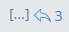
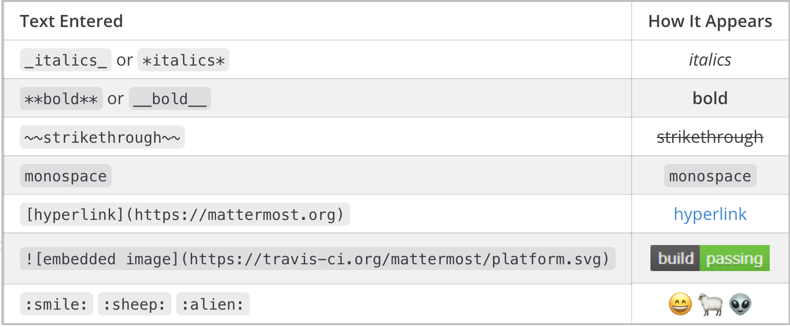

Messaging Basics
================

--------------

**Write messages** using the text input box at the bottom of Mattermost.
Press **ENTER** to send a message. Use **SHIFT+ENTER** to create a new
line without sending a message.

**Reply to messages** by clicking the reply arrow next to the message
text.

**Notify teammates** when they are needed by typing ``@username``.

**Format your messages** using Markdown that supports text styling,
headings, links, emoticons, code blocks, block quotes, tables, lists and
in-line images.

**Quickly add emoji** by typing ":", which will open an emoji
autocomplete. If the existing emoji don't cover what you want to
express, you can also create your own `Custom
Emoji <http://docs.mattermost.com/help/settings/custom-emoji.html>`__.

**Attach files** by dragging and dropping into Mattermost or clicking
the attachment icon in the text input box.

**Flag messages for follow up** by clicking the flag icon next to the
message timestamp.

Learn more about: 

* `Composing Messages and Replies <http://docs.mattermost.com/help/messaging/sending-messages.html>`__
* `Mentioning Teammates <http://docs.mattermost.com/help/messaging/mentioning-teammates.html>`__
* `Formatting Messages using Markdown <http://docs.mattermost.com/help/messaging/formatting-text.html>`__
* `Attaching Files <http://docs.mattermost.com/help/messaging/attaching-files.html>`__
* `Executing Commands <http://docs.mattermost.com/help/messaging/executing-commands.html>`__
