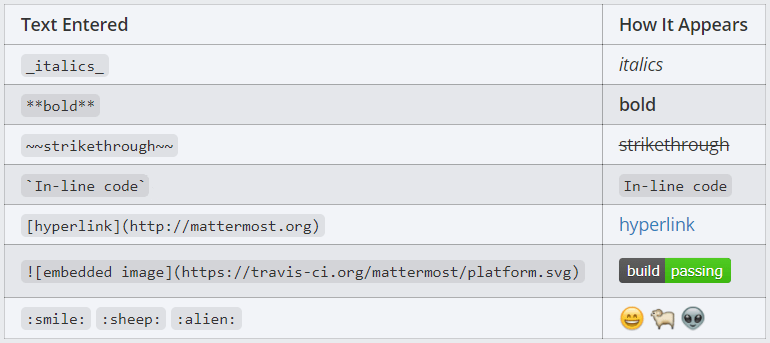

Messaging Basics
================

--------------

**Write messages** using the text input box at the bottom of the screen.
Press ENTER to send a message. Use SHIFT+ENTER to create a new
line without sending a message. To send messages on CTRL+ENTER and use ENTER to insert new lines go to **Main Menu** > **Account Settings** > **Advanced** > **Send messages on CTRL+ENTER**.

**Reply to messages** by clicking the reply arrow next to the message
text.

.. image:: ../../images/reply-icon.png
   :alt: reply arrow

**Notify teammates** when they are needed by typing ``@username``.

**Format your messages** using Markdown that supports text styling,
headings, links, emojis, code blocks, block quotes, tables, lists and
in-line images.

You can use either ``_`` or ``*`` for italics and bold text. See the table below for examples.

**Quickly add emojis** by typing ":" followed by two characters, which will open an emoji
autocomplete. If the existing emojis don't cover what you want to
express, you can also create your own `Custom
Emoji <https://docs.mattermost.com/help/settings/custom-emoji.html>`__.

**Attach files** by dragging and dropping them into Mattermost or clicking
the attachment icon in the text input box.

**Save messages for follow up** using the **Save** icon next to the
message.

.. figure:: ../../images/save-message.png
   :alt: flags

Learn more about:

* `Composing Messages and Replies <https://docs.mattermost.com/help/messaging/sending-messages.html>`__
* `Mentioning Teammates <https://docs.mattermost.com/help/messaging/mentioning-teammates.html>`__
* `Formatting Messages using Markdown <https://docs.mattermost.com/help/messaging/formatting-text.html>`__
* `Sharing Files <https://docs.mattermost.com/help/messaging/attaching-files.html>`__
* `Executing Commands <https://docs.mattermost.com/help/messaging/executing-commands.html>`__
