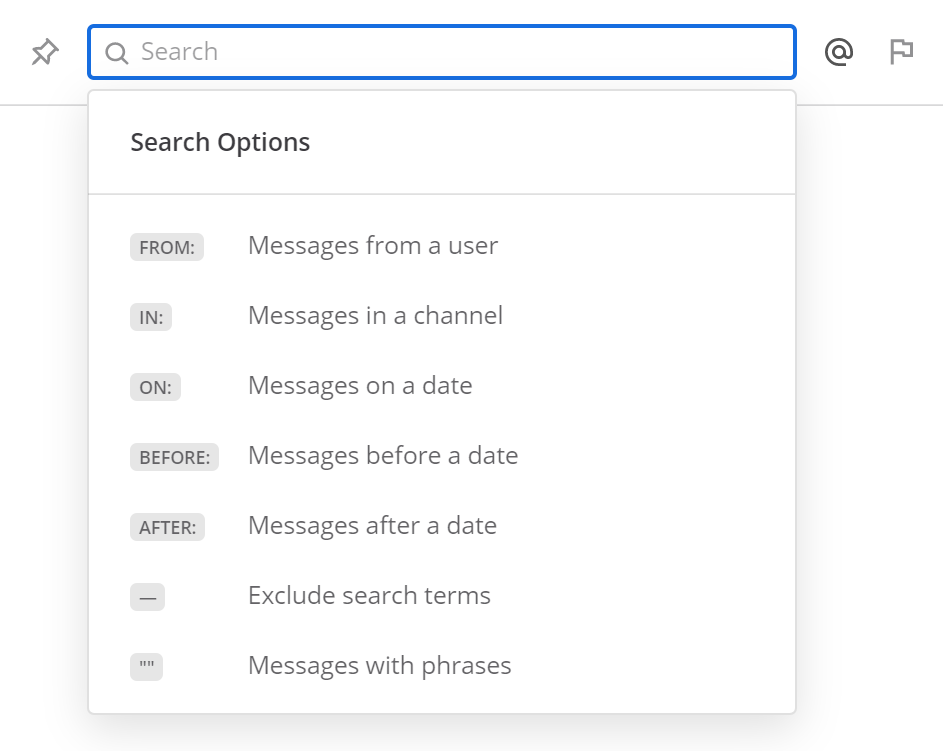

Searching
=========

Use the search box to find messages and replies that match the search terms that you enter. All channels that you are a member of in the current team are searched.

- Multiple-word search terms return results that contain all of the terms.
- When results appear, click **Jump** to view that post in the channel archive.
- File attachments and their filenames are not searched. If file attachments show up in the search results, it's because they are attached to messages that match the search query.
- Archived channels can be searched as long as you are a member of that channel. To remove archived channels from your search results, you can leave those channels. If you are unable to see messages in archived channels in your search results, ask your System Administrator if *Allow users to view archived channels* has been disabled under **System Console > Users and Teams**.
-  You can use search modifiers such as ``from:dave`` to return results only from certain people or in certain channels. For more information about this, see the `Search Modifiers`_ section.

Like many search engines, common words such as ``the``, ``which``, and ``are`` (known as "stop words"), as well as two-letter and one-letter search terms, are not shown in search because they typically return too many results. See database documentation on `MySQL`_ and `Postgres`_ for a full list.

Search Modifiers
----------------

Clicking inside the search field offers a selection of search filters to narrow down your query. Click on a search filter to add it to the search input.

From: and In:
^^^^^^^^^^^^^

Use ``from:`` to find posts from specific users and ``in:`` to find posts in specific public or private channels, as well as direct and group messages.  Channels can be searched by display name or id. 

-  For example: Searching ``Mattermost in:town-square`` only returns messages in Town Square that contain ``Mattermost``.
-  Searching ``Mattermost in: @john.doe`` returns messages that contain ``Mattermost`` in your direct message history with John Doe. 

Before:, After: and On:
^^^^^^^^^^^^^^^^^^^^^^^

Use ``before:`` to find posts before a specified date and ``after:`` to find posts after a specified date. Use both ``before:`` and ``after:`` together to search in a specified date range.  Use ``on:`` to find posts from a specific date.  You can use the date picker to select a date or you can type it in YYYY-MM-DD format. For example: 

-  Searching ``website before: 2018-09-01`` will return messages containing the keyword ``website`` posted prior to September 1, 2018.     
-  Searching ``website after: 2018-08-01`` will return messages containing the keyword ``website`` posted after August 1, 2018.  
-  Searching ``website before: 2018-09-01 after: 2018-08-01`` will return all messages that contain the keyword ``website`` that were posted between August 1, 2018 and September 1, 2018. 
-  Searching ``website on: 2018-09-01`` will return messages that contain the keyword ``website`` that were posted on September 1, 2018.

.. image:: ../../images/calendar2.png
  :width: 300 px
  
Exclusions
^^^^^^^^^^

Use the ``-`` symbol to exclude posts from your search results. For example, ``test -release`` will only return results with the word ``test`` that also do not contain the word ``release``.

This can be used in combination with modifiers to refine search results. For example, ``test -release -in:release-discussion -from:eric`` will return all results with the word ``test``, excluding posts with the word ``release``, excluding posts made in the ``release-discussion`` channel, and excluding posts from ``@eric``. 

Quotation Marks
^^^^^^^^^^^^^^^^^

Use quotation marks to return search results for exact terms.

-  For example: Searching ``"Mattermost website"`` returns messages
   containing the exact phrase ``Mattermost website``, but not messages
   containing ``Mattermost`` and ``website`` separately.

Wildcard
^^^^^^^^^

Use the ``*`` character for wildcard searches that match within words.

-  For example: Searching for ``rea*`` brings back messages containing
   ``reach``, ``reason`` and other words starting with ``rea``.
   

Hashtags
--------

Hashtags are searchable labels for posts. Search for any posts
containing a hashtag by clicking the hashtag in an existing post or
typing the hashtag with the pound symbol into the search bar. Create
hashtags in any post by using the pound sign ``#`` followed by
alphanumeric or other unicode characters.

Valid hashtags:

- Do not start with a number.
- Are at least 3 characters long, not including the ``#``.
- Are made up of alphanumeric or other unicode characters.
- May contain dots, dashes or underscores.

Examples: ``#bug``, ``#marketing``, ``#user_testing``,
``#per.iod``, ``#check-in``, ``#마케팅``

Hashtags do not link to channels. For example, if you have a channel
named “Marketing”, clicking a ``#marketing`` hashtag does not redirect
you to that channel. You can link to public channels using ``~`` followed
by the channel name, for example ``~marketing``.

Other notes:

-  IP addresses, for example ``10.100.200.101``, do not return results.

Technical Notes
---------------

Searching Chinese, Korean and Japanese
^^^^^^^^^^^^^^^^^^^^^^^^^^^^^^^^^^^^^^

-  The best experience for searching in Chinese, Korean and Japanese is
   to use MySQL 5.7.6 or later with special configuration. Please see
   `documentation`_.
-  You can search to some degree without this configuration by adding
   ``*`` to the end of search terms.

Differences between MySQL and Postgres Search
^^^^^^^^^^^^^^^^^^^^^^^^^^^^^^^^^^^^^^^^^^^^^

By default, Mattermost uses full text search support included in MySQL
and PostgreSQL. These databases have slightly different search behavior.
Check **Main Menu > About Mattermost** to see which database you’re
using.

For example, different databases have different “stop words” filtered
out of search results. See database documentation on `MySQL`_ and
`Postgres`_ for a full list. Other differences include:

PostgreSQL:

- Email addresses do not return results.
- Hashtags or recent mentions of usernames containing a dash do not return search results.
- Terms containing a dash return incorrect results as dashes are ignored in the search engine.

MySQL:

- Hashtags or recent mentions of usernames containing a dot do not return search results.

.. _documentation: https://docs.mattermost.com/install/i18n.html
.. _MySQL: http://dev.mysql.com/doc/refman/5.7/en/fulltext-stopwords.html
.. _Postgres: https://www.apt-browse.org/browse/debian/jessie/main/amd64/postgresql-9.4/9.4.18-0+deb8u1/file/usr/share/postgresql/9.4/tsearch_data/english.stop
