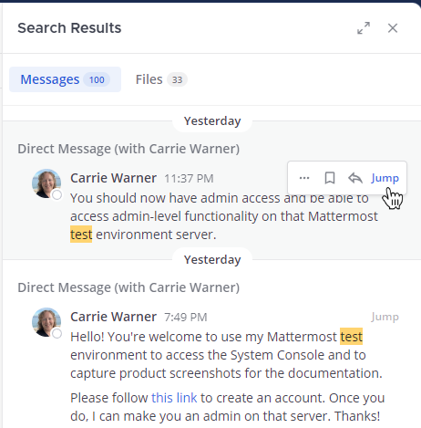
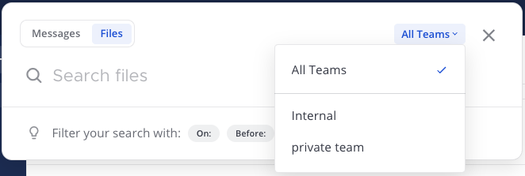

Searching
=========

Use the Mattermost Search field to find messages, replies, and the contents of files shared across all channels you're a member of in your team's conversation history. File content search is available now in Mattermost Cloud, and in Mattermost Server from v5.35, with mobile support coming soon.

Searching for Message Contents 
------------------------------

Select the search option, then type your search criteria. 

.. image:: ../../images/search-messages.png

When message results display in the Search Results pane, select **Jump** to view the full message in context.

.. tip::
  Message search results return first automatically if **Messages** isn't selected. In the Search Results pane, you can switch between message and file results by selecting the **Messages** and **Files** options.
  
  .. image:: ../../images/review-all-search-results.png

Searching for File Contents
---------------------------

Select the **Search** field, then select **Files** as the search type, then type your search criteria. File attachments that match on file name or contain matching text content within supported document types are returned in the Search Results pane. Each search result includes the file name, extension, size, as well as when and where the file was originally shared.

- For Mattermost Cloud workspaces, supported document file formats include PDF, DOCX, PPTX, ODT, HTML, and plain text documents. RTF, PAGES, and the contents of ZIP files are not supported.
- For Mattermost Server deployments, supported document file formats include PDF, PPTX, ODT, HTML, and plain text documents. 

  - System Admins can `extend content search support to include `file attachments shared before upgrading to Mattermost Server 5.35 <https://docs.mattermost.com/administration/command-line-tools.html#mattermost-extract-documents-content >`__.
  - System Admins can `extend content search support to include DOCX, RTF, and PAGES file formats <https://docs.mattermost.com/administration/config-settings.html#enable-document-search-by-content>`__.
  - System Admins can also `extend content search support to include documents within ZIP files <https://docs.mattermost.com/administration/config-settings.html#enable-searching-content-of-documents-within-zip-files>`__.

To narrow results further in the Search Results pane, select the **File Type Filter** option, then select specific file types, such as documents, spreadsheets, images, and more.
  
.. image:: ../../images/file-search-filter.png

.. tip::
 Access files recently shared in any channel by selecting the **Channel Files** icon below the channel name. 
  
  .. image:: ../../images/channel-files-icon.png

Search Modifiers
----------------

You can apply search modifiers to any search to reduce the number of results returned. Select a search modifier to add it to the Search field. Supported modifiers are described below.

.. image:: ../../images/search-modifiers.png

``from:`` and ``in:``
^^^^^^^^^^^^^^^^^^^^

Use ``from:`` to find posts from specific users. 
For example, searching ``from:john.smith`` only returns messages from your Direct Message history with John Smith.

Use ``in:`` to find messages and replies in specific Public channels, Private channels, Direct Messages, or Group Messages. You can specify channels by display name or channel ID. 
For example, searching ``Mattermost in:town-square`` only returns messages in the Town Square Public channel that contain the term ``Mattermost``, while searching ``Mattermost in:john.doe`` only returns messages that contain the term ``Mattermost`` in your Direct Message history with John Smith.

``before:``, ``after:``, and ``on:``
^^^^^^^^^^^^^^^^^^^^^^^^^^^^^^^^^^

Use ``before:`` to find posts before a specified date.

Use ``after:`` to find posts after a specified date. 

Use both ``before:`` and ``after:`` together to search in a specified date range.  

Use ``on:`` to find posts from a specific date. Use the date picker to select a date, or type it in YYYY-MM-DD format. 

.. image:: ../../images/calendar2.png
  :width: 300 px

Examples:

-  Searching ``website before: 2018-09-01`` returns messages containing the term ``website`` posted prior to September 1, 2018.
-  Searching ``website after: 2018-08-01`` returns messages containing the term ``website`` posted after August 1, 2018.
-  Searching ``website before: 2018-09-01 after: 2018-08-01`` returns all messages containing the term ``website`` posted between August 1, 2018 and September 1, 2018.
-  Searching ``website on: 2018-09-01`` returns messages containing the term ``website`` posted on September 1, 2018.
  
Exclusions
^^^^^^^^^^

Use the hyphen ``-`` symbol to exclude message terms from your search results. For example, searching ``test -release`` only returns results that include the term ``test`` and exclude the term ``release``.

This exclusion modifier can be used in combination with other modifiers to further refine search results. For example, searching ``test -release -in:release-discussion -from:eric`` returns all results with the term ``test``, excludes posts with the term ``release``, excludes posts made in the ``release-discussion`` channel, and excludes messages sent in Direct Messages by ``eric``.

Quotation Marks
^^^^^^^^^^^^^^^

Use quotation marks ``" "`` to return search results for exact terms. For example, searching ``"Mattermost website"`` returns messages containing the exact phrase ``Mattermost website``, but doesn't return messages containing ``Mattermost`` and ``website`` as separate terms.

Wildcard
^^^^^^^^

Use the asterisk ``*`` symbol for wildcard searches that match within words. For example, searching ``rea*`` returns messages containing ``reach``, ``reason``, ``reality``, ``real``, and other words starting with ``rea``.

Hashtags
--------

Hashtags are searchable labels for messages. Anyone can create a hashtag in a message by using the pound sign ``#`` followed by alphanumeric or other unicode characters. Hashtag examples include: ``#bug``, ``#marketing``, ``#user_testing``, ``#per.iod``, ``#check-in``, ``#마케팅``

Valid hashtags:

- Don't start with a number.
- Are at least three characters long, excluding the ``#``.
- Are made up of alphanumeric or other unicode characters.
- May contain dots, dashes, or underscores.

To search for messages containing hashtags, select a hashtag in an existing post, or type the hashtag (including the pound ``#`` symbol) into the search bar. 

.. note::
  Hashtags don't link to channels. If you have a channel named “Marketing”, selecting a ``#marketing`` hashtag does not take you to the Marketing channel. To link to public channels, use the tilde ``~`` symbol followed by the channel name. For example ``~marketing``.

Notes About All Searches
------------------------

- Multiple-word searches return results that contain *all* of your search criteria.
- Search modifiers can help narrow down searches. See the `Search Modifiers`_ section below for details.
- You can search Archived channels as long as you're a member of that channel. 

  - If you're unable to see messages in archived channels in your search results, ask your System Admin if **Allow users to view archived channels** has been disabled under **System Console > Site Configuration > Users and Teams**. 
  - To remove archived channels from your search results, you can leave Archived channels. 
- Like many search engines, common words such as ``the``, ``which``, and ``are`` (known as "stop words"), as well as two-letter and one-letter search terms, are not shown in search results because they typically return too many results. See the `Technical Notes`_ section below for details.
- IP addresses (e.g. ``10.100.200.101``) don't return results.
- When no search type is selected, message search results are returned first.

Technical Notes
---------------

Searching Chinese, Korean, and Japanese
^^^^^^^^^^^^^^^^^^^^^^^^^^^^^^^^^^^^^^^

- The best experience for searching in Chinese, Korean, and Japanese is to use MySQL 5.7.6 or later with special configuration. See the `Chinese, Japanese and Korean Search documentation <https://docs.mattermost.com/install/i18n.html>`__ for details.
- You can perform searches without this configuration by adding wildcards ``*`` to the end of search terms.

Differences between PostgreSQL and MySQL Search
^^^^^^^^^^^^^^^^^^^^^^^^^^^^^^^^^^^^^^^^^^^^^^^

By default, Mattermost uses full text search support included in MySQL and PostgreSQL. These databases have slightly different search behavior. Check **Main Menu > About Mattermost** to see which database you’re using.

For example, different databases have different “stop words” filtered out of search results. See `MySQL <https://dev.mysql.com/doc/refman/5.7/en/fulltext-stopwords.html>`__ or `PostgreSQL <https://www.postgresql.org/docs/10/textsearch-dictionaries.html#TEXTSEARCH-STOPWORDS>`__ database documentation for a full list. 

Other database-specific differences include:

PostgreSQL:

- Email addresses don't return results.
- Hashtags or recent mentions of usernames containing a dash don't return search results.
- Terms containing a dash return incorrect results as dashes are ignored in the search engine.

MySQL:

- Hashtags or recent mentions of usernames containing a dot don't return search results.
- Stop words that are excluded from search in MySQL: ``"a", "about", "an", "are", "as", "at", "be", "by", "com", "de", "en", "for", "from", "how", "i", "in", "is", "it", "la", "of", "on", "or", "that", "the", "this", "to", "was", "what", "when", "where", "who", "will", "with", "und", "the", "www"``.
