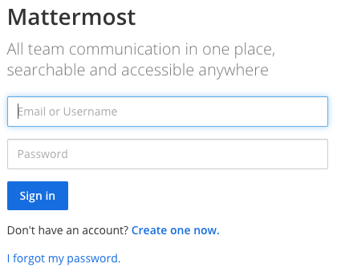
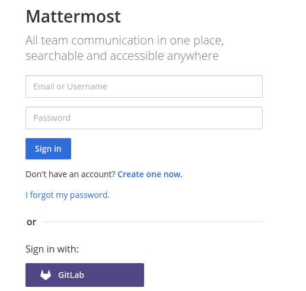
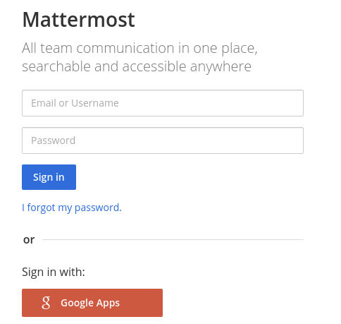
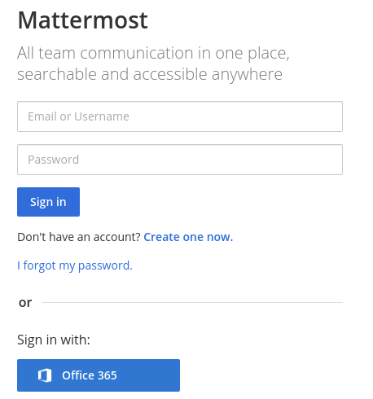
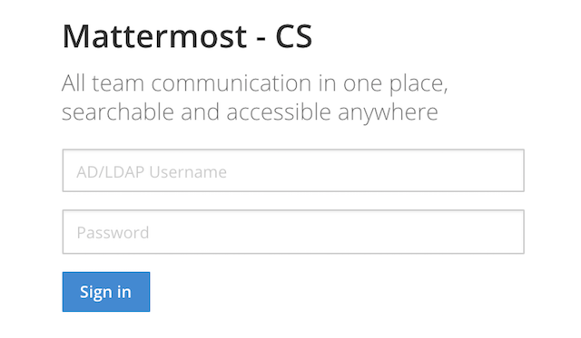
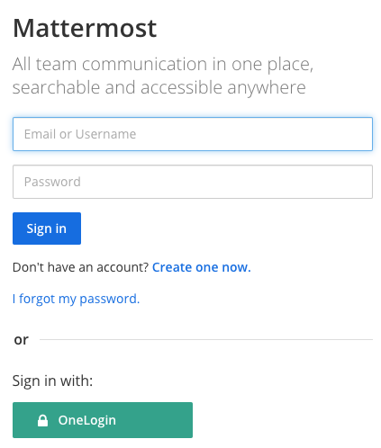

Signing In
==========

To sign in, navigate to the Mattermost sign-in screen. You can `get the URL of the sign-in screen <https://docs.mattermost.com/help/getting-started/access-your-workspace.html>`__ from your System Admin or from an email invitation.

.. tip::
  We recommend bookmarking the Mattermost URL provided by your System Admin or through an email invitation so signing in to Mattermost is easy in the future.

After signing in, the team that appears first on your team sidebar will open. If you have not joined a team, the Team Selection page opens where you can view a list of teams that you can join.

Email Address or Username Sign In
~~~~~~~~~~~~~~~~~~~~~~~~~~~~~~~~~

When enabled by your System Admin, you can sign in with the username or email address used to create your account.

If you've forgotten your password, you can reset it by selecting **I forgot my password** on the sign-in screen, or contact your System Admin for help resetting your password.

Single Sign-On
--------------
  
When enabled by your System Admin, you can sign in using your GitLab, Google, Office 365, AD/LDAP, or SAML credentials.

GitLab Single Sign-On (SSO)
~~~~~~~~~~~~~~~~~~~~~~~~~~~

When enabled by your System Admin, you can sign in with your GitLab account using a one-click sign in option.

Google Single Sign-On (SSO)
~~~~~~~~~~~~~~~~~~~~~~~~~~~

*Available in Mattermost Enterprise Edition E20*

When enabled by your System Admin, you can sign in with your Google account using a one-click sign in option.

Office 365 Single Sign-On (SSO)
~~~~~~~~~~~~~~~~~~~~~~~~~~~~~~~

*Available in Mattermost Enterprise Edition E20*

When enabled by your System Admin, you can sign in with your Office 365 account using a one-click sign in option.

AD/LDAP Sign In (SSO)
~~~~~~~~~~~~~~~~~~~~~

*Available in Mattermost Enterprise Edition E10 and E20*

When enabled by your System Admin, you can sign in with your AD/LDAP credentials. This lets you use the same username and password for Mattermost that you use for various other company services.

SAML Single Sign-On (SSO)
~~~~~~~~~~~~~~~~~~~~~~~~~

*Available in Mattermost Enterprise Edition E20*

When enabled by your System Admin, you can sign in with your SAML credentials. This lets you use the same username and password for Mattermost that you use for various other company services. Mattermost officially supports `Okta <https://docs.mattermost.com/deployment/sso-saml-okta.html>`__, `OneLogin <https://docs.mattermost.com/deployment/sso-saml-onelogin.html>`__, and Microsoft ADFS as an identity provider (IDP) for SAML, but you may use other SAML IDPs as well. Please see our `SAML Single Sign-On documentation <https://docs.mattermost.com/deployment/sso-saml.html>`__ to learn more about configuring SAML for Mattermost.

