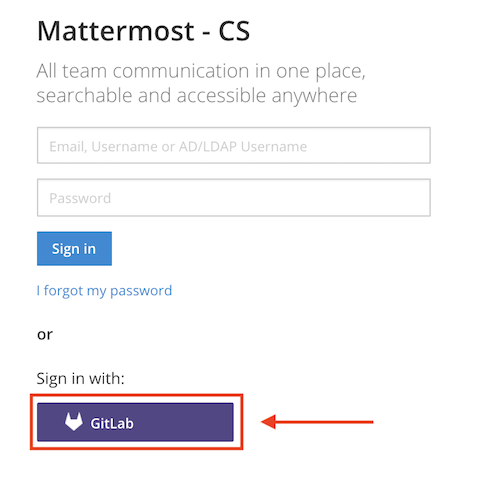
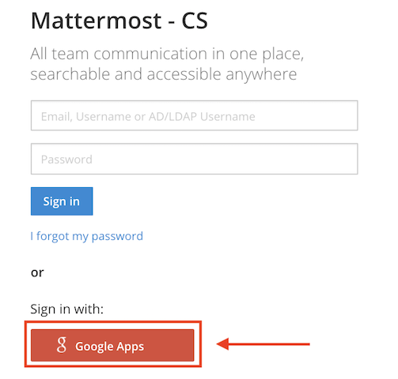
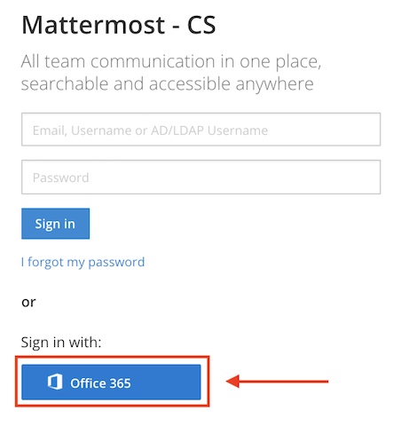
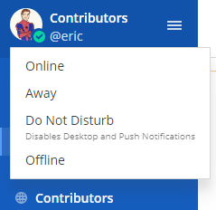

Signing In
==========

Accessing your Mattermost Workspace
------------------------------------

An invitation is required to access Mattermost. A member of your Mattermost workspace can send an invitation via email or by providing you with a link.

Sign In 
--------

To sign in, navigate to the Mattermost sign-in page. You can get the URL of the sign-in page from your System Admin or in an invitation email. We recommend bookmarking the site so you can easily find it again.

After signing in, the team that appears first on your team sidebar will open. If you have not joined a team, the Team Selection page opens where you can view a list of teams that you can join.

.. contents::
  :depth: 2
  :local:
  :backlinks: entry

Sign In Methods
---------------

There are several options for signing in to your team depending on how your System Admin has configured your server.

Email Address or Username Sign In
~~~~~~~~~~~~~~~~~~~~~~~~~~~~~~~~~

When enabled by your System Admin, you can sign in with the username or email address used to create your account.

If you have forgotten your password, you can reset it by selecting **I forgot my password.** on the sign-in screen, or contact your System Admin for help resetting your password.

.. image:: ../../images/sign-in_with_email.png

GitLab Single Sign-On (SSO)
~~~~~~~~~~~~~~~~~~~~~~~~~~~

When enabled by your System Admin, you can sign in using your GitLab account using a one-click sign in option.

Google Single Sign-On (SSO)
~~~~~~~~~~~~~~~~~~~~~~~~~~~

*Available in Enterprise Edition E20*

When enabled by your System Admin, you can sign in using your Google account using a one-click sign in option.

Office 365 Single Sign-On (SSO)
~~~~~~~~~~~~~~~~~~~~~~~~~~~~~~~

*Available in Enterprise Edition E20*

When enabled by your System Admin, you can sign in using your Office 365 account using a one-click sign in option.

AD/LDAP Sign In (SSO)
~~~~~~~~~~~~~~~~~~~~~

*Available in Enterprise Edition E10 and E20*

When enabled by your System Admin, you can sign in with your AD/LDAP credentials. This lets you use the same username and password for Mattermost that you use for various other company services.

.. image:: ../../images/sign-in_with_ldap.png

SAML Single Sign-On (SSO)
~~~~~~~~~~~~~~~~~~~~~~~~~

*Available in Enterprise Edition E20*

When enabled by your System Admin, you can sign in with your SAML credentials. This lets you use the same username and password for Mattermost that you use for various other company services. Mattermost officially supports `Okta`_ and `Microsoft ADFS`_ as an identity provider (IDP) for SAML, but you may use other SAML IDPs as well. Please see `documentation`_ to learn more about configuring SAML for Mattermost.

.. image:: ../../images/sign-in_with_saml.png

Switching Teams
---------------

You can switch between teams you have joined using the team sidebar that appears to the left of your channel list on the left-hand sidebar.

.. image:: ../../images/team-sidebar.png

Setting Your Status
-------------------

You can set your status as **Online**, **Away**, **Do not disturb**, or **Offline** by choosing a status from the menu that appears when you select your avatar at the top of the channel list. **Do not disturb** disables desktop, email, and push notifications.

How Mattermost determines your status
~~~~~~~~~~~~~~~~~~~~~~~~~~~~~~~~~~~~~

.. csv-table::
    :header: "Client", "**Online**", "**Away**", "**Offline**"

    "**Desktop App**", "You're interacting with your computer", "You're inactive on your computer for 5 minutes", "You close Mattermost, sleep, or lock your computer"
    "**Web Browser**", "You're interacting with Mattermost in a browser", "
    - You have not typed or switched channels for 5 minutes
    - The tab is unfocused for 5 minutes
    - The browser is in the background or minimized for 5 minutes", "You close the Mattermost browser window"
    "**Mobile App**", "Mattermost is open", "Mattermost is open with 5 minutes of inactivity", "You switch apps, close Mattermost, or lock your screen" 

Logging Out
-----------

You can log out from the **Main Menu** (the three lines next to your username). Select **Logout** to log out of all teams on the server.

iOS Setup
---------

Your Mattermost teams can be accessed on iOS mobile devices via the Mattermost Mobile App.

#. Open the `App Store` on your Apple device running iOS 9.0 or later.
#. Search for “Mattermost” and select **GET** to download the app.
#. Open Mattermost from your homescreen and enter your team and account information to log in:

   #. **Enter Server URL:** This is the web address you go to when you want to access Mattermost. You can find the Server URL by asking your
      System Admin or by looking at the address bar in a desktop browser tab with Mattermost open. It is in the format ``https://domain.com``.
   #. **Sign in to Mattermost:** This is your account login information as described by one of the sign in methods above.

Android Setup
-------------

Your Mattermost teams can be accessed on Android mobile devices by downloading the Mattermost Mobile App.

#. Open the `Google Play Store`_ on your Android device.
#. Search for “Mattermost” and select **INSTALL** to download the app.
#. Open Mattermost from your homescreen and enter your team and account information to login:

   #. **Enter Server URL:** This is the web address you go to when you want to access Mattermost. You can find the Server URL by asking your System Admin or by looking at the address bar in a desktop browser tab with Mattermost open. It is in the format ``https://domain.com``.
   #. **Sign in to Mattermost:** This is your account login information as described by one of the sign in methods above.

.. _Okta: https://developer.okta.com/docs/guides/saml_guidance.html
.. _Microsoft ADFS: https://msdn.microsoft.com/en-us/library/bb897402.aspx
.. _documentation: https://docs.mattermost.com/deployment/sso-saml.html
.. _App Store: https://geo.itunes.apple.com/us/app/mattermost/id984966508?mt=8
.. _Google Play Store: https://play.google.com/store/apps/details?id=com.mattermost.mattermost&hl=en
