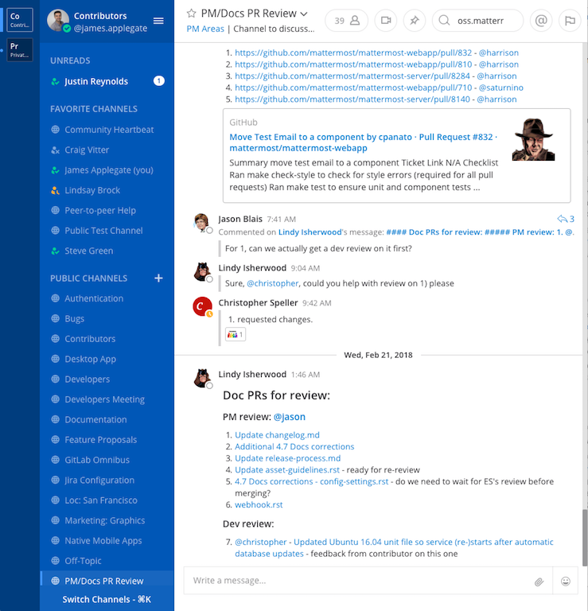

Welcome to Mattermost!
==========

This article will go over the basics of Mattermost and a general overview of the appliation so that you can get a good headstart.

Ready? Let's get started!

**What is Mattermost?**
-----------------------------------

Mattermost is a modern, digital workspace that will help you be more productive in your day to day work life.

Some of the major benefits of using Mattermost are:

- Direct 1:1 and group messaging with your colleages
- Channels for topic-based, group-based, or meeting-based chat
- Streamlined collaboration on projects
- Reduced email clutter
- Searching across messages and channels
- Sharing files

**Basic information**
---------------------

To understand how Mattermost works, below are some of the basic things you'll need to know. 

This is a what a typical Mattermost workspace looks like. 

- Teams
- Channels
- Messages
- Search
- Notifications

**Teams**
---------------------
A team is a digital workspace where you and your teammates can collborate on Mattermost. Depending on how Mattermost is set up in your organization, you can belong to 1 team or multiple teams.

**Channels**
---------------------
Channels are used to organize conversations across different topics, they are located on the left-hand panel of your Mattermost application. There are three types of channels: Public Channels, Private Channels, and Direct Messages.

**Public Channels:**

Public Channels are open to everyone on a team. New team members are automatically added to two Public Channels when they sign up: Town Square and Off-Topic.

Public Channels are identified with a **circle icon**

**Private Channels:**

Private Channels are for sensitive topics and are only visible to select team members. Any member of a Private Channel can add additional members. Channel members can choose to leave at any time, but only the channel owner or Team Admin can remove other members.

Private Channels have a **lock icon**

**Direct Messages (DM)**

Direct Messages are for conversations between two people. Group Messages are Direct Messages that have conversations among three or more people. Both are visible only to the people involved.

Use a Direct Message when you want a private conversation with one other person. 

Use a Group Message when you want to quickly set up a conversation with up to seven other participants. If you want more than that, you must create a Private Channel.

For more information on channels and how to manage them, `click here <https://docs.mattermost.com/help/getting-started/organizing-conversations.html>`__

**Sending Messages**
---------------------
Sending messages and replying to messages are important ways to keep conversations active with your team. You can edit and delete messages after you have sent them. You can also share links to any message in Mattermost.

Below is a list of other things you can do with Mattermost:

Since messaging is at the core of your Mattermost application, below are examples of what you can do:

- Mention teammates
- Format text (emojis, text style, links code, tables)
- Share files
- Execute commands
- Flag and pin messages
- Keyboard shortcuts

`Click here <https://docs.mattermost.com/guides/user.html#messaging>`__ or a complete list with instructions.

**Search**
---------------------
Use the search box to find messages and replies that match the search terms that you enter. All channels that you are a member of in the current team are searched.

You can also do more advanced search using search modifiers `here <https://docs.mattermost.com/help/getting-started/searching.html>`__

**Notifications**
---------------------
Notifications in Mattermost alert you to unread messages and mentions.

You can configure Mattermost on how you want to be notified `here <https://docs.mattermost.com/help/getting-started/configuring-notifications.html>`__
