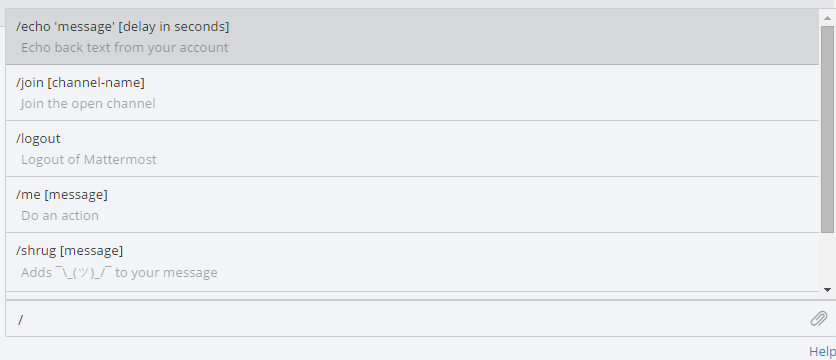

# Executing Commands
___
Slash commands perform operations in Mattermost by typing into the text input box. Enter a `/` followed by a command and some arguments to perform actions. 

Built-in slash commands come with all Mattermost installations and custom slash commands are configurable to interact with external applications. Learn about configuring custom slash commands on the [developer slash command documentation page](http://docs.mattermost.com/developer/slash-commands.html).

## Built-in Commands

The following slash commands are available on all Mattermost installations:

Begin by typing `/` and a list of slash command options appears above the text input box. The autocomplete suggestions help by providing a format example in black text and a short description of the slash command in grey text.

## Custom Commands
Custom slash commands integrate with external applications. For example, a team might configure a custom slash command to check internal health records with `/patient joe smith` or check the weekly weather forcast in a city with `/weather toronto week`. Check with your System Admin or open the autocomplete list by typing `/` to determine if your team configured any custom slash commands.

Custom slash commands are disabled by default and can be enabled by the System Admin in the **System Console** > **Service Settings**. Learn about configuring custom slash commands on the [developer slash command documentation page](http://docs.mattermost.com/developer/slash-commands.html).
