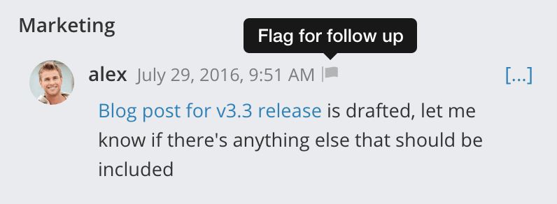
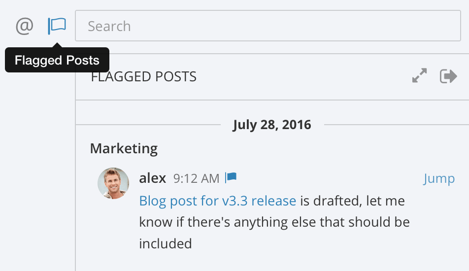
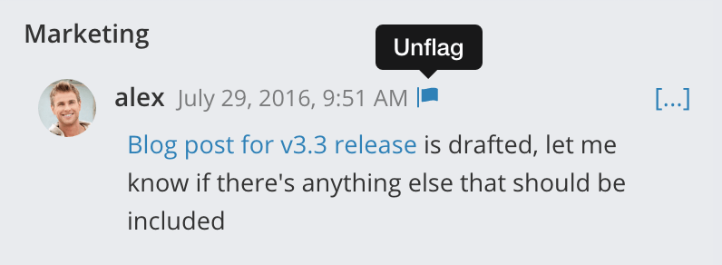

Flagging Messages
-------------------

Flags are a way to mark messages as important. Your flags are personal, and cannot be seen by other users.

One way we like to use flags is to mark messages we want to respond to later. It's useful when someone asks for something that requires work. We flag the post, keep doing what we're doing, and then go back to our list of flagged posts. After the work is completed, we can reply back to the post and unflag it to clear it from the list.

Flagging a Message
======================

To try it out, hover over a message to show the flag icon. Click the icon to flag the message for follow up.

Viewing Flagged Messages
===========================

To view a list of your flagged messages, click the flag beside the search box.

Unflagging Messages
===========================

To remove an item from the list, click the flag beside a message to clear it.

