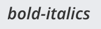
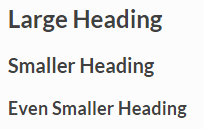

Formatting Text
===============

Markdown makes it easy to format messages. Type a message as you normally would, then use these the following formatting syntax to render the message a specific way. For a guide to using Markdown in Mattermost, `see this blog post <https://mattermost.com/blog/laymans-guide-to-markdown-on-mattermost/>`_.

Text Style
----------

You can use either ``_`` or ``*`` around a word or phrase to make it italic, or ``__`` or ``**`` around a word or phrase to make it bold. You can also use common keyboard shortcuts, including CTRL/CMD+B to bold, and CTRL/CMD+I to italicize text. 

* ``*italics*`` (or ``_italics_``) renders as *italics*
* ``**bold**`` renders as **bold**
* ``***bold-italic***`` renders as |bold_italics|
* ``~~strikethrough~~`` renders as |strikethrough|




Links
-----

Create labeled links by putting the desired text in square brackets ``[ ]`` and the associated link in round brackets ``( )``.

``[Check out Mattermost!](https://about.mattermost.com/)``

Renders as: `Check out Mattermost! <https://about.mattermost.com/>`__

Headings
--------

Make a heading by typing ``#`` and a space before your title. For smaller headings, use more ``#``'s.

.. code-block:: none

  ## Large Heading
  ### Smaller Heading
  #### Even Smaller Heading

Renders as:



Alternatively, you can underline the text using equal signs ``===`` or hyphens ``---`` to create headings.

.. code-block:: none

  Large Heading
  -------------

Renders as:

.. image:: ../../images/Headings2.png
   :alt: Smaller Heading

Lists
-----

Create a list by using asterisks ``*``, hyphens ``-``, and/or plus signs ``+`` interchangeably as bullets. Indent bullet points by adding two spaces in front each one.

.. code-block:: none

  * item one
  - item two
    + item two sub-point

Renders as:

* item one
* item two

  * item two sub-point

Make an ordered list by using numbers instead:

.. code-block:: none

  1. Item one
  1. Item two
  1. item three

Renders as:

#. Item one
#. Item two
#. Item three

You can also start a list at any number:

.. code-block:: none

  4. The first list number is 4.
  1. The second list number is 5.
  1. The third list number is 6.

Renders as:

4. The first list number is 4.
5. The second list number is 5.
6. The third list number is 6.

Make a task list by including square brackets ``[ ]``. Mark a task as complete by adding an ``x``.

.. code-block:: none

  - [ ] Item one
  - [ ] Item two
  - [x] Completed item

Renders as:

.. image:: ../../images/checklist.png
   :alt: List

Code Block
----------

Creating a fixed-width code block is recommended for pasting multi-line blocks of code or other text output because it's easier to read with fixed-width font alignment. Examples include block text snippets, ASCII tables, and log files.

This can be accomplished by placing three backticks :kbd:`\`\`\`` on the line directly above and directly below your code:

.. code-block:: none

  ```
  this is my
  code block
  ```

.. tip::

  Type three backticks ``\\\``, press SHIFT+ENTER, ``<type_your_code>``, press SHIFT+ENTER again, then type three more backticks ``\\\``.


Or by indenting each line by four spaces:

.. code-block:: none

      this is my
      code block

  ^^^^ 4x spaces


**Syntax highlighting**

To add syntax highlighting, type the language to be highlighted after the ``````` at the beginning of the code block. Mattermost also offers four different code themes (GitHub, Solarized Dark, Solarized Light, and Monokai) that can be changed in **Account Settings > Display > Theme > Custom Theme > Center Channel Styles**.

Supported languages include:
``applescript``, ``as``, ``atom``, ``bas``, ``bash``, ``boot``, ``_coffee``, ``c++``, 
``c``, ``cake``, ``cc``, ``cl2``, ``clj``, ``cljc``, ``cljs``, ``cljs.hl``,
``cljscm``, ``cljx``, ``cjsx``, ``cson``, ``coffee``, ``cpp``, ``cs``, ``csharp``, 
``css``, ``d``, ``dart``, ``dfm``, ``di``, ``delphi``, ``diff``, ``django``, ``docker``, 
``dockerfile``, ``dpr``, ``erl``, ``fortran``, ``freepascal``,  ``fs``, ``fsharp``, 
``gcode``, ``gemspec``, ``go``, ``groovy``, ``gyp``, ``h++``, ``h``, 
``handlebars``, ``hbs``, ``hic``,  ``hpp``, ``html``, ``html.handlebars``, 
``html.hbs``, ``hs``, ``hx``, ``iced``, ``irb``,
``java``, ``jinja``, ``jl``, ``js``, ``json``, ``jsp``, ``jsx``, ``kt``,
``ktm``, ``kts``, ``latexcode``, ``lazarus``, ``less``, ``lfm``, ``lisp``, ``lpr``,
``lua``, ``m``, ``mak``, ``matlab``, ``md``, ``mk``, ``mkd``, ``mkdown``,
``ml``, ``mm``, ``nc``, ``objc``, ``obj-c``, ``osascript``, ``pas``, ``pascal``,
``perl``, ``pgsql``, ``php``, ``php3``, ``php4``, ``php5``, ``php6``, ``pl``, ``plist``,
``podspec``, ``postgres``, ``postgresql``, ``ps``, ``ps1``, ``pp``, ``py``, ``r``, ``rb``,
``rs``, ``rss``, ``ruby``, ``scala``, ``scm``, ``scpt``, ``scss``, ``sh``, ``sld``, ``st``, ``styl``,
``sql``, ``swift``, ``tex``, ``texcode``, ``thor``, ``ts``, ``tsx``, ``v``, ``vb``, ``vbnet``, ``vbs``,
``veo``, ``xhtml``, ``xml``, ``xsl``, ``yaml``, and ``zsh``.

Example:

.. code-block:: none

  ``` go
  package main
  import "fmt"
  func main() {
      fmt.Println("Hello, 世界")
  }
  ```
Renders as:

**GitHub Theme**

.. image:: ../../images/syntax-highlighting-github.png
   :alt: Syntax Highlighting in GitHub

**Solarized Dark Theme**


**Solarized Light Theme**

.. image:: ../../images/syntax-highlighting-sol-light.png
   :alt: Syntax Highlighting Light

**Monokai Theme**

.. image:: ../../images/syntax-highlighting-monokai.png
   :alt: Syntax Highlighting Monokai

In-line Code
------------

Create in-line monospaced code text by surrounding it with backticks `````. Don't use single quotes ``'``.

.. code-block:: none

  `monospace`

Renders as: ``monospace``.

In-line Images
--------------

In-line images are images added within lines of text. From Mattermost Server v5.35 and in Mattermost Cloud, you can control whether all in-line images over 100px in height are automatically collapsed or expanded in messages by setting a `user preference <https://docs.mattermost.com/help/settings/account-settings.html#link-previews>`__, or by using the ``/collapse`` and ``/expand`` slash commands.

To add in-line images to text, use an exclamation mark ``!`` followed by the ``alt text`` in square brackets ``[ ]``, then the ``image URL`` in round brackets ``( )``. You can add hover text after the link by placing the text in quotes ``" "``.

Example:

.. code-block:: none

  

If the height of the original image is more than 500 pixels, Mattermost sets the image height at 500 pixels and adjusts the width to maintain the original aspect ratio.

You can set the width and height of the displayed image after the URL of the image by using an equals sign ``=`` followed by values for both width and height ``##x##``. If you set only the width, Mattermost adjusts the height to maintain the original aspect ratio.

Examples:

.. code-block:: none

  .. |mattermost-icon-76x76| image:: ../../images/icon-76x76.png
  .. |mattermost-icon-50x76| image:: ../../images/icon-50x76.png

In-line image with hover text
~~~~~~~~~~~~~~~~~~~~~~~~~~~~~

.. code-block:: none

  

Renders as:

  .. image:: ../../images/icon-76x76.png
    :alt: Mattermost
    :name: Mattermost Icon

In-line image with link
~~~~~~~~~~~~~~~~~~~~~~~

.. note::
  An extra set of square brackets ``[ ]`` is required around the alt text, and round brackets ``( )`` are required around the image link.

.. code-block:: none

  [](https://github.com/mattermost/mattermost-server)

Renders as:

  .. image:: ../../images/icon-76x76.png
    :target: https://github.com/mattermost/mattermost-server
   
In-line image displayed wtih fixed width and height
~~~~~~~~~~~~~~~~~~~~~~~~~~~~~~~~~~~~~~~~~~~~~~~~~~~

Example: An in-line image that's 50 pixels wide and 76 pixels high.

.. code-block:: none

  

Renders as:

  .. image:: ../../images/icon-50x76.png
    :alt: Mattermost
    :name: Mattermost Icon 

In-line image displayed with fixed width
~~~~~~~~~~~~~~~~~~~~~~~~~~~~~~~~~~~~~~~~

Example: An in-line image that's 50 pixels wide where the system adjusts the height to maintain the original aspect ratio.

.. code-block:: none

  

Renders as:

  .. image:: ../../images/icon-76x76.png
    :alt: Mattermost
    :width: 50
 
Lines
-----

Create a line by using three ``*``, ``_``, or ``-``.

``***``

Renders as:

---------------------------------------------------------------------------

Block quotes
------------

Create block quotes using ``>``.

``> block quotes`` renders as:

.. image:: ../../images/blockQuotes.png

Tables
------

Create a table by placing a dashed line ``---`` under the header row, then separating each column with using pipes ``|``. The columns don’t need to line up exactly. Choose how to align table columns by including colons ``:`` within the header row.

.. code-block:: none

  | Left-Aligned  | Center Aligned  | Right Aligned |
  | :------------ |:---------------:| -----:|
  | Left column 1 | this text       |  $100 |
  | Left column 2 | is              |   $10 |
  | Left column 3 | centered        |    $1 |

Renders as:

.. image:: ../../images/markdownTable1.png
   :alt: Markdown Table Sample

Math Formulas
-------------

Create formulas by using LaTeX in a ``latex`` `Code Block`_. 

.. note::

  This feature is `disabled by default <https://docs.mattermost.com/administration/config-settings.html#enable-latex-rendering>`_. Contact your System Admin to enable this setting in **System Console > Site Configuration > Posts** to use this feature.

.. code-block:: none

  ```latex
  X_k = \sum_{n=0}^{2N-1} x_n \cos \left[\frac{\pi}{N} \left(n+\frac{1}{2}+\frac{N}{2}\right) \left(k+\frac{1}{2}\right) \right]
  ```

Renders as:


