Formatting Text
===============

Markdown makes it easy to format messages. Type a message as you normally would, and use these rules to render it with special formatting.

Emojis
------

Open the emoji autocomplete by typing ``:`` followed by two characters. A full list of emojis can be found `here <http://www.emoji-cheat-sheet.com/>`_. It is also possible to create your own `Custom Emoji <http://docs.mattermost.com/help/settings/custom-emoji.html>`_ if the emoji you want to use doesn't exist.

``:smile: :+1: :sheep:``

Renders as:


Text Style
----------

You can use either ``_`` or ``*`` around a word to make it italic. Use two to make it bold.

* ``_italics_`` renders as `italics`
* ``**bold**`` renders as **bold**
* ``**_bold-italic_**`` renders as |bold_italics|
* ``~~strikethrough~~`` renders as |strikethrough|

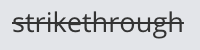

Links
-----

Create labeled links by putting the desired text in square brackets and the associated link in normal brackets.

``[Check out Mattermost!](https://about.mattermost.com/)``

Renders as: `Check out Mattermost! <https://about.mattermost.com/>`_

Headings
--------

Make a heading by typing # and a space before your title. For smaller headings, use more #’s.

.. code-block:: none

  ## Large Heading
  ### Smaller Heading
  #### Even Smaller Heading

Renders as:

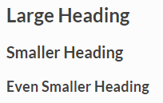

Alternatively, you can underline the text using ``===`` or ``---`` to create headings.

.. code-block:: none

  Large Heading
  -------------

Renders as:

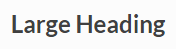

Lists
-----

Create a list by using ``*`` or ``-`` as bullets. Indent a bullet point by adding two spaces in front of it.

.. code-block:: none

  * item one
  * item two
    * item two sub-point

Renders as:

* item one
* item two

  * item two sub-point

Make it an ordered list by using numbers instead:

.. code-block:: none

  1. Item one
  1. Item two
  1. item three

Renders as:

#. Item one
#. Item two
#. Item three

You can also start a list at any number:

.. code-block:: none

  4. The first list number is 4.
  1. The second list number is 5.
  1. The third list number is 6.

Renders as:

4. The first list number is 4.
5. The second list number is 5.
6. The third list number is 6.


Make a task list by including square brackets:

.. code-block:: none

  - [ ] Item one
  - [ ] Item two
  - [x] Completed item

Renders as:

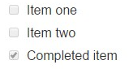

Code Block
----------

Create a code block by indenting each line by four spaces, or by placing ``````` on the line above and below your code.

Example:

.. code-block:: none


  ```
  code block
  ```

Renders as:

.. code-block:: none


  code block

**Syntax Highlighting**

To add syntax highlighting, type the language to be highlighted after the ``````` at the beginning of the code block. Mattermost also offers four different code themes (GitHub, Solarized Dark, Solarized Light, Monokai) that can be changed in **Account Settings** > **Display** > **Theme** > **Custom Theme** > **Center Channel Styles**

Supported languages are:
``actionscript``, ``applescript``, ``bash``, ``clojure``, ``coffeescript``, ``cpp``, ``cs``, ``css``, ``d``, ``dart``, ``delphi``, ``diff``, ``django``, ``dockerfile``, ``erlang``, ``fortran``, ``fsharp``, ``gcode``, ``go``, ``groovy``, ``handlebars``, ``haskell``, ``haxe``, ``java``, ``javascript``, ``json``, ``julia``, ``kotlin``, ``less``, ``lisp``, ``lua``, ``makefile``, ``markdown``, ``matlab``, ``objectivec``, ``ocaml``, ``perl``, ``php``, ``powershell``, ``puppet``, ``python``, ``r``, ``ruby``, ``rust``, ``scala``, ``scheme``, ``scss``, ``smalltalk``, ``sql``, ``swift``, ``tex``, ``vbnet``, ``vbscript``, ``verilog``, ``xml``, ``yaml``

Example:

.. code-block:: none


  ``` go
  package main
  import "fmt"
  func main() {
      fmt.Println("Hello, 世界")
  }
  ```

Renders as:

**GitHub Theme**

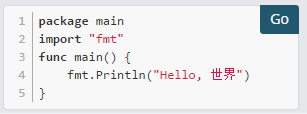

**Solarized Dark Theme**

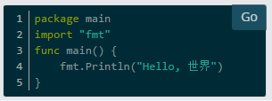

**Solarized Light Theme**

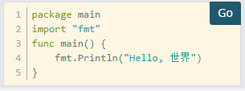

**Monokai Theme**

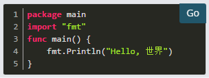


In-line Code
------------

Create in-line monospaced font by surrounding it with backticks.

.. code-block:: none


  `monospace`

Renders as: ``monospace``.

In-line Images
--------------

Create in-line images using an ``!`` followed by the alt text in square brackets and the link in normal brackets. Add hover text by placing it in quotes after the link.

.. code-block:: none


  

  and

  [](https://travis-ci.org/mattermost/platform) [](https://github.com/mattermost/platform)

Renders as:

.. image:: https://docs.mattermost.com
  :alt: alt text that shows when a link is broken

and

.. image:: https://travis-ci.org/mattermost/platform.svg?branch=master
  :alt: Build Status
  :target: https://travis-ci.org/mattermost/platform

.. image:: https://assets-cdn.github.com/favicon.ico
  :alt: GitHub
  :target: https://github.com/mattermost/platform

Lines
-----

Create a line by using three ``*``, ``_``, or ``-``.

``***`` renders as:

---------------------------------------------------------------------------

Block quotes
------------

Create block quotes using ``>``.

``> block quotes`` renders as:

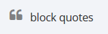

Tables
------

Create a table by placing a dashed line under the header row and separating the columns with a pipe ``|``. (The columns don’t need to line up exactly for it to work). Choose how to align table columns by including colons ``:`` within the header row.

.. code-block:: none


  | Left-Aligned  | Center Aligned  | Right Aligned |
  | :------------ |:---------------:| -----:|
  | Left column 1 | this text       |  $100 |
  | Left column 2 | is              |   $10 |
  | Left column 3 | centered        |    $1 |

Renders as:

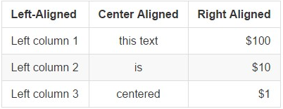


Math Formulas
-------------

Create formulas by using LaTeX in a ``latex`` `Code Block`_

.. code-block:: none


  ```latex
  X_k = \sum_{n=0}^{2N-1} x_n \cos \left[\frac{\pi}{N} \left(n+\frac{1}{2}+\frac{N}{2}\right) \left(k+\frac{1}{2}\right) \right]
  ```

Renders as:

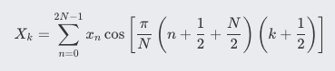
